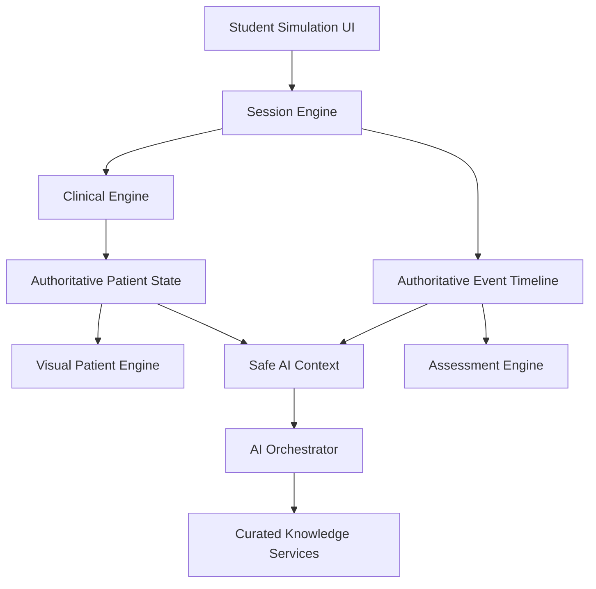
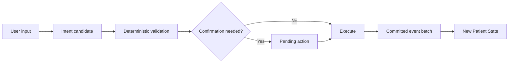
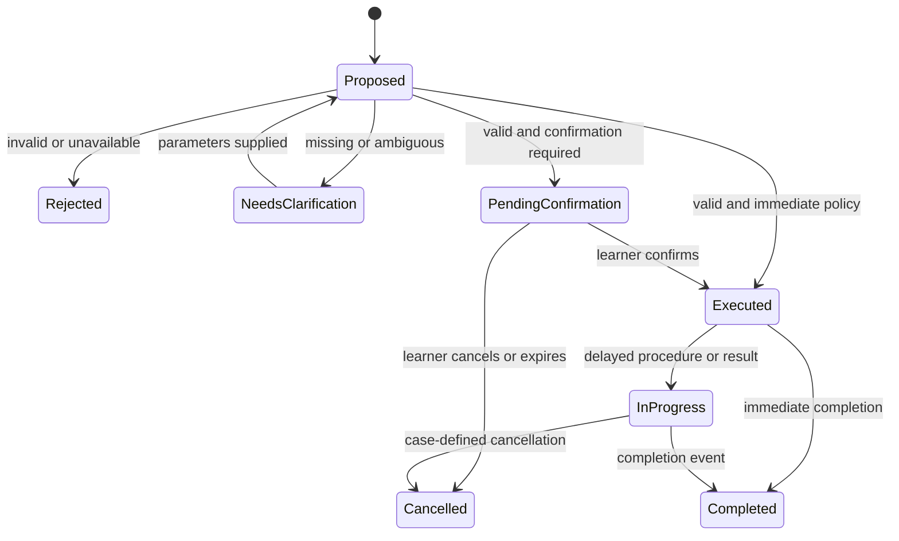
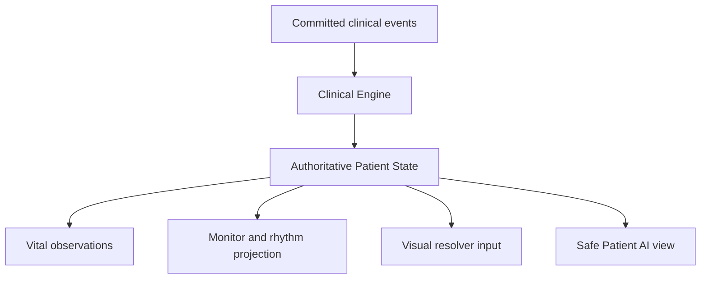
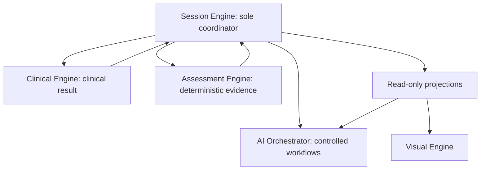
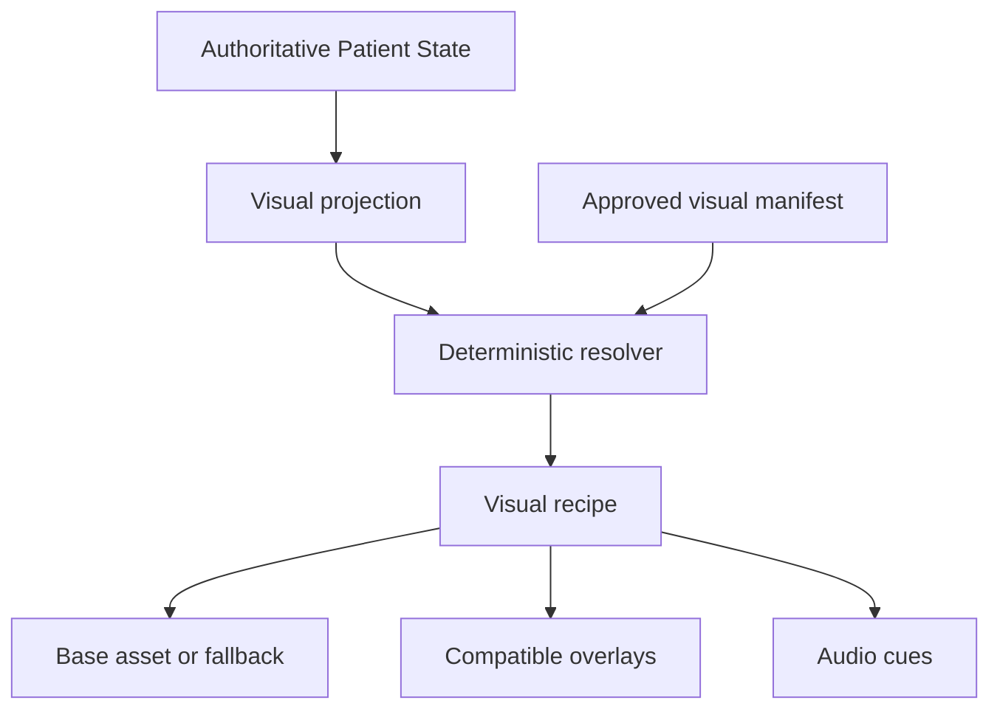
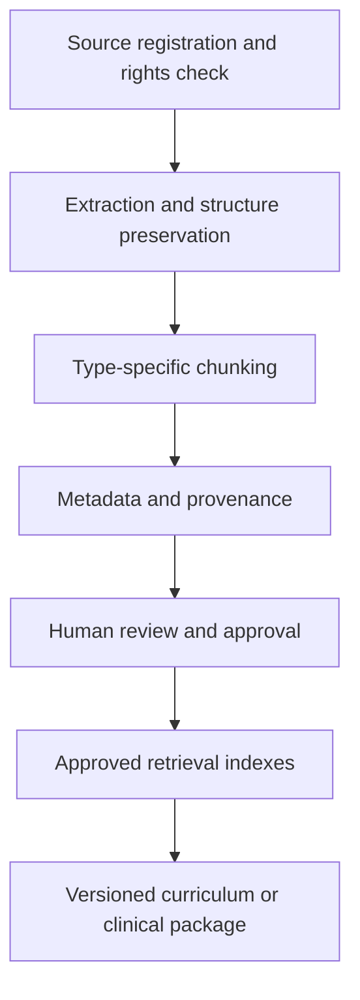

# AI Clinical Simulation Platform — Version 2

## Logical Architecture A–J for AI Expo Jordan 2026

**Status:** **LOGICAL ARCHITECTURE FREEZE v1.0 — APPROVED**  
**Date:** 29 August 2026  
**Scope boundary:** No technology-stack selection, production code, repository modification, database design, deployment design, or Codex implementation backlog is included.

## Freeze amendments incorporated

هذه النسخة هي Logical Architecture A–J النهائية المجمدة، وقد أُدمجت فيها القرارات اللاحقة المعتمدة دون تغيير ownership boundaries:

- Playable Expo scope: `Acute Inferior STEMI` و`Anaphylaxis` فقط؛ أي Case ثالثة تبقى unpublished Faculty Draft.
- `Speech-to-Text` جزء **EXPO REQUIRED** من Full Expo Experience، مع text input fallback دائم؛ Voice ليس Critical Dependency للـcore simulation.
- Faculty Expo Experience هو **Constrained Functional Demo**: catalogue/detail/lifecycle inspection + safe `NEW DRAFT CASE` metadata creation؛ لا AI approval أوauto-publish أوdirect Published Case editing.
- JU/JUST coverage عبارة عن curated approved subsets للحالات المنفذة، دون ادعاء full curriculum alignment.
- `Student/Curriculum Validation` منفصل عن `Clinical Review` ولا يمنح medical approval.
- **Clinical Reviewer Availability Gate — Dependency-Based:** Reviewer pathway must be confirmed before final clinical approval/publication of each playable Case Package. No fixed internal calendar date is required.

## Architecture thesis

The platform has three independently governed layers:

1. **The Clinical Engine knows what is happening to the patient.**
2. **The AI understands language, retrieves context, teaches, and explains why.**
3. **The Visual Engine shows approved consequences of the authoritative state.**

No layer may silently take ownership of another layer’s responsibility.



---

# A. Non-negotiable invariants

## 1. Decision

All Version 2 components must obey the following invariants:

1. **Single owner of clinical truth.** Only the deterministic Clinical Engine, operating on an approved and version-pinned Case Package, may calculate or change authoritative Patient State.
2. **AI is non-authoritative.** No AI workflow may commit a clinical action, create a clinical effect, change a score, publish a case, or override a higher-trust source.
3. **Intent is not execution.** Natural-language interpretation produces candidate intent only. An action exists clinically only after deterministic validation, any required confirmation, and committed execution.
4. **One authoritative timeline.** Every clinically relevant occurrence is recorded as a sequenced session event. Events are append-only; corrections supersede prior records rather than rewriting history.
5. **Version pinning.** A session pins the exact Case Version, Rubric Version, Visual Manifest Version, curriculum mappings, and knowledge-source versions used. Published content never changes underneath an active or historical session.
6. **Language-independent clinical truth.** Identifiers, state values, rules, and scoring remain language-neutral. Arabic and English are presentation and conversation policies, not alternate medical realities.
7. **Vitals are consequences, not the sole state.** Rhythm, perfusion, consciousness, respiratory condition, pain, and complications are explicit. Numeric vitals and waveforms are deterministic manifestations of those conditions.
8. **Visuals are downstream projections.** Media can represent Patient State but cannot infer, repair, or alter it. A missing asset cannot interrupt clinical processing.
9. **Deterministic numerical assessment.** The initial six-domain score and critical-action logic are computed from the approved rubric and event timeline. AI may explain those results but not assign or revise them.
10. **Evidence traceability.** Every published clinical rule and educational mapping points to an approved source or a documented reviewer decision. Every learner-facing sourced claim can identify its provenance.
11. **Publication requires humans.** AI-generated content remains a draft until faculty editing, medical review, approval, and publication are explicitly recorded.
12. **Least disclosure.** Patient AI receives only facts it is allowed to disclose at that moment; it does not receive unrestricted hidden case content merely for convenience.
13. **Idempotent commands.** Repeated clicks, retries, refreshes, and network duplication cannot administer a drug or perform a procedure twice unless the case explicitly permits a repeat action.
14. **Simulation time is explicit.** Clinical rules use Simulation Clinical Time, not wall-clock assumptions. Real time is recorded separately. The Expo default remains `time_ratio = 1.0`.
15. **Graceful degradation.** Core case navigation, action execution, physiology, scoring, and the known-good demonstration remain operable without live LLM, speech, retrieval, or video services.
16. **Educational use is explicit.** The product identifies itself as simulated training, never accepts real-patient data as part of the Expo workflow, and never presents itself as a diagnostic or treatment system.
17. **No hidden cross-case logic.** Disease-specific triggers and treatment responses live in the approved Case Package, not in generic engine code or AI prompts.
18. **Reproducibility.** For the same case version, initial seed, command sequence, and simulation times, the engine produces the same authoritative outcomes.

## 2. Why

These rules prevent the V1 failure modes from becoming platform behavior: parsed orders appearing executed, STEMI-specific stabilization logic inside a generic application, waveforms derived from crude vital thresholds, AI outputs receiving authority, and sessions being impossible to reproduce or audit. They also establish a credible clinical-safety story without pretending the Expo MVP is a regulated clinical device.

## 3. Proposed Model

The write path is deliberately narrow:



AI can participate only in the `User input → Intent candidate` step and in read-only downstream explanation. The Session Engine is the sole session coordinator; the Clinical Engine is the sole clinical decision function; the session commit writes the event batch and resulting state atomically.

## 4. Concrete STEMI Example

The phrase “Aspirin, oxygen, and call cath lab” produces three intent candidates. It does not treat the patient.

- `administer_aspirin` remains pending until dose, route, contraindications, and confirmation are resolved.
- `start_oxygen` may be rejected or require clarification under the case’s approved oxygen policy and current oxygenation state.
- `request_cardiology_consult` can execute as a communication event, but it is not equivalent to PCI or reperfusion.

Only a committed `MEDICATION_ADMINISTERED` event can invoke aspirin’s case-defined effects. Only the appropriate case-defined reperfusion event can initiate recovery. The Patient AI and Visual Engine merely read the resulting state.

## 5. Alternatives Considered

- **LLM-controlled simulation:** rejected because it is non-reproducible, difficult to validate, and can invent medical truth.
- **UI component owns state:** rejected because refreshes, multi-step actions, and future faculty review would become inconsistent.
- **Full enterprise event sourcing:** rejected for Expo because projections, distributed brokers, and general replay infrastructure add complexity without proportional value.
- **One mutable session object with an action log:** rejected because the log can diverge from state and cannot reliably support audit or replay.

## 6. Risks

- The team may bypass contracts to move faster near the deadline.
- Case authors may encode ambiguous or contradictory rules.
- “Deterministic” may be undermined by unseeded randomness or wall-clock coupling.
- AI explanations may sound authoritative even when a source is absent.

Mitigation is architectural enforcement: schema validation, one commit path, version pinning, visible source labels, and a release gate for each published Case Package.

## 7. Open Decisions

- Exact six scoring-domain labels after V1 rubric extraction and medical review.
- Which actions require explicit learner confirmation versus immediate execution.
- Whether Expo sessions use a fixed seed or no physiological noise at all.
- The exact minimum provenance fields required to publish a case.

These are policy decisions inside the invariants, not reasons to change them.

## 8. Expo Implementation

Enforce all 18 invariants for the two playable cases. Expo mode uses a fixed case version, fixed or deterministic seed, `time_ratio = 1.0`, a guest demo profile, and no arbitrary document upload or case publication. Every external AI/media feature has a tested fallback.

## 9. Post-Expo Evolution

Add tenant isolation, richer roles, replay tooling, qualitative assessments, faculty controls, accelerated time, research exports, and adaptive recommendations without changing ownership of truth, write-path authority, version pinning, or the trust hierarchy.

---

# B. Expo success scenario and scope cut

## 1. Decision

The Expo product will prove a platform with **two excellent playable cases**, not five shallow cases:

- **Primary:** Acute Inferior STEMI, migrated and clinically revalidated.
- **Second:** Anaphylaxis, selected because it tests a materially different action pathway, rapid hemodynamic/respiratory evolution, medication/procedure timing, and visual change. It demonstrates that the engine is not secretly a STEMI engine.

A third case may exist only as a structured, unpublished Faculty draft if it does not threaten the two playable cases.

## 2. Why

STEMI proves migration depth and continuity with V1. Anaphylaxis provides a high-impact, short Expo scenario with visible distress and recovery, while forcing the generic engine to support different preconditions, action effects, complications, and scoring. Sepsis is valuable but usually requires longer timing, broader investigation/treatment logic, and more nuanced physiology; it is a poorer second case under the current deadline.

## 3. Proposed Model

### Must have before 4 October

| Capability | Required Expo proof |
|---|---|
| V2 case runtime | Two published, medically reviewed, independently playable cases: STEMI and Anaphylaxis |
| Generic clinical rules | Neither case requires disease-name conditionals in engine code |
| Authoritative session | Clinical clock, idempotent commands, sequenced event timeline, recoverable session checkpoint |
| Action safety | Intent, validation, confirmation, execution, and effect are visibly distinct |
| Explicit physiology | State dimensions, deterministic vitals/rhythm, deterioration and recovery |
| Visual patient | Approved pre-generated reactive media, deterministic resolver, preload, static fallbacks, equipment where credible |
| Patient AI | Grounded Arabic default and English switch; text always available |
| Voice | Arabic/English STT → grounded Patient AI → text → TTS، مع text input/output fallback فوري؛ Voice لا يملك clinical authority |
| Clinical input | Reliable buttons/forms plus natural-language action interpretation; parser failure never blocks action |
| Assessment | Deterministic six-domain score, critical errors, timing evidence, event-based debrief facts |
| Curriculum Tutor | JU/JUST context selection, curated approved mappings for implemented topics, sourced personalized feedback |
| RAG | Real retrieval over a small approved corpus with layer separation, metadata filters, citations, and cached context fallback |
| Faculty proof | Constrained functional demo: catalogue/detail/version/review/sources/mappings/objectives/visual manifest/lifecycle + safe `NEW DRAFT CASE` metadata creation؛ no approval/publish controls |
| Expo modes | Level A full; Level B degraded; Level C known-good deterministic walkthrough; V1 remains separate emergency fallback |
| Demo access | Frictionless Expo profile; no mandatory registration; educational-use framing |

### Should have before Expo

- Timeline replay view for judges and faculty.
- One rule-based “recommended next case” card derived from weakness codes, clearly labelled as a preview of adaptive learning.
- More polished equipment overlays and monitor audio states.
- A pre-generated AI Case Builder demonstration that can be rerun live only if stable.

### Nice to have

- Third case as a schema-complete, unpublished draft.
- Arabic dialect selection beyond one reviewed Jordanian conversational style.
- Advanced animation transitions, multiple camera angles, or partial lip synchronization.
- Cross-attempt charts and faculty cohort mock data.
- Live faculty editing of state-transition rules.

### Post-Expo

- Full institutional authentication, tenancy, cohorts, assignments, gradebook integrations, and role management.
- Complete JU/JUST curricula and additional institutions under documented usage rights.
- Production case-authoring and review collaboration, version comparison, and rollback.
- Full learner model, mastery estimation, and adaptive case sequencing.
- Broad case library, faculty analytics, research exports, SSO, and institutional audit controls.
- Real-time multi-user faculty facilitation and remote observer mode.

## 4. Concrete STEMI Example

A judge selects JU, starts STEMI without registration, sees an uncomfortable diaphoretic patient, and asks “وين الألم؟”. The grounded response is heard and shown as text. The judge orders an ECG, then attempts aspirin and cath-lab escalation. Each requested action shows its actual status. The state, monitor, and visuals worsen or improve only after committed events. The final score cites exact timing and maps a missed shock-escalation behavior to one approved JU objective. If the LLM or TTS fails, the same clinical path, visual state, deterministic feedback facts, and score still complete.

## 5. Alternatives Considered

- **One polished case only:** rejected because it cannot convincingly prove case-engine separation.
- **Three to five complete cases:** rejected because clinical validation, media creation, bilingual dialogue, and failure testing would become shallow.
- **Sepsis as case two:** deferred because it is valuable but more time-consuming and less concise for a booth demonstration.
- **Full Faculty Portal before Expo:** rejected because it competes directly with the three product pillars.

## 6. Risks

- Two cases still require twice the validation and media continuity work.
- Voice and RAG can distract from core reliability.
- Faculty proof may be mistaken for a static mock-up.
- Curated institutional content may be too small to justify “curriculum-aware” claims.

The response is to keep the Faculty experience constrained and safe but genuinely functional for Draft metadata creation، backed by real versioned case data؛ make retrieval and citations visibly real؛ and cap media states to clinically meaningful changes.

## 7. Remaining discovery tasks — architecture remains frozen

- Exact JU/JUST public/licensed curriculum sources، wording، and usage status remain `UNKNOWN / NEEDS VERIFICATION` until source review.
- Exact Clinical Reviewer pathway is dependency-based and must exist before final clinical approval/publication لكل playable Case Package؛ لا fixed internal date.
- Live AI Case Builder generation remains optional؛ manual safe Draft creation is the reliable Faculty baseline.

## 8. Expo Implementation

Allocate feature capacity to the two playable cases, one shared engine, one shared visual resolver, one bilingual patient workflow, one debrief workflow, and one curated curriculum package per institution. Any feature that does not improve these proofs or demo resilience is cut.

## 9. Post-Expo Evolution

Add Sepsis next, then another contrasting emergency such as hypoglycemia or severe asthma. Expand the faculty workflow and curriculum coverage only after case quality, repeatability, and institutional pilot requirements are known.

---

# C. Case Schema V2

## 1. Decision

The unit of publication is a versioned **Case Package**, not a single large JSON object and not code. A Case Package contains separate but linked modules that are validated and published together:

1. Case definition and targeting
2. Patient profile and dialogue facts
3. Initial Patient State
4. Clinical content catalogue
5. Action catalogue and confirmation policy
6. Clinical rules and timeline
7. Assessment rubric
8. Visual/audio manifest
9. Curriculum mappings
10. Clinical evidence and approval record

Modules may later live in normalized storage, but the published package is an immutable contract pinned by a session.

## 2. Why

One monolithic schema would recreate V1 coupling. Completely independent documents would create version drift. The package model keeps engine inputs modular while guaranteeing that the exact rule, rubric, visuals, and mappings used for a session are compatible and auditable.

## 3. Proposed Model

### Conceptual structure

| Module | Principal contents | Principal consumers |
|---|---|---|
| `manifest` | `case_id`, package version, schema version, lifecycle status, compatibility, module hashes | Session, Faculty |
| `classification` | setting, specialties, acuity, difficulty, target years, estimated duration, tags | Catalogue, Tutor, Faculty |
| `localization` | UI labels and authored content by locale; fallback locale | UI, Patient AI, Tutor |
| `patient_profile` | demographic facts, persona, conversational style, supported patient languages, disclosure policy | Patient AI, Visual |
| `presentation` | presenting complaint, arrival context, triage summary, initial public information | UI, Session |
| `initial_state` | explicit clinical dimensions, numeric observations, current interventions, active complications | Clinical Engine |
| `clinical_facts` | history items, symptoms, exam findings, investigations/results, diagnoses, differentials, dispositions | UI, Clinical Engine, Patient AI |
| `action_catalogue` | stable action IDs, type, parameter schema, aliases, prerequisites, confirmation policy, repeat policy | UI, Interpreter, Clinical Engine |
| `rules` | triggers, preconditions, contraindications, immediate/delayed effects, schedules, cancellation, conflicts, outcomes | Clinical Engine |
| `timeline_policy` | clinical clock ratio, initial scheduled events, pause policy, deterministic seed policy | Session, Clinical Engine |
| `assessment_rubric` | six domains, critical actions/errors, timing windows, evidence rules, caps, penalties | Assessment Engine |
| `dialogue_policy` | fact disclosure, question concepts, emotional tone, forbidden disclosure, deterministic fallbacks | Patient AI |
| `visual_manifest` | visual recipes, media references, overlays, audio cues, fallbacks, preload groups | Visual Engine |
| `curriculum_mappings` | internal competency codes mapped to institution objectives and approved versions | Tutor, Faculty |
| `validation` | sources, guideline versions, reviewer references, dates, review and approval status | Faculty, Release gate |
| `instructor_notes` | facilitation notes and known teaching points, never exposed to Patient AI | Faculty |

### Important schema rules

- Every item has a stable ID; rules reference IDs, not display strings.
- Clinical codes and state enums are locale-neutral; translated strings are separate.
- Hidden facts include a disclosure rule such as `on_direct_question`, `after_exam`, `after_result`, or `never_to_patient`.
- Action aliases help interpretation but never define execution.
- Rubric evidence refers to committed event types, action IDs, state conditions, and timing windows.
- Rules cite one or more source/reviewer references and cannot publish with dangling references.
- Extensions are namespaced and cannot overwrite core fields.
- A publication validator rejects incompatible module versions, missing fallback media, unreachable transitions, duplicate action IDs, invalid timing windows, unresolved source status, or unapproved modules.

### Representative STEMI package fragment

The following is conceptual and intentionally incomplete; it is not production syntax. Clinical values and exact source mappings require medical review.

```yaml
manifest:
  case_id: case.stemi.inferior.001
  case_version: 2.0.0
  schema_version: 2.0
  status: APPROVED
  modules: [patient, facts, actions, rules, rubric, visuals, curriculum, validation]

classification:
  setting: emergency_department
  clinical_domains: [emergency_medicine, cardiology]
  system: cardiovascular
  topic: acute_inferior_stemi
  difficulty: intermediate
  target_levels: [clinical_year_5, clinical_year_6]

patient_profile:
  patient_id: patient.stemi.001
  default_language: ar-JO
  supported_languages: [ar-JO, en-US]
  persona: anxious_cooperative_adult
  disclosure_policy_ref: dialogue.stemi.001

presentation:
  chief_complaint_fact_id: fact.chest_pain
  arrival_mode: self_or_ems  # finalize during review

initial_state:
  clinical_phase: acute_ischemia
  hemodynamic_state: borderline_unstable
  cardiac_rhythm: sinus_bradycardia
  perfusion: impaired
  respiratory_state: mild_distress
  consciousness: alert
  pain_state: {severity: severe, score_0_10: 8}
  active_complications: []
  observations_ref: observations.stemi.arrival

action_catalogue:
  - action_id: investigation.ecg_12_lead
    type: INVESTIGATION
    required_parameters: []
    confirmation_policy: immediate_after_validation
  - action_id: medication.aspirin
    type: MEDICATION
    required_parameters: [dose, route]
    confirmation_policy: explicit_administration
    repeat_policy: case_defined
  - action_id: consult.activate_pci_pathway
    type: CONSULT
    required_parameters: []
    confirmation_policy: explicit_request

rules:
  - rule_id: rule.ecg.result.delay
    trigger: INVESTIGATION_ORDERED[investigation.ecg_12_lead]
    effect: schedule INVESTIGATION_RESULT_AVAILABLE
    delay_clinical_seconds: 20
  - rule_id: rule.aspirin.administered
    trigger: MEDICATION_ADMINISTERED[medication.aspirin]
    preconditions: [dose_route_valid, no_case_defined_contraindication]
    effects: [mark_intervention_active, apply_case_defined_progression_modifier]
  - rule_id: rule.untreated.progression
    trigger: CLINICAL_TIME_REACHED
    preconditions: [reperfusion_not_performed]
    effects: [transition_to_worsening_state]

assessment_rubric:
  rubric_id: rubric.stemi.2.0
  domains: [history, examination, investigations, treatment, diagnosis, disposition]
  critical_actions:
    - evidence: INVESTIGATION_ORDERED[investigation.ecg_12_lead]
      timing_window_ref: window.early_ecg
    - evidence: CONSULT_REQUESTED[consult.activate_pci_pathway]
      timing_window_ref: window.escalation

visual_manifest:
  profile_id: visual.patient.stemi.001
  resolver_rules_ref: visual.rules.stemi.001
  required_fallback: asset.stemi.baseline.static

curriculum_mappings:
  - competency_code: competency.acs.recognition
    mappings:
      - institution_id: ju
        institution_code: JU
        institution_name: University of Jordan
        objective_id: UNKNOWN_PENDING_SOURCE_REVIEW
      - institution_id: just
        institution_code: JUST
        institution_name: Jordan University of Science and Technology
        objective_id: UNKNOWN_PENDING_SOURCE_REVIEW

validation:
  clinical_sources: [source.placeholder_requires_review]
  review_status: UNDER_REVIEW
  approval_status: DRAFT
```

The deliberately inconsistent illustrative status above demonstrates an important publication rule: a package with placeholder sources or curriculum IDs cannot actually be `APPROVED`; the package validator must reject it until the manifest and validation record agree.

## 4. Concrete STEMI Example

The ECG result, aspirin administration, cath-lab activation, and reperfusion are four distinct facts/events. The case schema can define their timing and relationships without generic engine code knowing the word “STEMI.” The rubric can reward early ECG, penalize contraindicated medication, and measure escalation delay by referencing timeline evidence. The visual manifest can select a worsening clip after a state transition without embedding that video path in the clinical rule.

## 5. Alternatives Considered

- **Single flat case JSON:** rejected due to poor ownership boundaries and unwieldy versioning.
- **Code-defined cases:** rejected because faculty authoring, validation, and version history would remain impossible without developers.
- **Fully normalized relational model as the logical contract:** rejected at this stage; storage design must follow the logical package, not dictate it.
- **Independent module publication:** rejected because incompatible rules, rubric, and media could be combined accidentally.

## 6. Risks

- The schema may become too expressive to validate safely.
- Authors may need to understand state-machine concepts.
- A generic extension mechanism can become a hiding place for disease-specific code.
- Migrating V1’s 150+ data points may expose contradictions or missing provenance.

The mitigation is a deliberately small core rule vocabulary, templates, schema validation, visual rule previews, and strict prohibition on executable case code.

## 7. Open Decisions

- Final controlled vocabularies for specialties, competencies, state dimensions, and action types.
- Whether authored examination/investigation content is embedded or referenced within the package.
- Exact six-domain rubric structure after V1 extraction.
- Formal rule-expression limits and authoring UX.
- Exact JU/JUST objective IDs and licensed/public source wording: **UNKNOWN / NEEDS VERIFICATION**.

## 8. Expo Implementation

Implement only the schema features needed by STEMI and Anaphylaxis, but retain the package boundaries above. Both published cases must pass one package validator and render in the same catalogue/faculty detail view. The Case Builder may create only a draft and cannot publish.

## 9. Post-Expo Evolution

Add reusable clinical libraries, shared medication definitions, case inheritance where safe, richer authoring tools, semantic version comparison, collaborative review, and institution-specific variants. Do not allow inheritance to obscure the exact compiled package pinned to a session.

---

# D. Clinical Action and Event Model

## 1. Decision

Use a command/event model with a narrow authoritative commit path. **Commands request work; events record what actually happened.** The model distinguishes seven concepts:

1. **Intent:** a learner’s possible meaning, possibly AI-parsed and uncertain.
2. **Action Definition:** the approved case catalogue entry describing allowable parameters and policies.
3. **Action Request:** a typed request tied to one session and idempotency key.
4. **Validation Result:** deterministic assessment of parameters, availability, preconditions, contraindications, and permissions.
5. **Confirmation:** explicit learner commitment when required.
6. **Execution:** deterministic application of an approved action at clinical time.
7. **Effect/Event:** committed facts and resulting state changes.

## 2. Why

This removes the V1 ambiguity in which recognizing “aspirin” could imply treatment. It also supports delayed results, cancelled actions, administration after ordering, double-click safety, replay, scoring, and clinically defensible debrief evidence.

## 3. Proposed Model

### Action lifecycle



### Canonical event envelope

Every committed event contains:

- Identity: `event_id`, `session_id`, monotonic `sequence_no`, `event_schema_version`.
- Time: `clinical_time`, `real_time_utc`.
- Origin: `actor_type`, `actor_id` where appropriate, `source` (`UI`, `NATURAL_LANGUAGE`, `ENGINE`, `AI_RESPONSE`, `FACULTY`).
- Causality: `correlation_id`, `causation_event_id`, `action_request_id`, `action_id`, `rule_id` where applicable.
- Fact: `event_type`, normalized `parameters`, `status`.
- Consequence references: `clinical_effect_ids`, `state_version_before`, `state_version_after`, `scoring_evidence_refs`.
- Audit: `case_version`, `idempotency_key`, optional `supersedes_event_id`.

Large text such as Patient AI responses may be referenced rather than duplicated, but the authoritative timeline retains the immutable response identity and safe content snapshot needed for replay.

### Minimum Expo event taxonomy

| Category | Events |
|---|---|
| Session | `SESSION_STARTED`, `SESSION_PAUSED`, `SESSION_RESUMED`, `SIMULATION_ENDED` |
| Conversation | `QUESTION_ASKED`, `PATIENT_RESPONSE_RECORDED` |
| Examination | `EXAM_PERFORMED`, `EXAM_FINDING_REVEALED` |
| Investigations | `INVESTIGATION_ORDERED`, `INVESTIGATION_RESULT_AVAILABLE`, `INVESTIGATION_CANCELLED` |
| Medication | `MEDICATION_ORDERED`, `MEDICATION_ADMINISTERED`, `MEDICATION_REJECTED`, `MEDICATION_EFFECT_APPLIED` |
| Procedure | `PROCEDURE_ORDERED`, `PROCEDURE_PERFORMED`, `PROCEDURE_CANCELLED` |
| Decisions | `CONSULT_REQUESTED`, `DIAGNOSIS_SUBMITTED`, `DISPOSITION_SELECTED` |
| Clinical | `PATIENT_STATE_CHANGED`, `CRITICAL_EVENT_OCCURRED`, `COMPLICATION_ACTIVATED`, `OUTCOME_REACHED` |

AI interpretation diagnostics may be stored in a separate operational log. A parsed intent is not placed in the clinical timeline as if it happened. If needed for audit, it is recorded as a non-clinical interaction event clearly marked `PROPOSED`, never as clinical execution.

### Commit rule

For one action request, the Session Engine submits the current state, case rules, action, and clinical time to the Clinical Engine. The Clinical Engine returns a deterministic proposed event batch and next state. The Session Engine commits both atomically or commits neither. Retries with the same idempotency key return the prior result.

## 4. Concrete STEMI Example

Learner text: “Give aspirin 300 mg PO and call cardiology.”

1. Interpreter returns two candidates with normalized parameters and confidence.
2. Catalogue lookup finds `medication.aspirin` and `consult.activate_pci_pathway`.
3. Aspirin validation checks required dose/route and current case-defined contraindications. It becomes `PendingConfirmation` because administration is consequential.
4. The consult request may also require a simple confirmation.
5. Confirming aspirin commits `MEDICATION_ORDERED`, then `MEDICATION_ADMINISTERED` if the Expo action model combines order/admin in one confirmed interaction; the two remain distinct events even if committed in one batch.
6. The rule engine applies only the approved aspirin effects and emits `PATIENT_STATE_CHANGED` if state values change.
7. Calling cardiology emits `CONSULT_REQUESTED`; it does not emit `PROCEDURE_PERFORMED` or reperfusion.

Ordering an ECG emits `INVESTIGATION_ORDERED`; the result appears later through `INVESTIGATION_RESULT_AVAILABLE`. The learner cannot score credit for interpreting a result before it exists.

## 5. Alternatives Considered

- **AI emits executable action:** rejected because confidence is not clinical validation.
- **One `ACTION_TAKEN` event for everything:** rejected because ordering, administering, performing, and resulting are clinically different.
- **Mutable action record only:** rejected because it obscures chronology and causality.
- **Distributed event broker and complete event-sourced application:** deferred because Expo requires one coherent session boundary, not distributed infrastructure.

## 6. Risks

- Too many event types can slow development and faculty comprehension.
- Atomic event/state commitment can be implemented incorrectly later.
- Confirmation prompts can make the demo tedious.
- Natural language may produce duplicate intents for one user phrase.

Use a limited core taxonomy, confirmation policies per action type, correlation IDs, and deduplication before presenting pending actions.

## 7. Open Decisions

- Which medication interactions combine order and administration in Expo UI while retaining distinct events.
- Timeout/expiry policy for pending confirmations.
- Whether questions and Patient AI responses are part of the same timeline store or linked interaction stream; logically they remain in the authoritative session history either way.
- Which non-clinical parser diagnostics are retained for privacy and debugging.

## 8. Expo Implementation

Support the minimum taxonomy above, idempotency, delayed investigation results, explicit medication administration, procedure performance, and a visible status indicator (`Proposed`, `Needs confirmation`, `Executed`, `Rejected`). No generic free-text prompt can bypass the action catalogue.

## 9. Post-Expo Evolution

Add orders with staff fulfilment, faculty overrides, multi-actor events, reversible procedures, richer cancellation, event export, replay controls, and validated research datasets. Keep the same command/event distinction.

---

# E. Patient State Model

## 1. Decision

Represent the patient as an explicit, versioned **Authoritative Patient State Snapshot** derived from the initial state and committed clinical events. Vitals, rhythm display, Patient AI affect, and visual presentation are projections of this state; they are not competing state owners.

## 2. Why

Numeric vitals alone cannot distinguish sinus tachycardia from ventricular tachycardia, compensated shock from anxiety, or alert hypoxia from reduced consciousness. Explicit clinical dimensions make rules comprehensible, testable, reusable across diseases, and appropriate for visual representation.

## 3. Proposed Model

### Core state dimensions

| Dimension | Examples | Notes |
|---|---|---|
| Identity/version | `state_version`, `case_version`, clinical time | Supports ordering and replay |
| Clinical phase | presentation, evolving, critical, recovering, stabilized, terminal | Case-defined phase IDs may map to common phase classes |
| Hemodynamics | stable, compensated, hypotensive, shock, arrest | Includes causal modifiers, not only BP |
| Cardiac rhythm | sinus, bradycardia, tachycardia, AF, VT, VF, asystole | Rhythm is explicit and drives waveform |
| Perfusion | adequate, impaired, poor, absent | Can drive pallor, capillary refill, mentation |
| Respiratory state | normal, mild/moderate/severe distress, fatigue, apnea | Separate from oxygen saturation |
| Oxygenation | adequate, borderline, hypoxemic, severe hypoxemia | Drives saturation policy and cues |
| Consciousness | alert, confused, drowsy, unresponsive | Uses a controlled scale; detailed scores may be observations |
| Neurologic state | no focal deficit, seizure, focal deficit, global impairment | Extensible for non-cardiac cases |
| Pain state | location, quality code, severity, trend | Language-neutral fact IDs |
| Temperature state | normal, febrile, hypothermic | Important for sepsis and exposure |
| Metabolic state | normal, hypoglycemic, hyperglycemic, acidotic proxy where modelled | Needed for future varied emergencies |
| Active interventions | oxygen device, IV access, monitored status, medications/effects, procedures | Records active clinical context |
| Active complications | arrhythmia, pulmonary edema, anaphylactic airway risk, etc. | Stable codes with case-defined instances |
| Outcome flags | transfer ready, admitted, deteriorated, death/termination where educationally appropriate | Does not replace phase |

### Observations and derived views

- **Authoritative state dimensions** express the clinical condition.
- **Observation model** contains current numeric vitals and observable values, calculated by deterministic case policies from state plus active effects.
- **Monitor projection** uses explicit `cardiac_rhythm` plus calculated rate; it never guesses rhythm from heart rate.
- **Patient-AI safe view** exposes only conversationally perceivable state and allowed facts.
- **Visual descriptor** is resolved from state and active interventions; it is not stored as medical truth.
- **Assessment view** derives state/timing evidence from the timeline, not from what the UI happened to display.



### Determinism and variability

Case rules may define trajectories, bounded changes, or seeded variability. Any noise must be seeded and must not decide major outcomes. State transitions remain rule-based; a random vital fluctuation cannot independently create VT or shock.

## 4. Concrete STEMI Example

At one clinical moment:

```yaml
clinical_phase: acute_ischemia_worsening
hemodynamic_state: hypotensive
cardiac_rhythm: sinus_bradycardia
perfusion: poor
respiratory_state: mild_distress
oxygenation: adequate
consciousness: alert
pain_state: {severity: 8, trend: persistent}
active_interventions: [iv_access, cardiac_monitoring]
active_complications: [suspected_right_ventricular_involvement]
```

The observation policy may produce BP 84/56, HR 48, RR 24, and SpO₂ 96%. The monitor shows sinus bradycardia, not VT. The visual resolver selects an alert but pale/diaphoretic hypotensive recipe. The Patient AI can sound weak and report pain, but cannot tell the learner “I have right ventricular infarction” unless that disclosure is explicitly allowed—which it normally would not be.

## 5. Alternatives Considered

- **Vitals-only state:** rejected as clinically weak and visually misleading.
- **One disease-specific phase string:** rejected because it cannot support shared visual and engine concepts.
- **Highly detailed full physiology model:** rejected for Expo; it would be expensive to validate and unnecessary for the learning objectives.
- **Visual state stored as authoritative state:** rejected because display choices would become medical truth.

## 6. Risks

- State dimensions may overlap or conflict.
- Generic enums may be either too coarse or too disease-specific.
- Unrealistic vital calculations can undermine otherwise correct transitions.
- Authors may set numeric vitals and causal states inconsistently.

The Case Package validator must enforce compatibility constraints, while the clinical reviewer evaluates plausible trajectories rather than isolated values.

## 7. Open Decisions

- Final controlled scales for consciousness, respiratory effort, perfusion, and pain trend.
- Which numeric observations are calculated versus explicitly authored at keyframes.
- Whether case-specific variables use a constrained typed extension object.
- Exact STEMI arrival rhythm and hemodynamic values after medical review.

## 8. Expo Implementation

Implement only dimensions exercised by STEMI and Anaphylaxis, plus reserved core dimensions needed for compatibility. Use authored deterministic trajectories between reviewed key states. Visuals and waveforms consume read-only projections. No unseeded random instability.

## 9. Post-Expo Evolution

Expand typed dimensions for neurologic, metabolic, pediatric, obstetric, and trauma cases; add validated physiology modules where educational value justifies them. Maintain backward-compatible state schema versions and never require old cases to adopt unrelated dimensions.

---

# F. State Transition Model

## 1. Decision

Use a deterministic, case-defined transition system executed by a generic rule engine. A transition rule contains a trigger, preconditions, effects, scheduling/cancellation behavior, conflict policy, provenance, and emitted events. The engine supplies reusable mechanics; the Case Package supplies medical meaning.

## 2. Why

This prevents rules such as “ECG + aspirin + cath lab = stabilization” from living in generic code. It also permits immediate medication effects, delayed investigation results, time-driven deterioration, complication activation, recovery, and cancellation while preserving reproducibility.

## 3. Proposed Model

### Transition rule contract

| Field | Purpose |
|---|---|
| `rule_id`, `rule_version` | Stable identity and auditability |
| `trigger` | Committed event, clinical-time threshold, scheduled effect, or state condition |
| `preconditions` | Boolean conditions over state, prior events, timing, and case facts |
| `exclusions/contraindications` | Conditions that block or redirect execution |
| `priority` | Deterministic order when multiple rules are eligible |
| `effects` | Typed operations on allowed state paths or active-effect records |
| `schedule` | New future effects at clinical times |
| `cancel` | Scheduled effects or active modifiers to cancel by stable ID/category |
| `conflict_group` | Identifies mutually exclusive or competing effects |
| `resolution_policy` | Case-approved `replace`, `block`, `highest_priority`, `min/max`, or constrained combination |
| `emitted_events` | State-change, complication, critical-event, outcome, or operational facts |
| `scoring_hooks` | Evidence references only; score logic remains in the rubric |
| `source_refs` | Clinical evidence and reviewer decisions |

### Processing order

For each accepted command or due clinical-time task:

1. Load the pinned case version, current state version, and clinical time.
2. Validate action parameters, availability, preconditions, and contraindications.
3. Produce the execution event if allowed.
4. Apply immediate typed effects in deterministic priority order.
5. Add, replace, or cancel scheduled effects.
6. Resolve conflicts using the rule-declared policy.
7. Recalculate deterministic observations and rhythm projection from the new state.
8. Evaluate derived transition conditions until stable, with a bounded cycle guard.
9. Emit critical/state/outcome events and the next state version.
10. Return one proposed atomic batch to the Session Engine for commit.

### Supported transition forms

- **Immediate:** occurs in the same atomic event batch as execution.
- **Delayed:** scheduled relative to the execution event, such as treatment onset.
- **Absolute scheduled:** occurs at a clinical-time milestone if not cancelled.
- **Conditional deterioration:** fires when a time threshold and untreated/unstable condition are both true.
- **Recovery:** moves selected dimensions toward reviewed recovery targets; it does not automatically normalize every dimension.
- **Complication:** activates a named complication with its own rules and visual/assessment consequences.
- **Cancellation:** removes a pending effect because a prerequisite changed or an intervention superseded it.
- **Terminal/outcome:** closes or constrains further actions according to the case’s educational design.

### Conflict rules

Conflicts are explicit and local to a state channel. For example:

- Two oxygen devices are mutually exclusive: higher-priority confirmed device replaces the prior device.
- An active hypotensive process and a treatment response may both affect perfusion. The case defines whether effects combine, one blocks another, or a reviewed target transition is used.
- A critical rhythm transition has priority over a lower-priority pain-recovery transition but does not erase unrelated intervention records.
- Equal-priority contradictory writes are a package-validation error, not a runtime guess.

## 4. Concrete STEMI Example

An illustrative reviewed sequence could be:

1. `SESSION_STARTED` initializes acute ischemia, severe pain, impaired perfusion, and the arrival observations.
2. An untreated-progression rule schedules worsening at clinical time T+180 seconds.
3. `INVESTIGATION_ORDERED[ECG]` schedules the result at T+20; it produces no therapeutic effect.
4. `MEDICATION_ADMINISTERED[ASPIRIN]` applies only its case-approved modifier. It does not normalize blood pressure or resolve ischemia.
5. If hypotension and a case-defined contraindication are present, an attempted nitrate action is rejected or produces a rubric error according to the reviewed design; the AI cannot decide this.
6. `CONSULT_REQUESTED[PCI pathway]` records escalation but does not perform reperfusion.
7. A separate `PROCEDURE_PERFORMED[PCI]`, if the Expo scenario models it, cancels the untreated-progression schedule and schedules staged recovery: pain trend improves first, perfusion later, then hemodynamics.
8. If escalation is delayed beyond the approved window, the scheduled deterioration may activate a bradyarrhythmic or hypotensive complication defined by the case. The rhythm waveform changes only if `cardiac_rhythm` changes.

All precise times, effects, contraindications, and outcome claims require clinical review; this architecture does not assert them medically.

## 5. Alternatives Considered

- **Hard-coded disease workflows:** rejected because every new case would require engine changes.
- **General-purpose scripting inside cases:** rejected because arbitrary code defeats validation and safety.
- **Probabilistic LLM transition choice:** rejected because it is non-reproducible and unreviewable.
- **Full mathematical physiology simulator:** deferred; it exceeds Expo needs and review capacity.

## 6. Risks

- Rule interaction may create loops or unreachable states.
- Overly generic effect arithmetic can create implausible physiology.
- Incorrect cancellation can leave stale deterioration tasks active.
- Dense rule graphs may be hard for reviewers to understand.

Mitigations include a small typed effect vocabulary, cycle bounds, package linting, deterministic transition traces, and reviewer-facing scenario walkthroughs.

## 7. Open Decisions

- Exact effect vocabulary and permitted state paths.
- Whether scheduled effects use reviewed keyframe transitions only or constrained interpolation for some vitals.
- STEMI and Anaphylaxis deterioration/recovery timelines after medical review.
- Policy for actions submitted at exactly the same clinical timestamp.

## 8. Expo Implementation

Support immediate effects, delayed results/effects, time-triggered deterioration, cancellation, one level of complication activation, staged recovery, and explicit outcome states. Avoid nested probabilistic complications or arbitrary scripting. Provide a deterministic trace for every state change.

## 9. Post-Expo Evolution

Add reusable validated physiology modules, richer concurrent effects, faculty-authored branching, scenario randomization using approved seeded variants, and formal transition visualization. Preserve the same typed, deterministic rule contract.

---

# G. Engine Responsibilities

## 1. Decision

Split runtime responsibilities into five logical engines with one-way ownership. These are logical boundaries, not a decision that each must be a separate deployed service.

## 2. Why

The architecture needs testable modules without premature distributed-system complexity. Clear ownership also prevents AI, visuals, scoring, or session recovery from contaminating clinical truth.

## 3. Proposed Model

### Responsibility matrix

| Engine | Owns | Does not own | Inputs | Outputs | Allowed dependencies |
|---|---|---|---|---|---|
| **Session Engine** | Session lifecycle; pinned versions; clinical clock policy; command routing; idempotency; authoritative event sequence; atomic commit; checkpoint/recovery | Medical validity; case-specific effects; score meaning; visual selection; AI prose | User commands, current session snapshot, engine results, time policy | Committed event batches, current session/state version, recovery checkpoint, read projections | Clinical Engine, Assessment Engine at end/update, AI Orchestrator for interaction workflows; persistence abstraction later |
| **Clinical Engine** | Deterministic clinical validation; rule evaluation; scheduled effects; next Patient State; observation/rhythm calculation; proposed clinical events | Session persistence; UI; prompts; media; curriculum retrieval; narrative feedback | Pinned Case Package, current state, relevant prior-event facts, validated action request, clinical time | Validation result or proposed event/effect batch plus next state | Case Package and clinical-time input only; no AI/RAG/media dependency |
| **Assessment Engine** | Deterministic rubric evaluation; six-domain scores; critical errors; timing metrics; weakness/competency evidence codes | Patient-state mutation; LLM narrative; curriculum-source interpretation; visual behavior | Pinned rubric, authoritative timeline, final/required state projections | Score object, evidence records, timing findings, weakness codes | Case rubric and read-only timeline/state; no AI dependency |
| **Visual Engine** | Visual recipe resolution; asset preload; playback; transitions; equipment overlays; media/audio fallbacks; current presentation state | Clinical state; medical rule interpretation; scoring; Patient AI output content | Read-only Patient State projection, active interventions, visual manifest, media availability | Visual recipe, playback commands, fallback status, non-clinical media telemetry | Approved visual manifest and media delivery abstraction; no Clinical Engine write access |
| **AI Orchestrator** | Workflow selection; prompt/context assembly; tool allow-list; structured-output validation; timeouts; retries; model/provider abstraction logically; AI fallbacks; AI audit metadata | Clinical state mutation; action validation/execution; numerical score; case publication; source approval | Workflow request, safe case/state view, action catalogue, timeline/score facts, retrieved approved evidence | Intent candidates, grounded patient response, debrief narrative, curriculum explanation, case draft | AI gateway, structured case/rubric readers, retrieval service; read-only session projections |

### Ownership and dependency rules

- Session Engine is the only coordinator allowed to commit to the authoritative timeline.
- Clinical Engine behaves as a deterministic function from approved inputs to a proposed clinical result.
- Clinical Engine has no network dependency and no knowledge that video, LLM, or RAG exists.
- Assessment Engine reads committed history; it cannot infer execution from UI clicks or parsed intent.
- Visual Engine and AI Orchestrator receive explicit projections, not unrestricted internal objects.
- AI responses that belong in session history return to Session Engine as non-clinical interaction facts. They still cannot create clinical effects.



## 4. Concrete STEMI Example

The Session Engine receives a confirmed aspirin request at clinical time 94 seconds. The Clinical Engine validates it against the pinned STEMI action definition and state, then returns proposed administration/effect/state events. Session commits them once. The Assessment Engine later recognizes the committed administration within or outside the rubric window. The Visual Engine sees the resulting pain/perfusion trajectory and selects an approved recipe. The AI Tutor receives the final deterministic evidence and explains the delay. None of the latter three can edit the aspirin event or patient response.

## 5. Alternatives Considered

- **One large frontend controller:** rejected because it repeats V1’s hidden coupling.
- **Separate microservice for every engine:** rejected for Expo due to latency, failure modes, and operational overhead.
- **Session Engine also owns clinical rules:** rejected because lifecycle concerns would again become disease-coupled.
- **AI Orchestrator directly calls Clinical Engine tools:** rejected because it could blur interpretation and execution. AI output must return through ordinary deterministic command validation.

## 6. Risks

- Logical boundaries may be ignored if implemented in one application without module enforcement.
- Session and Clinical Engine responsibilities can overlap around validation.
- Persisting state and events atomically is an implementation challenge to address later.
- AI projections could accidentally leak hidden facts.

Define narrow typed interfaces, separate clinical validation from request-shape validation, and maintain explicit safe projections for each AI workflow.

## 7. Open Decisions

- Physical deployment boundaries after technology selection.
- Persistence transaction mechanism and checkpoint frequency.
- Whether scoring updates continuously or only at milestones/end; the final score always derives from committed events.
- Exact safe-context fields supplied to Patient AI versus Tutor.

## 8. Expo Implementation

These engines may run within one deployable backend/application boundary, but must exist as separate modules with no circular imports or hidden writes. Clinical and assessment paths must run without network AI services. Visual resolution may execute near the UI but remains a pure read-only consumer.

## 9. Post-Expo Evolution

Move selected boundaries into separate services only when scale, tenancy, or independent release cadence requires it. Add institutional policy, analytics projections, and adaptive-learning services as new readers of events rather than new writers of clinical state.

---

# H. Visual Patient Contract

## 1. Decision

Use a **bounded compositional visual model**:

`Patient State → deterministic Visual Descriptor → approved Visual Recipe → media playback`.

A Visual Recipe selects one approved base asset plus compatible overlays and audio cues. Dedicated full-media variants are used for states where overlays would look false. Runtime generative video is excluded.

## 2. Why

A single state label cannot represent pain, consciousness, breathing, perfusion, and equipment combinations. Fully independent overlays create visual artifacts, while a video for every combination creates an unmanageable asset matrix. Approved recipes provide reuse without sacrificing credibility.

## 3. Proposed Model

### Visual Descriptor

The resolver receives only visual-relevant projections:

- `patient_visual_profile_id`
- `clinical_severity_band`
- `consciousness_cue`
- `posture`
- `pain_cue`
- `anxiety_cue`
- `perfusion_cue` such as pallor/diaphoresis
- `respiratory_effort_cue`
- `active_equipment`
- `critical_alerts`
- `clinical_time` for transition policy

It does not receive a diagnosis and does not interpret raw vitals to infer clinical truth.

### Visual Recipe

| Field | Purpose |
|---|---|
| `recipe_id`, `version` | Stable approved presentation identity |
| `match_conditions` | Conditions over the visual descriptor |
| `priority` and `specificity` | Deterministic conflict resolution |
| `base_asset_id` | Looping video or still image |
| `overlay_asset_ids` | Only approved compatible equipment/effects |
| `audio_cue_ids` | Monitor, breathing, alarm, or ambience cues |
| `minimum_dwell_ms` | Prevents flicker during rapid state changes |
| `transition_policy` | Crossfade, immediate cut, wait-for-loop-boundary, or critical interrupt |
| `preload_group` | Required/likely/lazy asset set |
| `fallback_recipe_id` | Deterministic degradation path |

### Media Asset

Each asset records:

- Identity and version: `asset_id`, `asset_version`, `patient_visual_profile_id`.
- Technical class: video, image, transparent overlay, audio loop, TTS/cached speech; dimensions, duration, loopability.
- Continuity metadata: patient reference, environment, camera angle, pose, wardrobe, lighting.
- Semantic tags: supported severity/cues/equipment and incompatibilities.
- Runtime: checksum, size class, preload priority, fallback asset, poster image.
- Governance: production source/tool, usage rights, review status, reviewer reference/date, approval status.
- Accessibility/localization: alt-description key; spoken-language applicability where relevant.

### Deterministic conflict order

The resolver selects the highest-priority compatible recipe using this order:

1. Terminal or critical consciousness/airway state.
2. Consciousness and required posture.
3. Severe respiratory effort.
4. Severe hemodynamic/perfusion cue.
5. Pain/anxiety/diaphoresis cues.
6. Equipment and environment layers.
7. Baseline/default.

Within a level: most specific approved condition wins, then explicit recipe priority, then stable recipe ID as final deterministic tie-break. Equal-priority contradictory recipes fail package validation.

### Equipment strategy

- Use overlays for visually stable items such as ECG leads, a nasal cannula, IV line, or defibrillator pads when camera and body geometry permit.
- Use a dedicated base variant for oxygen masks, nebulizers, major posture changes, airway procedures, or anything whose occlusion/movement makes an overlay unconvincing.
- Store equipment state in Patient State/active interventions; the Visual Engine only chooses its representation.

### Transition and preload strategy

- Preload the arrival recipe, its still fallback, likely first deterioration, recovery, and all assets on the demonstrated critical path before session start.
- Use minimum dwell/hysteresis for non-critical changes so minor state oscillations do not flash between clips.
- Critical transitions interrupt immediately with an approved cut/alarm.
- When a loop is still loading, show its poster/static fallback; do not blank the patient.
- On asset failure: exact recipe video → recipe static poster → compatible lower-specificity static → patient-profile baseline static → neutral clinical-status panel. The session continues at every step.

### Audio and voice

- Monitor/ambient audio is selected from state/recipe and has explicit priority and mute controls.
- Patient response text is authoritative for what the Patient AI said; TTS is a presentation layer.
- Voice audio may be generated live from the grounded text or selected from a small cached fallback phrase set.
- TTS failure shows text immediately; it does not block the next action.
- No lip synchronization is required, and audio is never used to infer state.



## 4. Concrete STEMI Example

Recommended minimum STEMI media set:

| Clinical projection | Preferred recipe | Fallback |
|---|---|---|
| Arrival: alert, severe pain, anxious, diaphoretic | `stemi.arrival.severe_pain` loop | Matching still |
| Persistent ischemia: pain severe, poor perfusion | `stemi.worsening.pale_diaphoretic` loop | Worsening still |
| Hypotension with alert consciousness | `stemi.hypotensive.alert` loop | Worsening still + hypotension status cue |
| Drowsy/critical | Dedicated `stemi.critical.drowsy` loop with alarm | Critical still |
| Early response | `stemi.recovering` loop | Recovering still |
| Stabilized | `stemi.stabilized` loop | Stabilized still |

ECG leads and IV access may be overlays if reviewed as visually credible. An oxygen mask or substantial posture change should use a dedicated variant. Aspirin administration itself need not produce a visual jump; only a genuine state transition can do so. Activation of PCI pathway does not visually “cure” the patient.

## 5. Alternatives Considered

- **One clip per named state:** too coarse for equipment and combined cues.
- **Every combination pre-rendered:** impossible asset count and continuity burden.
- **Fully layered avatar:** visually fragile for body/equipment interaction.
- **Runtime generated video:** rejected for latency, cost, inconsistency, and failure risk.
- **AI/vision reads clip to infer state:** explicitly rejected; causality runs the opposite direction.

## 6. Risks

- Patient identity and room continuity may drift between generated assets.
- Overlay geometry may look artificial.
- Rapid state changes may create jarring transitions.
- Asset size may harm booth loading.
- Visual severity may overstate or understate the authoritative condition.

Use one reference patient/environment package, fixed camera, asset review, small state set, compatibility metadata, preloading, still fallbacks, and clinical sign-off on semantic appropriateness.

## 7. Open Decisions

- Final reference patient appearance, camera framing, and consent/rights model for generated likeness.
- Exact asset count and acceptable size budget after media prototypes.
- Which equipment can pass visual review as overlays.
- Whether live TTS or pre-cached common answers is primary under Expo network conditions.
- Exact crossfade/cut timings after rehearsal.

## 8. Expo Implementation

Produce 5–7 approved recipes plus static fallback per playable case, one camera angle, one patient identity per case, and only the most important equipment layers. Preload the complete demonstrated path. Patient text appears before audio completion. A visible but unobtrusive degraded-media indicator supports booth troubleshooting.

## 9. Post-Expo Evolution

Add reusable patient visual profiles, broader poses/equipment, multiple demographic variants, richer audio states, asset-authoring workflow, media compatibility tooling, and optional higher-fidelity animation. The resolver contract and downstream-only ownership remain unchanged.

---

# I. AI Workflow Architecture

## 1. Decision

Implement the AI roles as **separate controlled workflows behind one logical AI Orchestrator**, not as autonomous agents. They may share one or more models later, but each workflow has a separate purpose, input projection, tool allow-list, output schema, timeout, grounding policy, and fallback.

The Expo workflows are:

1. Patient Conversation
2. Clinical Language Interpretation
3. Deterministic Performance Evidence Extraction — non-LLM
4. Assessment Narrative and Curriculum-Aware Tutor
5. Curriculum Retrieval/Mapping
6. AI-Assisted Case Drafting

The Assessment Analyst and Tutor remain distinct logical responsibilities, but for Expo they form one controlled debrief pipeline rather than two conversing agents.

## 2. Why

Autonomous multi-agent behavior adds latency, cost, non-determinism, debugging difficulty, and possible authority leakage. None of the current roles needs independent goals or unrestricted planning. Controlled workflows provide the appearance and value of specialized intelligence while retaining explicit safety boundaries.

## 3. Proposed Model

### Shared workflow envelope

Every AI call includes:

- `workflow_type` and workflow schema version.
- `request_id`, session/case references where appropriate, and locale policy.
- A minimal safe context projection.
- A workflow-specific tool allow-list.
- Output schema and maximum response limits.
- Grounding source IDs and trust-layer labels.
- Timeout, retry, budget, and fallback policy.
- Audit metadata that excludes provider secrets and unnecessary sensitive data.

Outputs are schema-validated. Invalid structured output is retried at most according to policy, then replaced by a deterministic fallback. AI prose is never treated as a command.

### Workflow responsibility matrix

| Workflow | Purpose and model strength | Inputs | Allowed outputs | Forbidden actions | Grounding and tools | Fallback / required structure |
|---|---|---|---|---|---|---|
| **Patient Conversation** | Natural, low-latency patient behavior; moderate model capability with strong instruction following | Allowed patient fact cards; public state cues; persona; disclosure rules; bounded conversation history; selected patient language | Patient utterance, language, emotion/tone tag, fact IDs used, uncertainty/safety flags | Reveal hidden facts; diagnose; invent findings; teach medicine; change state; request tools that execute actions | Direct structured Case Ground Truth only. Tools: read allowed facts and safe state projection. No general clinical RAG | Deterministic responses by question concept/state, plus safe “I don’t know/please ask me differently.” Schema: text, locale, cited fact IDs, disclosure check |
| **Clinical Language Interpreter** | Normalize clinician phrasing; small/fast model is sufficient if accuracy passes evaluation | Learner text; UI language; current action catalogue subset; required parameter schemas; permitted aliases | One or more intent candidates with action ID, parameters, confidence, ambiguity, missing fields, confirmation recommendation | Execute; validate contraindications; create effects; invent catalogue actions; infer unrequested administration | Action catalogue only. Optional catalogue-search tool; no patient hidden facts unless required for disambiguation | Deterministic aliases/search/manual action UI. Schema rejects unknown action IDs and extraneous parameters |
| **Assessment Analyst** | Explain deterministic evidence; moderate/strong model for temporal synthesis | Normalized timeline evidence, deterministic scores, critical errors, timing metrics, rubric findings | Evidence-linked strengths, delays, missed actions, concise rationale plan | Recalculate score; assert an event absent from evidence; add a clinical rule; modify session | Rubric and timeline evidence only; clinical references only for explanation | Deterministic feedback templates. Structured finding list with event IDs, time deltas, rubric IDs, no free numeric scoring |
| **Curriculum-Aware Tutor** | Personalized bilingual debrief; stronger model for synthesis and pedagogy | Assessment facts; learner context; approved rubric; retrieved clinical references; approved JU/JUST objective mappings; tutor language | Learner-facing explanation, competency links, citations, study/practice suggestions, optional next-case recommendation | Change score; expose hidden case facts unnecessarily; claim official alignment without approved mapping; provide real-patient advice | Read-only curriculum and clinical retrieval tools with trust labels; direct rubric/performance facts | Template debrief from deterministic findings and pre-approved objective descriptions. Structured sections and citation IDs required |
| **Curriculum Workflow** | Retrieve and rank relevant objectives; primarily deterministic retrieval, not an autonomous LLM role | Institution, program, academic level, course/rotation where known, case topics, weakness/competency codes | Approved objective records, mapping relations, source locators, retrieval confidence/coverage status | Define patient truth; override rubric; invent curriculum wording; cross institution boundaries | Metadata filters, lexical/semantic retrieval, approved mapping records | Pre-pinned per-case/institution context bundle. Every returned objective has version and provenance |
| **AI-Assisted Case Builder** | Generate a schema-conforming draft; strongest reasoning may be useful but remains asynchronous | Faculty request; Case Schema; approved template; target objectives; approved clinical sources; authoring constraints | Draft Case Package modules, unresolved-question list, source links, validation warnings | Publish; mark clinically approved; silently fill unsupported rules; access arbitrary private content; mutate live cases | Approved reference retrieval, curriculum retrieval, schema validator, catalogue lookups. No runtime session tools | Template-based draft or saved pre-generated demo. Output must validate structurally and remain `DRAFT` with unsupported fields flagged |

### Debrief pipeline

1. Assessment Engine computes scores and evidence.
2. A deterministic evidence builder converts timeline facts into a compact, lossless debrief packet.
3. Curriculum Workflow retrieves approved objective mappings using institution/level/topic/weakness codes.
4. Clinical retrieval supplies only the references needed to explain why a mistake mattered.
5. Assessment Analyst structures strengths, delays, misses, and evidence links.
6. Tutor renders the learner-facing bilingual narrative with citations.
7. Schema and citation checks reject unsupported claims; fallback templates remain available.

### Language policy

- Patient language is a session property with `ar-JO` default and `en-US` option for Expo؛ contract: `ar-JO / en-US`.
- Clinical action IDs and case facts are language-neutral.
- Tutor output language is independent of patient language.
- Arabic tutor prose may retain English clinical terms when clearer. The language policy maintains a reviewed terminology glossary rather than forcing literal translation.
- Conversation history stores locale per turn, allowing explicit switching without changing clinical state.

## 4. Concrete STEMI Example

The judge asks “وين الألم؟”. Patient Conversation receives only allowed pain/location facts, the patient’s Arabic persona, and the public cue `pain_severe`. It returns a Jordanian-natural answer referencing approved fact IDs. It cannot mention the ECG diagnosis.

Later, “ECG and troponin stat, give aspirin” is processed by the Interpreter into three candidates. The Session/Clinical path validates and executes them separately.

At the end, the Assessment Engine reports that ECG was ordered early, escalation was delayed by 96 clinical seconds, and the investigation domain score is 90%. The Analyst may explain those facts but cannot change 90%. The Tutor maps the escalation weakness to an approved, versioned JU or JUST objective and cites the clinical reference used to explain time sensitivity. If retrieval fails, it uses the pinned curriculum bundle and deterministic feedback; if the LLM fails, the evidence cards and score still display.

## 5. Alternatives Considered

- **Autonomous agent per role:** rejected for Expo because there is no need for independent goals or agent-to-agent negotiation.
- **One universal chatbot prompt:** rejected because it mixes authority, hidden data, tools, and failure behavior.
- **Fine-tuned foundation model:** not justified before Expo; curated context, structured outputs, and retrieval solve the immediate problem more safely.
- **AI-derived numerical score:** rejected; it would make assessment inconsistent and difficult to defend.
- **Patient Agent retrieves general guidelines:** rejected because patient dialogue should come from case facts, not medical literature.

## 6. Risks

- Prompt injection through learner text or retrieved documents.
- Hidden-fact leakage in Patient AI.
- Interpreter overconfidence or multiple unintended actions.
- Tutor citations that do not support the sentence.
- Arabic quality that is either too formal or clinically unnatural.
- Latency accumulation across retrieval, analysis, and TTS.

Mitigate with minimal projections, data/instruction separation, tool allow-lists, output schemas, source-ID checks, confirmation, parallel read-only retrieval where safe, bounded context, and reviewed Arabic fallback content.

## 7. Open Decisions

- Exact Arabic conversational style and reviewer(s) for patient scripts.
- Model capability/latency choices are deferred to stack selection.
- Whether the Expo Case Builder runs live or uses a saved draft plus optional live regeneration.
- Exact tutor citation granularity and bilingual terminology glossary.
- Data retention period for learner prompts and AI outputs.

## 8. Expo Implementation

Use controlled calls only. Patient Conversation, Interpreter, and Tutor are live when available. Curriculum mapping and approved context are pinned/cacheable. Case Builder is isolated from published cases and may be demonstrated from a prepared prompt. Every workflow has a visible deterministic alternative: manual actions, grounded response templates, evidence cards, and template debrief.

## 9. Post-Expo Evolution

Add richer multilingual policy, faculty-configurable personas, qualitative communication-skill rubrics clearly separated from deterministic scores, asynchronous case drafting with human task checkpoints, and adaptive recommendations. Autonomous planning may be considered only for bounded faculty authoring workflows, never for runtime patient-state control.

---

# J. RAG Trust and Provenance Architecture

## 1. Decision

Use **separate retrieval channels governed by a strict trust hierarchy**, not one mixed vector index and not “chat with PDFs.”

1. Approved Case Ground Truth — direct structured lookup, highest trust.
2. Approved Simulation Rubric/Rules — direct structured lookup.
3. Validated Clinical Knowledge — curated retrieval with citations.
4. University Curriculum — institution- and level-filtered retrieval/mapping.
5. LLM Prior Knowledge — lowest trust; may improve wording but cannot supply unsupported simulation facts or silently override a higher layer.

Case Ground Truth and the rubric are not ordinary RAG documents for runtime decisions. They are version-pinned structured inputs. Vector/lexical retrieval primarily serves clinical references and curriculum content.

## 2. Why

Mixing case facts, guidelines, rubrics, and curricula in one retrieval pool creates the risk that a general guideline changes the simulated patient, one institution’s objective is attributed to another, or an LLM treats an unreviewed passage as authoritative. Separate channels make provenance, filtering, and failure behavior defensible.

## 3. Proposed Model

### Ingestion and publication pipeline



1. **Source registration:** assign source identity; record owner, URL/origin, permitted usage, visibility, version, retrieval date, and checksum.
2. **Rights gate:** reject arbitrary copyrighted books, private slides, question banks, or unlicensed institutional content. Private institutional content is isolated and ingested only under an agreement.
3. **Extraction:** preserve document hierarchy, page/section locators, table boundaries, language, and heading path.
4. **Type-specific segmentation:** curriculum objectives are atomic records; guidelines are segmented by recommendation/section; tables remain semantically linked.
5. **Normalization:** assign controlled topic/system/competency metadata without rewriting source meaning.
6. **Review:** a reviewer confirms content identity, metadata, applicability, and usage status. Clinical guidance additionally receives clinical approval.
7. **Index publication:** only approved chunks become retrievable to Expo workflows. Draft and superseded content remains unavailable to learner-facing retrieval.
8. **Version package:** active index versions are immutable and can be pinned to a debrief/session.

### Chunking policy

| Source type | Chunk unit | Typical guidance | Required locator |
|---|---|---|---|
| Curriculum | One learning objective/competency plus its immediate hierarchy | Prefer semantic units; do not merge unrelated objectives | Institution, program, year/course, objective ID, page/section |
| Guideline | Recommendation block or coherent subsection | Roughly 300–800 tokens where structure permits; modest overlap only for prose | Source version, section/recommendation, page/paragraph |
| Clinical reference | One concept or management subsection | Preserve warnings, contraindications, and linked tables | Chapter/section/page or web anchor |
| Rubric | No open vector retrieval for scoring | Direct structured lookup by case/rubric version | Rubric item ID |
| Case facts | No open vector retrieval for patient truth | Direct disclosure-aware structured lookup | Fact ID and disclosure rule |

Token ranges are tuning starting points, not fixed truth. Structure and citation precision take priority over uniform chunk size.

### Metadata schema

The proposed provenance record improves the initial list by separating identity, educational scope, clinical scope, governance, and lifecycle:

| Group | Fields |
|---|---|
| Identity | `knowledge_item_id`, `chunk_id`, `corpus_id`, `layer`, `document_type`, `language` |
| Institution/tenancy | `institution_id`, `visibility_scope`, `tenant_id` when private, `public_or_private` |
| Educational scope | `program_code`, `academic_year_min`, `academic_year_max`, `course_code`, `rotation`, `learning_objective_id`, `competency_code`, `competency_level` |
| Clinical scope | `clinical_domain`, `system`, `topic`, `subtopic`, `care_setting`, `jurisdiction`, `population_scope` |
| Source/provenance | `source_title`, `source_owner`, `source_url_or_locator`, `publisher`, `source_version`, `effective_from`, `effective_to`, `retrieved_at`, `citation_locator`, `checksum` |
| Rights/governance | `usage_status`, `license_or_permission_ref`, `review_status`, `reviewer_ref`, `approved_at`, `approval_scope` |
| Version lifecycle | `content_version`, `supersedes_item_id`, `status`, `published_at`, `archived_at` |
| Retrieval controls | `trust_level`, `allowed_workflows`, `embedding_version`, `index_version`, `keywords` |

Private reviewer identity can remain protected while a public-safe reviewer reference and approval date are retained.

### Retrieval policy

1. The workflow declares required source layers; it cannot search all layers by default.
2. Mandatory metadata filters apply before semantic ranking: institution, visibility, approval status, source version, academic-level range, and relevant domain/topic.
3. Retrieval uses a logical hybrid of exact/lexical and semantic matching. Exact objective IDs and competency codes outrank approximate similarity.
4. Existing human-approved `CurriculumMapping` records outrank ad hoc similarity.
5. Reranking is introduced only if a small evaluation set shows that initial retrieval confuses near-duplicate objectives or guideline sections. It is not mandatory for the small Expo corpus.
6. The retrieval result returns text plus layer, trust, source version, citation locator, and mapping status.
7. The Tutor receives sources in separate labelled collections and must cite source IDs in structured output.
8. A citation verifier confirms that every cited ID was actually retrieved and belongs to the correct institution/version. Unsupported statements are removed, softened, or marked as general explanation.

### Trust enforcement

- Case facts can answer “what happened in this simulation”; guidelines cannot overwrite them.
- Rubric determines what was expected/scored; a curriculum document cannot change the numerical score.
- Clinical references explain why a behavior matters; curriculum documents explain educational alignment.
- Curriculum mappings are human-approved relations such as `DIRECT`, `SUPPORTING`, or `NOT_MAPPED`; similarity alone is never displayed as official alignment.
- LLM prior knowledge may connect wording but sourced clinical claims require retrieved approved evidence. If evidence is unavailable, the Tutor must say the explanation is unavailable or use a pre-approved fallback rather than fabricate a citation.

### Versioning

- Sources and chunks are immutable by version; corrections create a successor.
- Indexes have published versions with a manifest of included chunk checksums.
- A debrief records which retrieval/index version and source IDs were used.
- Updating a curriculum or guideline affects new debriefs only; historical attempts retain their original evidence context.
- Expired/superseded clinical sources are removed from active retrieval but remain auditable.

### JU and JUST Expo corpus

For Expo, create two explicitly labelled **curated curriculum packages**, not claims of comprehensive curriculum coverage:

- `JU Expo Cardiovascular/Emergency Curriculum Subset`
- `JUST Expo Cardiovascular/Emergency Curriculum Subset`

Each should contain only official public or explicitly permitted material relevant to the implemented cases, such as approved learning outcomes for the applicable clinical years/courses/rotations. Each mapping to internal competencies such as ACS recognition, early ECG, safe initial management, shock recognition, escalation, and communication must be reviewed by a qualified person.

A realistic quality target is approximately 8–15 highly relevant, approved objective/competency records per institution, not hundreds of poorly mapped pages. The exact number is secondary to provenance and usefulness. Add a small set of current, permitted, clinically validated references sufficient to support the debrief claims for STEMI and Anaphylaxis. Exact documents, official objective wording, and reuse rights are **UNKNOWN / NEED VERIFICATION** until the ingestion review occurs.

If detailed official outcomes are not publicly available or permission is unclear, the platform must display “Curated Expo mapping based on approved public materials,” not “full JU/JUST curriculum alignment.”

### Failure and contamination controls

- Retrieved text is treated as data, never as instructions; embedded prompt-like content is ignored.
- No open uploads or arbitrary web retrieval are enabled in Expo learner workflows.
- Institution filters are mandatory and fail closed.
- A pinned per-case/per-institution context bundle supports debrief if vector retrieval is unavailable.
- If both live retrieval and the bundle fail, the score/evidence cards display without curriculum narrative.

## 4. Concrete STEMI Example

The Assessment Engine emits weakness code `time_critical_escalation_delayed` with event IDs and a 96-second delay. For a learner profile set to JU (`institution_id: ju`, `institution_code: JU`, `institution_name: University of Jordan`):

1. The Curriculum Workflow first checks approved STEMI-to-JU mapping records.
2. It retrieves only active JU objectives within the relevant clinical-year and cardiovascular/emergency scope.
3. The Clinical channel retrieves the approved ACS/STEMI reference sections necessary to explain why escalation time matters.
4. The Tutor receives four labelled blocks: simulation facts, rubric findings, clinical sources, and JU curriculum objectives.
5. It produces a statement such as “Your ECG selection was timely, but escalation was delayed,” citing event evidence; an educational explanation citing the clinical source; and a curriculum link citing the approved JU objective.

Running the same attempt under JUST changes only the curriculum mapping/context, not the event timeline, patient state, score, or clinical explanation.

## 5. Alternatives Considered

- **Upload PDFs and chat:** rejected because it lacks structured educational context and trust separation.
- **One mixed vector index:** rejected due to cross-layer and cross-institution contamination risk.
- **Fine-tuning on university material:** rejected because provenance, rights, updates, and citation are harder to manage.
- **LLM-only curriculum mapping:** rejected because similarity is not institutional approval.
- **Complex knowledge graph before Expo:** deferred; approved mapping records plus filtered hybrid retrieval solve the immediate need.
- **Mandatory neural reranker:** deferred until retrieval evaluation demonstrates value.

## 6. Risks

- Copyright or permission ambiguity.
- Stale or unofficial curriculum material.
- Overclaiming institutional alignment.
- Cross-institution leakage.
- Retrieval returning a relevant-sounding but unsupported passage.
- Source text in Arabic/English causing inconsistent semantic retrieval.
- Small corpus making the feature look superficial.

Mitigate through rights gates, explicit subset labelling, version manifests, fail-closed filters, human-approved mappings, bilingual metadata, citation checks, and a live demo that shows the mapping chain rather than document volume.

## 7. Open Decisions

- Exact JU and JUST source documents, permissions, versions, and official objective identifiers.
- Who performs curriculum and clinical mapping review.
- Whether source passages remain in their original language or also receive reviewed translations.
- The retrieval quality threshold that would justify reranking.
- How private institutional content will be isolated post-Expo; physical storage design is deferred.

## 8. Expo Implementation

Ingest only approved JU/JUST subsets for STEMI and Anaphylaxis; maintain separate curriculum corpora and a separate clinical-reference corpus. Create human-reviewed `CurriculumMapping` records from case competencies to each institution. Demonstrate source cards and citation locators in the Tutor. Cache the exact required context bundles for Level B degraded mode. No arbitrary uploads, no private documents, and no claims of full curriculum coverage.

## 9. Post-Expo Evolution

Add institution-managed private corpora, delegated approval, larger curriculum coverage, mapping version history, multilingual retrieval evaluation, knowledge-graph relations where they deliver measurable value, and tenant-specific retrieval policies. The trust hierarchy, source separation, immutable provenance, and human approval of official mappings remain permanent.

---

## Logical architecture approval gate

Approval of A–J freezes the following contracts before technology selection:

- The authoritative write path and invariants
- The two-case Expo scope and feature cuts
- Case Package boundaries
- Intent/action/event semantics
- Explicit Patient State and deterministic transition semantics
- Engine ownership boundaries
- Visual recipe/media contract
- Controlled AI workflow model
- Layered RAG trust and provenance model

Items marked **UNKNOWN / NEEDS VERIFICATION** remain explicit discovery tasks and must not be converted into implementation assumptions.
