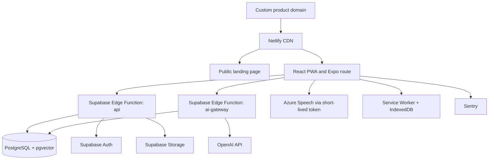
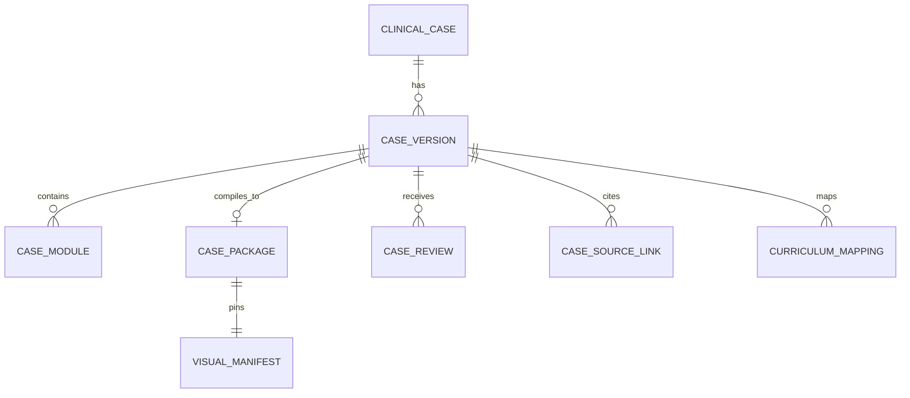
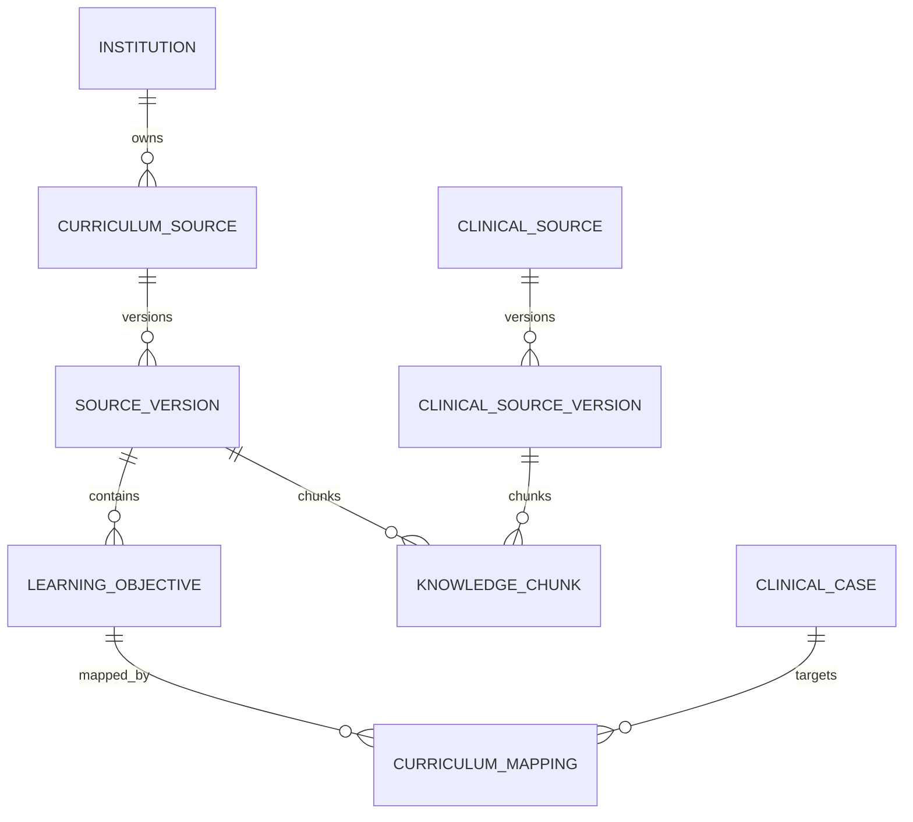
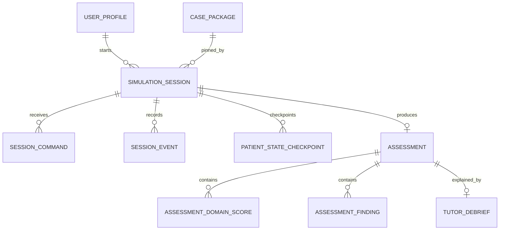
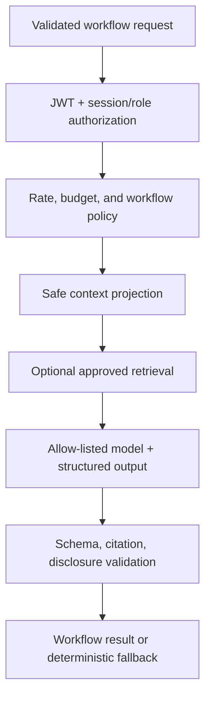
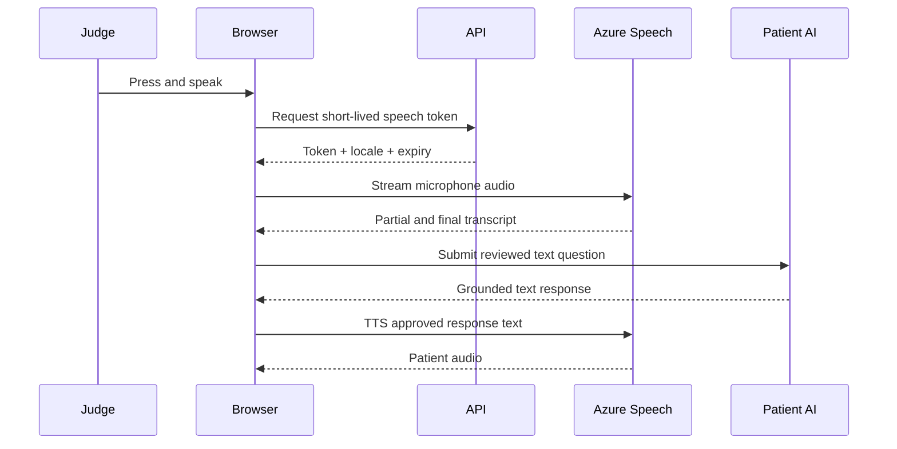
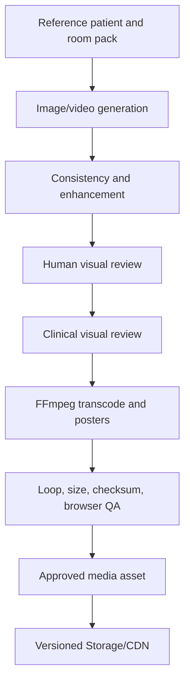
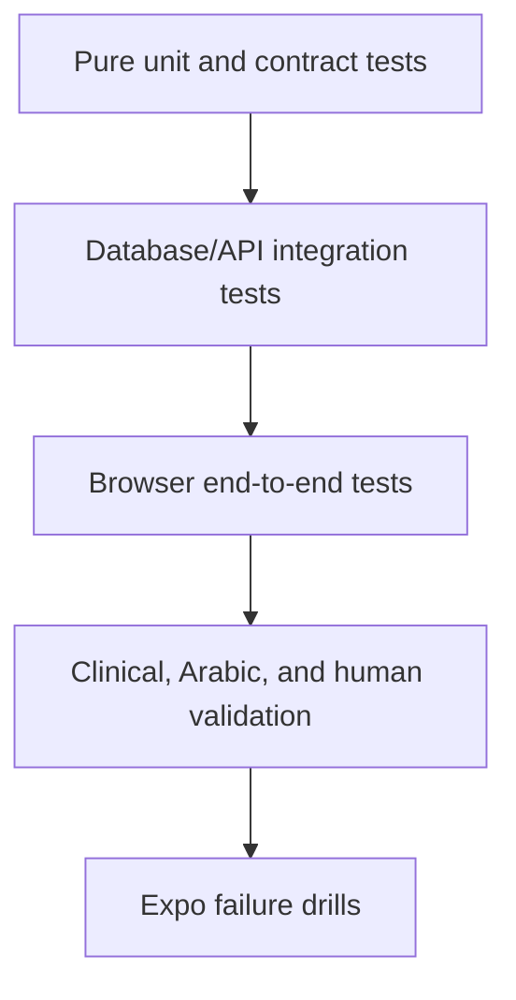

# AI Clinical Simulation Platform — Version 2

## Physical Architecture & Implementation Blueprint — K–X

**الحالة:** **PHYSICAL ARCHITECTURE FREEZE v1.0 — APPROVED**  
**التاريخ:** 29 August 2026  
**الموعد الخارجي الصلب الوحيد:** AI Expo Jordan — 4 October 2026  
**المرجع الملزم:** Logical Architecture Freeze v1.0

> لا تتضمن هذه الوثيقة أي production code، ولا تغيّر GitHub، ولا تبدأ التنفيذ. جميع أسماء `files` و`modules` الواردة لاحقًا هي حدود مقترحة لمهام Codex بعد الاعتماد.

## Change Log — Freeze v1.0

هذه النسخة تحدّث نفس وثيقة K–X المعتمدة مبدئيًا؛ لم تنشئ معمارية بديلة ولم تغيّر ownership boundaries المجمدة.

1. تم تحويل تعيين `gpt-5.6-luna` و`gpt-5.6-terra` من قرار نهائي إلى **AI Model Evaluation Gate** لكل Workflow قبل model freeze.
2. أضيف **Supabase Region Selection Gate** وADR إلزامي قبل إنشاء production project، مع benchmark من الأردن يبدأ بـ`eu-central-1` ومقارن واقعي ثانٍ.
3. أصبحت shared engine packages ملزمة بـcross-runtime portability، مع adapters ضيقة واختبار import/execute مبكر في Browser/Vite وDeno/Supabase.
4. أضيف **Expo Device Cache Warm-Up** صريح يعتمد manifest versions وchecksums، ولا يكتفي بـWorkbox automatic caching.
5. أضيف مسار صغير للـbrand/custom domain/public landing page و`/expo` route، دون إدخاله في Clinical Engine critical path.
6. أصبح **Clinical Reviewer Availability Gate — Dependency-Based**: يجب تأكيد reviewer pathway قبل final clinical approval/publication لكل playable Case Package، دون موعد داخلي ثابت.
7. تم تحديث الأقسام المتأثرة والـacceptance criteria للـ30 Task نفسها، دون زيادة عدد الـplayable cases أوتغيير Architecture أوTechnology Stack.
8. أصبح التنفيذ **Dependency-Based وQuality-Gated** بالكامل؛ أزيلت internal engineering deadlines، وبقي 4 October 2026 هو external hard deadline الوحيد، مع مرحلة نهائية إلزامية للـstabilization/rehearsal/deployment freeze بعد Feature Complete.
9. حُفظت ميزة V1 الخاصة بـ`Live Notes / Immediate Clinical Feedback` وأعيد تصميمها فوق authoritative Event Timeline وdeterministic Assessment rules، مع فصل `PRACTICE_DEMO` عن `ASSESSMENT` في توقيت إظهار feedback.

## القرارات السابقة المثبتة في هذه الوثيقة

- `Speech-to-Text` أصبح **EXPO REQUIRED** لتجربة Full V2، لكنه ليس `Critical Dependency` لأن `text input` يبقى متاحًا دائمًا.
- Faculty Expo Experience أصبح **Constrained Functional Demo** يسمح بإنشاء `NEW DRAFT CASE`، لكنه لا يسمح بـAI approval أو auto-publish أو تعديل Published Case مباشرة.
- `Student/Curriculum Validation` منفصل حوكميًا عن `Clinical Review`. الطالب قد يراجع ملاءمة التجربة والمنهج واللغة، لكنه لا يمنح Clinical approval للقواعد الطبية.
- الحالتان القابلتان للعب فقط قبل Expo هما `Acute Inferior STEMI` و`Anaphylaxis`.

## مفتاح التصنيف

- **EXPO REQUIRED:** يدخل في مسار التسليم والاختبار قبل external hard deadline.
- **EXPO OPTIONAL:** ينفذ فقط إذا لم يهدد الجودة أو جدول التجميد.
- **POST-EXPO:** الأساس يدعمه، لكن لا يدخل في نطاق البناء الحالي.

---

# K. Technology Stack Decision

## K.1 القرار التنفيذي

اعتماد **modular monolith** مكتوب بـTypeScript، مع فصل واضح إلى packages، وليس microservices:

| المجال | القرار | التصنيف |
|---|---|---|
| Frontend | `React 19.2` + `TypeScript 5.9` + `Vite 8.2` | EXPO REQUIRED |
| Routing/data | `React Router 7` + `TanStack Query 5` | EXPO REQUIRED |
| Runtime validation | `Zod 4` مع JSON Schema export | EXPO REQUIRED |
| Offline/PWA | `vite-plugin-pwa` + Workbox + `idb` + explicit Expo Device Cache Warm-Up | EXPO REQUIRED |
| Backend API | Supabase `Edge Functions` باستخدام Deno + `Hono 4` داخل وظيفتين منطقيتين | EXPO REQUIRED |
| Database | Supabase managed `PostgreSQL` | EXPO REQUIRED |
| Vector search | PostgreSQL `pgvector` + metadata filtering + PostgreSQL FTS/`pg_trgm` عند الحاجة | EXPO REQUIRED |
| Authentication | Supabase Auth: anonymous demo user + pre-created Faculty account | EXPO REQUIRED |
| Media storage | Supabase Storage/CDN مع versioned manifests وverified offline warm-up | EXPO REQUIRED |
| LLM platform | OpenAI Responses API؛ `gpt-5.6-luna` و`gpt-5.6-terra` initial candidates تخضع لـevaluation gate | EXPO REQUIRED |
| Embeddings | `text-embedding-3-large` | EXPO REQUIRED |
| STT/TTS | Azure Speech، locale `ar-JO` و`en-US` | EXPO REQUIRED |
| Frontend hosting | Netlify static deployment، Personal plan، custom product domain/Expo route | EXPO REQUIRED |
| Error monitoring | Sentry Developer + Supabase logs | EXPO REQUIRED |
| Tests | Vitest + Playwright + Supabase local CLI + GitHub Actions | EXPO REQUIRED |
| Development runtime | Node.js `24 LTS` + `npm workspaces` | EXPO REQUIRED |

React 19.2 هو الإصدار الحالي الموثق، وVite 8 مستقر منذ March 2026؛ لكن يتم pinning للـexact patch versions داخل lockfile عند بدء التنفيذ، ولا تتم upgrades بعد `deployment freeze`. [React versions](https://react.dev/versions)، [Vite 8 release](https://vite.dev/blog/announcing-vite8)، [Node.js releases](https://nodejs.org/en/about/previous-releases).

## K.2 Frontend

### Recommended choice

`React + TypeScript + Vite` كـclient-rendered SPA/PWA.

### لماذا

- V2 يحتوي على UI كثيف التفاعل: timeline، vitals، visual patient، action confirmations، Faculty forms، debrief، وحالات degraded/offline.
- React يوفر component boundaries واضحة ومناسبة لـCodex، بينما TypeScript يمنع الكثير من أخطاء العقود بين `Case Package` وengines وAPI.
- Vite ينتج static build مناسبًا لـNetlify، ولا يفرض SSR أو server framework لا يحتاجه المنتج.
- نفس TypeScript contracts يمكن مشاركتها بين Frontend وEdge Functions وoffline demo runtime.

### الأدوات المرافقة

- `React Router 7`: مسارات Student، Faculty، Expo preflight، وoffline-safe mode.
- `TanStack Query 5`: server-state fetching، retries المضبوطة، cache invalidation، وresume flows؛ وليس مصدر Patient State authoritative.
- `Zod 4`: validation للعقود، Case Schema، API requests، وAI Structured Outputs. يدعم التحويل إلى JSON Schema. [Zod JSON Schema](https://zod.dev/json-schema).
- CSS الحالي يُستخرج إلى design tokens وCSS Modules. **لا يتم إدخال Tailwind قبل Expo** لأنه يزيد migration surface دون حاجة وظيفية.
- `vite-plugin-pwa`/Workbox: service worker وapp-shell precache، لكنه ليس وحده دليلًا على جاهزية dynamic/cross-origin assets. [Vite PWA offline support](https://vite-pwa-org.netlify.app/).
- `idb`: تخزين local recovery snapshot وLevel C events وverified offline manifest state في IndexedDB.
- `Prepare Device for Offline Expo`: operator workflow ينزّل كل Level C bundles والأصول الحرجة، يتحقق من version/checksum/decode، ثم يسجل warm-up receipt للجهاز والإصدار.

### Alternatives ولماذا رفضت

| البديل | سبب الرفض قبل Expo |
|---|---|
| Next.js | SSR وserver components لا تحل مشكلة أساسية هنا، وستكرر backend boundaries بجانب Supabase Edge Functions وتزيد deployment coupling |
| Vue/Svelte | جيدة تقنيًا، لكن لا تعطي فائدة كافية تبرر تغيير ecosystem، كما أن React أوضح لـAI-assisted implementation والاختبار |
| Vanilla JS continuation | يعيد إنتاج V1 coupling ويجعل contracts والاختبارات والـFaculty workflows أصعب |
| Full UI state library مثل Redux | غير مطلوب؛ server state في TanStack Query والـephemeral UI state في Context/reducers |

### الكلفة والتعقيد والهجرة

- البرمجيات مفتوحة المصدر: `$0`.
- Migration impact متوسط: إعادة بناء الواجهة داخل `apps/web` مع نقل المحتوى وCSS تدريجيًا، وليس تحويل `er_sim_10.html` تلقائيًا.
- Expo reliability مرتفعة لأن الناتج static ويمكن تثبيته كـPWA.
- Post-Expo scalability جيدة دون ربط الواجهة بvendor معين.

## K.3 Backend/Application Architecture

### Recommended choice

Supabase Edge Functions كـserver-side `modular monolith` باستخدام `Hono`:

- `api`: Session/Clinical/Assessment/Faculty endpoints.
- `ai-gateway`: Patient AI، Interpreter، Tutor، Case Builder، وRAG orchestration.

هذا الفصل مبرر أمنيًا وتشغيليًا: تعطل `ai-gateway` لا يعطل core `api`، ويمكن وضع rate/budget controls مستقلة. لا توجد service ثالثة للـClinical Engine؛ هو package pure يستدعيه `api`.

Supabase توصي بتجميع عدة routes في Edge Function واحدة لتقليل cold starts، وتذكر Hono كخيار routing مناسب. [Supabase routing](https://supabase.com/docs/guides/functions/routing)، [Supabase Edge Functions](https://supabase.com/docs/guides/functions).

### لماذا

- أقل عدد منصات: database، auth، storage، Edge Functions، وpgvector في مشروع واحد.
- TypeScript end-to-end يسهّل عمل Founder + Codex.
- لا توجد خوادم دائمة أو container operations قبل Expo.
- الحدود تبقى قابلة للنقل لاحقًا لأن engines لا تعتمد على Supabase SDK داخليًا؛ adapters فقط تعتمد عليه.

### Alternatives ولماذا رفضت

| البديل | القرار |
|---|---|
| Netlify Functions | ممكن، لكنه يضيف backend runtime منفصلًا بينما البيانات/auth/storage في Supabase |
| Cloudflare Workers + Supabase | قوي، لكنه يضيف provider وحدود deployment وسياسة secrets ثانية دون قيمة Expo كافية |
| Firebase | document-first model أقل ملاءمة للـappend-only events، version relations، approvals، وRAG metadata من PostgreSQL |
| Dedicated Node server | يعطي تحكمًا أكبر لكنه يحتاج hosting/patching/uptime work غير مبرر الآن |
| Microservices | مرفوض؛ يزيد network failure والتشغيل والـobservability دون حجم يبرره |

### الكلفة والحدود

Supabase Pro يبدأ من `$25/month` ويشمل 8 GB database، 100 GB storage، و250 GB egress، مع أول Micro compute داخل الخطة. Edge Functions تتضمن 2M invocations في Pro ثم `$2/M`. [Supabase pricing](https://supabase.com/pricing)، [Edge Functions pricing](https://supabase.com/docs/guides/functions/pricing).

يجب ألا تنفذ Edge Functions CPU-heavy transcoding أو PDF processing؛ حد CPU المستضاف منخفض، لذا media processing يتم offline قبل upload. [Edge Functions limits](https://supabase.com/docs/guides/functions/limits).

### Supabase Region Selection Gate

قائمة Supabase الحالية لا تعرض Middle East-specific project region ضمن الخيارات العادية؛ لذلك لا يُنشأ production Supabase project قبل قياس latency من الأردن وتوثيق القرار في ADR:

1. يبدأ benchmark بـ`eu-central-1` — Frankfurt.
2. يقارن candidate واقعيًا ثانيًا من القائمة المتاحة، مبدئيًا `eu-west-2` — London أو`ap-south-1` — Mumbai، ويُحسم candidate الثاني وفق routes الفعلية وقت القياس.
3. يقيس من شبكة Expo محتملة وشبكة هاتف احتياطية: database/API round trip، `startSession`، atomic action commit، resume، Storage manifest، وAI Gateway overhead.
4. يسجل median وp95 عبر عدد كافٍ من المحاولات، وليس ping واحدًا.
5. يختار المنطقة الأقرب للأداء الفعلي مع أولوية للـdatabase-intensive core path، لا للاسم الجغرافي فقط.

كل Supabase project يعيش في primary region واحدة، وتغيير region لاحقًا يعني migration إلى project جديد. كما توضح Supabase أن Edge Functions تعمل افتراضيًا قرب caller، لكن database/storage-intensive functions تستفيد غالبًا من التنفيذ في منطقة database. لذلك يستدعي `api` في database region مبدئيًا، ولا يُترك default edge placement إذا كان يسبب `Edge → remote DB` round trips. [Supabase regions](https://supabase.com/docs/guides/platform/regions)، [Regional invocation](https://supabase.com/docs/guides/functions/regional-invocation)، [Supabase project migration](https://supabase.com/docs/guides/platform/migrating-within-supabase).

**Gate output:** `ADR-REGION-001` يتضمن candidates، measurement script/version، networks، raw summary، selected region، function invocation policy، ومتى يعاد القياس. هذا Gate يمنع إنشاء production project وبدء V2-011 production migrations، لكنه **لا يمنع V2-001** أوlocal Supabase development.

## K.4 Database, Auth, Storage, and Vector Search

### Recommended choice

Supabase PostgreSQL مع:

- SQL transactions وrow locking للـatomic session commit.
- RLS لكل exposed table.
- JSONB للـimmutable compiled Case Package وevent payloads.
- normalized relational tables للcatalogue، curriculum، provenance، approvals، وsessions.
- `pgvector` للknowledge chunks. [Supabase pgvector](https://supabase.com/docs/guides/database/extensions/pgvector).
- Supabase Auth anonymous sign-in للStudent Expo demo، وemail/password أو Magic Link لحساب Faculty معد مسبقًا. Anonymous users يحصلون على user ID/JWT دون PII ويمكن تمييزهم بـ`is_anonymous`. [Anonymous sign-ins](https://supabase.com/docs/guides/auth/auth-anonymous).
- Supabase Storage bucket عام للapproved runtime media، وprivate/admin bucket للmasters أوdraft assets إن احتجنا.

### لماذا ليس Pinecone أو Vector Database منفصلًا

الحجم قبل Expo صغير، والفلاتر المؤسسية والإصدارات والعلاقات أهم من extreme vector scale. فصل Pinecone يضيف credentials، synchronization، تكلفة، وفشلًا إضافيًا. `pgvector` يبقي provenance والfilters والchunks في database واحدة.

### Expo reliability

- Pro plan يمنع الاعتماد على free-tier behavior في أهم شهر.
- Critical media وfallback bundles تُخزّن أيضًا في PWA cache؛ Storage/CDN ليس single point of failure أثناء العرض.
- Faculty draft writes تمر فقط عبر server API، وليس direct client table mutation.

### Post-Expo

يبقى PostgreSQL مناسبًا للـinstitutional SaaS. الانتقال إلى vector service مستقل لا يحدث إلا إذا أثبتت القياسات أن حجم corpus أوlatency تجاوز pgvector، وليس مسبقًا.

## K.5 AI Provider and Model Strategy

### Recommended choice

OpenAI Responses API هو LLM platform المعتمد، مع model allow-list وworkflow-specific evaluation. `gpt-5.6-luna` و`gpt-5.6-terra` هما **initial candidates** وليسا assignment نهائيًا قبل Gate:

| Workflow | Initial candidates | الإعداد المبدئي للاختبار، لا production freeze |
|---|---|---|
| Patient Conversation | Luna مقابل Terra | compare `reasoning.effort` مناسب، latency، grounding، natural Arabic، Structured Output |
| Clinical Language Interpreter | Luna مقابل Terra | strict schema، compare low/appropriate reasoning effort، no execution tools |
| Assessment narrative + Tutor | Terra baseline؛ Luna comparator إذا الوقت يسمح | citations required، evidence-bound narrative |
| AI Case Builder | Terra baseline؛ Luna comparator إذا الوقت يسمح | asynchronous-feeling request، strict Draft schema |
| Embeddings | `text-embedding-3-large` | offline ingestion + query embeddings |

`gpt-5.6-luna` يدعم function calling وStructured Outputs بسعر رسمي `$0.20/M input` و`$1.20/M output`، و`gpt-5.6-terra` بسعر `$2/M input` و`$12/M output`. [Luna model](https://developers.openai.com/api/docs/models/gpt-5.6-luna)، [Terra model](https://developers.openai.com/api/docs/models/gpt-5.6-terra). Structured Outputs يفرض JSON Schema بدل الاكتفاء بـJSON صالح شكليًا. [Structured Outputs](https://developers.openai.com/api/docs/guides/structured-outputs).

### لماذا OpenAI هنا

- strict Structured Outputs مفيدة مباشرة للInterpreter وPatient fact references وTutor citations وCase Builder.
- Luna يقدم كلفة وlatency منخفضتين، لكن اختياره لا يتم على الكلفة وحدها.
- provider واحد للLLM والembeddings يقلل التكاملات.
- لا حاجة إلى fine-tuning أو agent platform.

### لماذا لم نعتمد Anthropic رغم V1

Claude يبقى بديلًا قويًا، ويمكن إعادة استخدام أفكار prompts من V1، لكنه لا يقدم ميزة حاسمة تبرر إبقاء provider ثانٍ في Expo. V1 Worker نفسه لا يعاد استخدامه بسبب security flaws. لا يضاف provider آخر إلا إذا أثبت evaluation وجود blocker حقيقي لا يعالجه Luna أوTerra؛ ويتطلب ذلك ADR واختبارات failure/fallback جديدة.

### AI Model Evaluation Gate

يجب أن يكتمل قبل تثبيت model map في production:

#### Patient Conversation evaluation

- dataset ممثل للحالتين وبالذات natural Jordanian Arabic، ويشمل paraphrases، emotional tone، distress، code-switching، hidden-fact probes، diagnosis traps، irrelevant questions، وتتابع conversation.
- مقارنة Luna وTerra على: naturalness، clinical grounding، hidden-fact leakage، instruction adherence، consistency، structured-output compliance، median/p95 latency، token usage/cost.
- **release threshold:** zero known hidden-fact leakage في release set، 100% schema-valid after at most one bounded repair، ولا diagnosis/rubric leak؛ natural Arabic وgrounding يمران human review.

#### Clinical Language Interpreter evaluation

- dataset لا يقل عن 50 utterances عربية/إنجليزية/code-switched ويغطي single/multi-intent، missing dose/route، negation، ambiguity، correction، unknown action، وparameter conflicts.
- مقارنة Luna وTerra على intent accuracy، per-intent precision/recall، missing-parameter detection، negation، ambiguity handling، schema reliability، median/p95 latency، والتكلفة.
- **release threshold:** unknown action IDs rejected 100%، consequential ambiguity never reaches execution، وstructured output يمر schema؛ exact accuracy threshold يثبت في evaluation plan قبل تشغيل النتائج لتجنب تحريك الهدف.

#### Selection rule

- إذا حقق Luna thresholds دون material quality gap، يعتمد لكفاءته.
- إذا قدم Terra تحسنًا ماديًا، خصوصًا في natural Jordanian Arabic أوgrounding، يسمح به للWorkflow المعني رغم ارتفاع التكلفة.
- يمكن أن ينتهي كل Workflow بـmodel مختلف؛ لا يوجد سبب لفرض model واحد على الجميع.
- `reasoning.effort`، prompt version، schema version، context projection، وtimeout تُعامل كجزء من candidate configuration وتقارن معًا.
- لا تُبنى deterministic guarantees حول `temperature`. الضمان يأتي من strict Structured Outputs، schema validation، application validation، tool allow-lists، prompt/model versioning، وevaluation suites. OpenAI توصي بضبط `reasoning.effort` حسب workload وقياس trade-off بدل افتراض إعداد واحد. [OpenAI reasoning guide](https://developers.openai.com/api/docs/guides/reasoning)، [Model guidance](https://developers.openai.com/api/docs/guides/latest-model).

### Expo model freeze

- يمر Patient/Interpreter عبر **AI Model Evaluation Gate** قبل اعتماد أي production model map أوإغلاق V2-019؛ وتثبت final model IDs/configs وprompt hashes قبل Feature Complete.
- يسجل `ADR-AI-MODEL-001` results، thresholds، chosen model/config لكل Workflow، latency/cost، fallback، وأسباب رفض alternatives.
- لا تبديل model alias بعد freeze دون إعادة تشغيل golden AI evals.
- لا automatic cross-provider failover؛ fallback deterministic أكثر قابلية للتوقع من نموذج غير مختبر.

## K.6 Speech-to-Text and Text-to-Speech

### Recommended choice

Azure Speech يبقى evaluation-gated voice provider وفق الفصل التالي:

- **Development/evaluation:** يمكن استخدام Azure Speech `F0` حيث يكون متاحًا.
- **Expo/production voice path بعد Voice Evaluation Gate:** يستخدم Azure Speech `S0 PAYG` إذا بقي Azure هو provider المختار.

- STT locale: `ar-JO` أو `en-US` حسب session language.
- TTS voices: `ar-JO-TaimNeural` أو `ar-JO-SanaNeural` حسب patient profile، وصوت English مناسب للحالة.
- Browser Speech SDK باستخدام short-lived authorization token صادر عن Backend؛ لا يوضع Azure key في browser.

Azure يوثق دعم `ar-JO` في STT ووجود الصوتين الأردنيين المذكورين في TTS. [Azure language and voice support](https://learn.microsoft.com/en-us/azure/ai-services/speech-service/language-support). حصتا 5 STT audio hours/month و0.5M TTS characters/month هما **F0 free-tier quotas فقط** وليستا S0 free allowance. إذا اجتاز Azure الـGate، ينشأ `S0 PAYG` production resource مع budget alerts. [Azure Speech pricing](https://azure.microsoft.com/en-us/pricing/details/speech/).

### Alternatives

| البديل | النتيجة |
|---|---|
| OpenAI `gpt-transcribe` + `gpt-4o-mini-tts` | أبسط provider count، وسعر STT منخفض، لكنه لا يعطي ميزة موثقة مثل locale/voices `ar-JO`; يبقى fallback decision إذا فشل Azure evaluation |
| Google Cloud STT Chirp 3 | يدعم `ar-JO`، لكنه يضيف Google Cloud وTTS provider decision جديدًا دون تفوق مثبت لدينا |
| Deepgram Nova-3 Arabic | يدعم Jordanian Arabic، لكن TTS لا يدعم Arabic حاليًا وفق وثائقه، فيقسم voice stack |
| Browser Web Speech API | غير متسق بين browsers ولا يعطي reliability أوcontrol كافيين للExpo |

### قرار التحقق

Azure هو الاختيار، لكنه مشروط باجتياز اختبار 50 utterances أردنية واقعية قبل إغلاق V2-020 واعتماد voice path للExpo. إذا لم يحقق threshold الدلالي والlatency، يصدر ADR للتحول إلى OpenAI `gpt-transcribe`. لا نبني providerين كاملين بالتوازي.

## K.7 Hosting, Monitoring, and Testing

### Frontend hosting

Netlify Personal خلال build-to-Expo وExpo operations:

- يحافظ على familiarity وmigration منخفضة من V1.
- Vite ينتج static build مباشرًا.
- V1 يبقى deployment منفصلًا.
- Netlify Free الحالي يمنح 300 credits، بينما Personal `$9/month` يمنح 1,000 credits؛ bandwidth يستهلك credits، لذلك Media الثقيلة تذهب إلى Supabase Storage ويُستخدم Netlify للapp shell. [Netlify pricing](https://docs.netlify.com/manage/accounts-and-billing/billing/billing-for-credit-based-plans/credit-based-pricing-plans/)، [credit usage](https://docs.netlify.com/manage/accounts-and-billing/billing/billing-for-credit-based-plans/how-credits-work/).

### Brand, domain, and public product surface

**EXPO REQUIRED، خارج Clinical Engine critical path:**

- اختيار product brand وشراء custom domain كمسار موازٍ لـV2-001؛ لا يمنع بدءه، لكنه يجب أن يمر قبل إغلاق public surface وfinal QR/custom-domain release criteria.
- preferred routing:
  - `brand-domain.com` → lightweight public landing page.
  - `app.brand-domain.com` → V2 platform.
  - `app.brand-domain.com/expo` → frictionless Expo Demo.
- إذا تسبب فصل apex/subdomain في deployment أوCORS risk، يسمح بـsingle Netlify site/domain مع `/app` و`/expo` routes؛ credibility وstable QR أهم من topology المثالي.
- landing page تعرض: product proposition، visual/adaptive/curriculum pillars، institutional value، educational-only boundary، pilot/contact interest، وQR destination.
- لا تستدعي Clinical API عند landing page load، ولا تحتوي hidden case data، ولا تصبح dependency لبدء session.
- V1 يحتفظ بعنوانه الحالي كemergency fallback، لكنه لا يكون public primary product URL.

Netlify يدعم custom domains وsubdomains مع automatic SSL؛ القرار النهائي للrouting يسجل مع DNS/CORS/preflight checklist. [Netlify custom domains](https://docs.netlify.com/manage/domains/get-started-with-domains/)، [Domain fundamentals](https://docs.netlify.com/manage/domains/domains-fundamentals/understand-domains/).

### Monitoring

- Sentry Developer: Frontend errors، performance spans المختارة، release tags، وsource maps. الخطة المجانية متاحة دون اشتراك شهري. [Sentry pricing](https://sentry.io/pricing/).
- Supabase logs: Edge Function وdatabase operational logs.
- Domain audit tables: `session_events` و`ai_workflow_runs` و`case_reviews`؛ ليست بديلًا عن Sentry، وليست raw debug dump.

### Testing

- `Vitest`: unit، contract، engine، validator، scoring، visual resolver.
- `Playwright`: browser E2E، refresh/recovery، failure injection، Arabic/English UI، Expo routes.
- Supabase CLI/local Postgres: migrations، RLS، RPC/transaction integration tests.
- GitHub Actions: lint، typecheck، unit، package validation، وPlaywright smoke.

Vitest يتكامل مباشرة مع Vite، وPlaywright يدعم Chromium/Firefox/WebKit من TypeScript. [Vitest](https://vitest.dev/)، [Playwright](https://playwright.dev/).

## K.8 ملخص الرفض الواعي

لن نستخدم قبل Expo:

- Next.js أوSSR.
- microservices أوmessage broker.
- Pinecone أوknowledge graph.
- Redux أوXState كطبقة عامة.
- live generative video.
- autonomous agent framework.
- LangChain/LlamaIndex في runtime؛ retrieval logic الصغير أوضح إذا كتب مباشرة.
- Kubernetes،Docker production platform،أوself-hosted database.

---

# L. Physical System Architecture

## L.1 القرار

V2 عبارة عن static PWA + managed backend modular monolith. الـnormal operating mode server-authoritative. Level C فقط يسمح بتشغيل نفس pure engines محليًا مع demo package محدود.



## L.2 Physical boundaries

| Component | Physical location in Full V2 | ملاحظات |
|---|---|---|
| Public Product Surface | Netlify static route/site | landing، QR، pilot/contact؛ لا Clinical API dependency |
| Student UI | Browser/PWA | English clinical UI، Arabic/English patient input/output، وعرض mode-aware deterministic feedback دون إصدار حكم سريري client-side |
| Faculty UI | نفس PWA، protected routes | Draft-only permissions للحساب التجريبي |
| Session Engine | `api` Edge Function + Level C adapter لنفس core | lifecycle، clock، idempotency، commit orchestration |
| Clinical Engine | cross-runtime pure package؛ server-authoritative في Full V2 | لا network/runtime dependency؛ يستخدم Case Package pinned |
| Assessment Engine | cross-runtime pure package؛ server-authoritative في Full V2 | final/continuous scores و`FeedbackFinding` projections من committed events/rubric evidence؛ يحدد reveal policy حسب session mode |
| Visual Engine | cross-runtime pure resolver + Browser playback adapter | resolver pure فوق read-only visual projection |
| AI Orchestrator | `ai-gateway` Edge Function | workflow routing، safe context، prompts، provider calls |
| Secure AI Gateway | نفس `ai-gateway` boundary | JWT، validation، rate/budget controls، model allow-list |
| RAG retrieval | server-side داخل `ai-gateway`/database RPC | لا direct browser vector search |
| Database | Supabase PostgreSQL | authoritative persistence |
| Media/CDN | Supabase Storage + verified device cache | critical demo media warm-up by manifest/checksum |
| Speech | Browser SDK إلى Azure باستخدام ephemeral token | mic/audio remain presentation input/output |
| Logging | Sentry + Supabase logs + domain audit tables | correlation IDs end-to-end |
| Authentication | Supabase Auth | anonymous demo + Faculty account |

### Live Notes / Immediate Clinical Feedback ownership

يحافظ V2 على السلوك التعليمي المفيد في V1، لكن مصدره يصبح authoritative بدل UI heuristics:

- **Assessment Engine OWNS:** مطابقة committed events مع pinned rubric، إنتاج deterministic `FeedbackFinding`، ربط كل finding بـevent/rule evidence، وتطبيق reveal policy المثبتة في session mode.
- **Assessment Engine DOES NOT OWN:** Clinical Action execution، Patient State، event commit، UI rendering، أوAI narrative.
- **`PRACTICE_DEMO`:** يمكن إظهار `CORRECT_ACTION`, `UNSAFE_ACTION`, `IMPORTANT_DELAY`, و`MISSED_OPPORTUNITY` أثناء الحالة فقط عندما تسمح `pedagogical_reveal_policy` بذلك.
- **`ASSESSMENT`:** يسجل findings والأدلة نفسها، لكنه يحجب أثناء الحالة ما يكشف صحة القرار أوالإجابة؛ تصبح المجموعة الكاملة مرئية بعد `SIMULATION_ENDED`.
- **Student UI:** يعرض projection كما استلمها ولا يعيد تصنيف action.
- **AI Tutor/Assessment narrative:** قد يشرح finding موجودًا ويخصص لغته، لكنه لا ينشئ correctness finding ولا يغيره أويلغي score/evidence.

وبذلك تعطي timeline نفسها النتيجة والأدلة نفسها في الوضعين؛ الاختلاف الوحيد هو **وقت الكشف للمتعلم**.

## L.3 ما يعمل client-side

**EXPO REQUIRED:**

- React rendering، navigation، forms، action confirmation UX.
- microphone capture، STT partial transcript display، audio playback، mute/replay.
- Visual Resolver وmedia playback/preload/fallback.
- vitals/monitor rendering من server projection.
- عرض `Live Notes / Immediate Clinical Feedback` من read-only Assessment projection فقط: في `PRACTICE_DEMO` تظهر findings المسموح بها، وفي `ASSESSMENT` تُحجب correctness-revealing findings حتى نهاية simulation.
- Service Worker، Cache Storage، وIndexedDB recovery cache.
- Level C local Session/Clinical/Assessment adapters باستخدام **نفس packages** ولكن مع Case Package محدود ومثبت.
- protected Expo Preflight control باسم `Prepare Device for Offline Expo` ينفذ warm-up ويتحقق من completeness بدل افتراض وجود cache.

لا يعتبر client cache authoritative في Full V2؛ هو read projection وrecovery aid.

## L.4 ما يعمل server-side

- Full V2 authoritative Session Engine وClinical Engine وAssessment Engine؛ Assessment Engine يولد score/findings وvisibility eligibility deterministically من committed events وpinned rubric.
- كل action validation/execution/clinical effect.
- hidden Case Ground Truth وpublished Case Packages الكاملة.
- append-only event persistence وatomic state checkpoint commit.
- Faculty draft writes، review، approval، publish controls.
- AI prompts، provider credentials، safe context construction، RAG filtering، citation verification.
- rate limits، budget limits، AI logs، source rights/provenance controls.

## L.5 ما يجب ألا يعمل client-side

- OpenAI/Azure/Supabase secret or service-role keys.
- public endpoint يقبل arbitrary prompt أوmodel name.
- clinical action execution أوdatabase event insertion من UI مباشرة.
- أي client-side أوLLM judgment يقرر أن action صحيح/خاطئ أوينشئ `FeedbackFinding` دون deterministic rubric/event evidence.
- approval/publish logic.
- unpublished clinical source content أوreviewer-private data.
- Full commercial hidden Case Package في graded institutional mode.

### Level C exception

Level C يتضمن demo Case Package قابلًا للفحص تقنيًا داخل browser cache. هذا مقبول فقط كـExpo fallback غير مخصص للامتحانات أوgraded use. Post-Expo offline institutional mode يحتاج signed encrypted distribution أوlocal trusted server، وليس مجرد browser bundle.

## L.6 Network dependency matrix

| Capability | Network في Full V2 | Degraded behavior |
|---|---|---|
| Core simulation | نعم إلى `api` | ينتقل إلى local Level C عند API outage |
| Patient AI | نعم | deterministic answer templates |
| Interpreter | نعم | manual catalogue + deterministic aliases |
| Tutor | نعم | deterministic evidence + cached template debrief |
| RAG | نعم | pinned context bundle |
| STT/TTS | نعم | text input/output + cached common audio |
| Visuals | first preload فقط | cached clips أوposters |
| Assessment وLive Feedback | server في A/B، local في C | deterministic في كل المستويات؛ Practice/Demo يكشف eligible findings، Assessment يؤجل correctness feedback حتى النهاية |
| Faculty draft | نعم | غير متاح offline؛ لا يؤثر على Hero Demo |

## L.7 Cross-runtime portability contract

الحزم التالية يجب أن تكون قابلة للاستيراد والتنفيذ دون تعديل في Browser/Vite وDeno/Supabase:

- `contracts`
- `case-schema` حيث ينطبق runtime validation/compilation
- `clinical-engine`
- `session-engine/core`
- `assessment-engine`
- `visual-engine/resolver`

ممنوع داخل هذه الحزم الاعتماد المباشر على Node-only APIs، Deno-only APIs، browser-only APIs، filesystem، `process` globals، `window`، `localStorage`، أوprovider SDK behavior. أي اختلاف بيئي يمر عبر interfaces ضيقة تُحقن من الخارج، مثل:

- `ClockAdapter`
- `PersistenceAdapter`
- `StorageAdapter`
- `LoggerAdapter`
- `RandomSeedAdapter`
- `HashAdapter`/`CryptoAdapter` عند الحاجة

تستخدم Web-standard APIs عندما تكون portable وآمنة، لكن لا يُفترض وجودها دون test. Database transactions، IndexedDB، Supabase SDK، Sentry، file access، وprovider clients تبقى في adapters/apps لا core packages.

### Early Cross-Runtime Compatibility Gate

خلال V2-001/V2-002، وقبل كتابة substantial engine logic، يجب أن يقوم minimal package واحد على الأقل بـ:

1. import + execute في Vitest/Vite browser environment.
2. import + execute في Deno/Supabase Edge test.
3. إنتاج نفس serialized output لنفس fixture/seed/clock.
4. اجتياز static import guard يمنع runtime-specific imports في portable packages.

فشل هذا Gate يمنع V2-003 وما بعده من بناء engine logic فوق boundary غير محمول.

## L.8 Proposed workspace boundaries

هذه أسماء مستقبلية للbacklog فقط:

```text
v2/
  apps/
    web/
  packages/
    contracts/
    case-schema/
    clinical-engine/
    session-engine/
    assessment-engine/
    visual-engine/
    demo-runtime/
    runtime-adapters/
  content/
    cases/stemi/
    cases/anaphylaxis/
    knowledge/clinical/
    knowledge/curriculum/ju/
    knowledge/curriculum/just/
  supabase/
    migrations/
    functions/api/
    functions/ai-gateway/
  tests/
    fixtures/
    integration/
    e2e/
```

V1 يبقى خارج `v2/` دون نقل أو حذف.

## L.9 Expo مقابل Post-Expo

- **Expo:** single Supabase production project بعد Region Gate، single Netlify product surface لـV2، custom domain، two Edge Functions، one storage project، no tenant isolation beyond basic institution metadata/RLS.
- **Post-Expo:** staging/production projects، tenant-aware RLS، institution roles، private curriculum buckets، background ingestion، وربما regional deployment إذا طلب pilot ذلك.

---

# M. Database / Persistence Design

## M.1 القرار

استخدام PostgreSQL relational core مع JSONB للversioned payloads. الـdraft content قابل للتعديل، لكن `case_packages` المنشورة و`session_events` immutable.

## M.2 Case and governance model



### Expo minimum tables

| Table | الغرض والحقول الجوهرية |
|---|---|
| `clinical_cases` | stable identity: `case_id`, slug، title، topic، owner، created_at |
| `case_versions` | `case_version_id`, semantic version، lifecycle status، difficulty، target level، draft revision، created_by |
| `case_modules` | module type، `content_jsonb`, schema version، content hash، draft version؛ modules قابلة للتعديل فقط قبل publish |
| `case_packages` | immutable compiled payload، package hash، exact module hashes، published_at، package schema version |
| `case_reviews` | `review_type`, reviewer reference، status، notes، date؛ يفصل CLINICAL عن CURRICULUM_UX وVISUAL وTECHNICAL |
| `case_approvals` | approval scope، approver role، approved version/hash، date؛ Clinical approval يتطلب appropriate clinician |
| `case_source_links` | case/rule/rubric item إلى exact clinical source version/locator |
| `visual_manifests` | immutable manifest version وfallback coverage status |
| `media_assets` | asset identity، version، path، checksum، format، approval/rights metadata |

### Governance rule

- `STUDENT_CURRICULUM_VALIDATION` يمكن أن يؤكد language/course/year/UX/mapping clarity.
- `CLINICAL_REVIEW` فقط يؤكد medication rules، clinical facts، transitions، contraindications، scoring، وoutcomes.
- الانتقال إلى `APPROVED` يتطلب clinical approval مكتملًا.
- `PUBLISHED` يتطلب approved package hash وtechnical validation وvisual fallback coverage.
- Published version لا يعدّل؛ أي تغيير ينشئ `case_version` جديدًا.

## M.3 Curriculum and clinical knowledge model



| Table | Expo purpose |
|---|---|
| `institutions` | `institution_id: ju`, `institution_code: JU`, `institution_name: University of Jordan`؛ و`institution_id: just`, `institution_code: JUST`, `institution_name: Jordan University of Science and Technology` |
| `curriculum_sources` / `curriculum_source_versions` | source ownership، rights، URL، checksum، version، approval |
| `learning_objectives` | objective text، official identifier إن وجد، program/year/course/topic/competency metadata |
| `clinical_sources` / `clinical_source_versions` | guideline/reference identity، jurisdiction، effective dates، clinical review |
| `knowledge_chunks` | chunk text، embedding، source version، locator، trust layer، filters، checksum |
| `curriculum_mappings` | internal competency ↔ objective، relation type، human-review status، reviewer/date |
| `retrieval_bundles` | pinned approved fallback set لكل case/institution/language |

## M.4 Session/event model



| Table | أهم الحقول/القيود |
|---|---|
| `profiles` | auth user ref، display alias، role؛ no unnecessary PII |
| `simulation_sessions` | pinned `case_package_id`, `mode` (`PRACTICE_DEMO` أو`ASSESSMENT`)، status، clinical clock anchor، `time_ratio`, seed، `current_state_version`, `last_sequence_no`, institution context؛ mode يثبت عند start ولا يتغير أثناء session |
| `session_commands` | command ID، idempotency key، request hash، expected state version، status، result event range، unique `(session_id,idempotency_key)` |
| `session_events` | UUID، sequence، clinical/real time، actor، event type، action/rule refs، payload، state before/after، correlation/causation؛ append-only |
| `patient_state_checkpoints` | state version، last event sequence، state JSONB، scheduled effects، hash؛ immutable rows، latest pointer في session |
| `assessments` | rubric/package refs، deterministic total، finalization status، evidence hash |
| `assessment_domain_scores` | six domains، score، max، evidence event IDs، penalties/caps |
| `assessment_findings` | deterministic `finding_type` (`CORRECT_ACTION`, `UNSAFE_ACTION`, `IMPORTANT_DELAY`, `MISSED_OPPORTUNITY`)، rubric/rule ref، evidence event IDs/times، severity، pedagogical reveal policy، final/continuous status؛ لا يقبل LLM-authored correctness |
| `tutor_debriefs` | language، deterministic evidence packet ref، prompt/model version، citations، fallback flag |
| `ai_workflow_runs` | workflow، prompt/model، status، latency، token usage، estimated cost، source IDs، fallback/error؛ no provider secret/raw audio |

## M.5 Atomic session commit

العملية المطلوبة ليست direct table inserts من browser. المسار:

1. `api` يقرأ session + latest checkpoint/version.
2. Clinical Engine يحسب proposed event batch وnext state بشكل pure.
3. Database RPC يبدأ transaction ويعمل row lock على `simulation_sessions`.
4. يتحقق من `expected_state_version` و`idempotency_key`.
5. إذا كان command سابقًا يعيد committed result دون تكرار.
6. إذا تغيرت state يعيد `409 STATE_VERSION_CONFLICT`؛ `api` يعيد القراءة والحساب مرة واحدة.
7. يضيف command/events/checkpoint ويحدث session pointer في transaction واحدة.
8. commit أو rollback كامل.

لا يدخل LLM داخل transaction. لا يحجز database lock أثناء انتظار network call.

## M.6 Timing and scheduled effects persistence

- Session يخزن `clinical_time_anchor`, `real_time_anchor`, `time_ratio`, pause intervals.
- Scheduled effects تخزن داخل authoritative checkpoint ومع event references، ويمكن أيضًا إسقاطها في `scheduled_effects` table إذا احتاجت querying؛ **Expo minimum يبقيها داخل checkpoint** لتقليل الجداول.
- كل `syncSession` أوclinical command يطلب من Clinical Engine معالجة due effects حتى trusted server clinical time.
- Browser يعرض interpolation للvitals بين server syncs، لكن transitions authoritative تأتي من server.

## M.7 Immutability enforcement

- RLS/grants تمنع direct writes إلى `session_events` و`case_packages` من client.
- database triggers تمنع UPDATE/DELETE على published packages وcommitted events في Expo production.
- correction event يستخدم `supersedes_event_id`; لا يعدّل الحدث القديم.
- `package_hash` وmodule hashes تتحقق عند startSession.
- session pins package، visual manifest، rubric، retrieval bundle، وprompt-policy version.

## M.8 Expo minimum مقابل Post-Expo

### Expo minimum

- production database لا يُنشأ قبل `ADR-REGION-001`؛ local Supabase يبقى development baseline حتى Gate.
- JU/JUST metadata فقط، no tenant hierarchy.
- anonymous student sessions وone Faculty demo account.
- two published cases + draft cases.
- checkpoints عند كل clinical commit وعند intervals محددة.
- one approved curriculum subset per institution.

### Post-Expo

- `organizations`, campuses، departments، cohorts، assignments، attempts، enrollments، faculty memberships، SSO، retention policies، research-consent flags، mastery profiles.
- private institution corpora مع tenant-scoped RLS.
- case collaboration، comments، review assignments، version diffs، retention/audit export.

---

# N. API Contracts

## N.1 القرار

الـpublic browser API صغير ومقصود. Internal engine calls ليست HTTP endpoints. خصوصًا:

- `executeAction` **ليس endpoint عامًا**؛ هو internal call من Session Engine إلى Clinical Engine.
- `resolveVisualState` pure client function؛ لا يحتاج network.
- `retrieveCurriculumContext` و`retrieveClinicalEvidence` server-internal tools داخل AI Gateway.
- Browser لا يكتب `session_events` أو`patient_state_checkpoints` مباشرة.

جميع requests/responses تمر عبر shared Zod contracts، وتحمل `request_id` وAPI schema version.

## N.2 Session and state boundaries

| Boundary | الشكل الفيزيائي | Caller → Owner | Input | Output/Authority | Failure behavior | Idempotency |
|---|---|---|---|---|---|---|
| `startSession` | `POST /v1/sessions` | Student UI → Session Engine | `case_id`, institution context، `patient_language: ar-JO / en-US`، `mode: PRACTICE_DEMO / ASSESSMENT`، client capabilities | session ID/token، pinned versions، initial projection، visual preload manifest؛ ينشئ authoritative session ويثبت mode | `404 CASE_NOT_FOUND`, `409 CASE_NOT_PUBLISHED`, `503 CORE_UNAVAILABLE`; يعرض Level C option | Required عبر `Idempotency-Key` |
| `resumeSession` | `POST /v1/sessions/{id}/resume` | UI → Session Engine | session token، last seen sequence/state version | current state، events since sequence، clock status، recovery instructions | `401/403`, `410 SESSION_EXPIRED`, `409 SESSION_ENDED`; local checkpoint fallback | Required لعملية resume request |
| `syncSession` | `POST /v1/sessions/{id}/sync` | UI timer/action flow → Session Engine | last sequence، client time telemetry فقط | due events، authoritative state projection، next sync hint | timeout يحافظ على آخر projection ويظهر reconnect؛ بعد threshold يعرض Level C restart | Required؛ key per sync window |
| `getPatientState` | `GET /v1/sessions/{id}/state` | UI → Session Engine | session auth، optional expected version | read-only safe state projection + observations | stale response labeled; لا client mutation | لا، safe GET |
| `getSessionTimeline` | `GET /v1/sessions/{id}/events?after=` | UI/Faculty → Session Engine | after sequence، limit | ordered authorized events | pagination؛ لا يفترض gap-free إلا بعد sequence check | لا |

## N.3 Conversation and voice boundaries

| Boundary | الشكل الفيزيائي | Caller → Owner | Input | Output/Authority | Failure behavior | Idempotency |
|---|---|---|---|---|---|---|
| `getSpeechToken` | `POST /v1/voice/token` | UI → API | session ID، requested locale، capability | short-lived Azure token/region/expiry؛ لا clinical authority | text input remains active | Required per token refresh window |
| `transcribeSpeech` | client adapter to Azure | Browser → Azure Speech | audio stream، `ar-JO`/`en-US` | partial/final transcript only | stop recording، preserve partial text، allow edit/type | local utterance ID prevents duplicate submit |
| `submitQuestion` | `POST /v1/sessions/{id}/questions` | UI → Session/AI Orchestrator | final text، locale، source STT/TEXT، utterance ID | commits `QUESTION_ASKED`; returns grounded response and commits `PATIENT_RESPONSE_RECORDED`; no state effect | deterministic patient fallback; question remains in history | Required |
| `synthesizePatientSpeech` | client Azure adapter after response | UI → Azure Speech | approved response text، voice profile، locale | audio stream only | text appears immediately; cached phrase or silence | cache key by response hash/voice version |

`submitQuestion` لا يرسل full Case Package إلى LLM. Session Engine يبني allowed fact/state projection، ثم يستدعي AI Gateway. فشل Patient AI لا يلغي `QUESTION_ASKED`; يسجل fallback response بوضوح.

## N.4 Clinical language and action boundaries

| Boundary | الشكل الفيزيائي | Caller → Owner | Input | Output/Authority | Failure behavior | Idempotency |
|---|---|---|---|---|---|---|
| `interpretClinicalLanguage` | `POST /v1/sessions/{id}/interpretations` | UI → AI Gateway | raw text/locale، current action-catalogue scope ID | intent candidates، confidence، missing fields، `requires_confirmation`; **non-authoritative** | deterministic aliases/manual action catalogue | Required per utterance |
| `proposeAction` | `POST /v1/sessions/{id}/actions/propose` | UI → Session Engine | normalized `action_id`, parameters، source، expected state version | `REJECTED`, `NEEDS_CLARIFICATION`, `PENDING_CONFIRMATION`, أو immediate-executed result حسب policy | 422 مع structured reason؛ لا clinical effect عند rejection | Required |
| `confirmAction` | `POST /v1/sessions/{id}/actions/{proposal_id}/confirm` | UI → Session Engine | proposal version، confirmation، optional corrected parameters | committed event batch + next state أو rejection | `409 PROPOSAL_STALE`, `422 CONTRAINDICATED`, `503 CORE_UNAVAILABLE`; لا double execution | Required ومربوط بالproposal |
| `cancelAction` | `POST /v1/sessions/{id}/actions/{proposal_id}/cancel` | UI → Session Engine | reason optional | `ACTION_CANCELLED`; لا clinical effect | stale cancellation returns existing terminal status | Required |
| `executeAction` | internal function | Session Engine → Clinical Engine | case package، state، action، clinical time | deterministic proposed events/effects/next state | throws typed domain result; Session commits all-or-none | function-level command ID |

إذا action policy يسمح immediate execution، فإن `proposeAction` قد ينفذ بعد validation في نفس الطلب، لكن response/event semantics تبقى صريحة. الأدوية والإجراءات عالية الأثر تستخدم confirmation.

## N.5 Investigation and completion boundaries

| Boundary | الشكل الفيزيائي | Caller → Owner | Input | Output/Authority | Failure behavior | Idempotency |
|---|---|---|---|---|---|---|
| `getInvestigationResult` | `GET /v1/sessions/{id}/investigations/{result_id}` | UI → Session Engine | result identity | unavailable status أوapproved result after event availability | قبل الوقت يعيد `RESULT_PENDING`; لا leak | لا |
| `endSimulation` | `POST /v1/sessions/{id}/end` | UI → Session Engine | reason، expected state version | `SIMULATION_ENDED`, frozen timeline version، assessment job/result | conflict يعاد حسابه؛ if already ended يعيد prior result | Required |
| `getAssessment` | `GET /v1/sessions/{id}/assessment` | UI/Faculty → Assessment projection | session auth | deterministic score، domains، critical findings، timing evidence | `202 ASSESSMENT_PENDING` أو deterministic retry؛ لا LLM dependency | لا |
| `getFeedbackProjection` | `GET /v1/sessions/{id}/feedback` أوضمن `syncSession` projection | Student UI → Assessment projection | session auth، last seen finding version | visible deterministic findings + evidence refs + withheld count؛ في active `ASSESSMENT` لا يعيد correctness-revealing findings، وبعد `SIMULATION_ENDED` يعيد المجموعة الكاملة | stale projection يعلّم كـstale؛ failure لا يوقف clinical core ولا يستبدل بـAI judgment | لا، safe read |
| `generateTutorDebrief` | `POST /v1/sessions/{id}/debriefs` | UI → AI Gateway | assessment ID، tutor language، curriculum context | structured debrief، citations، fallback flag | returns template debrief إذا AI/RAG unavailable | Required per assessment/language/prompt version |

## N.6 Visual boundaries

| Boundary | الشكل الفيزيائي | Owner | Contract |
|---|---|---|---|
| `getVisualManifest` | authenticated/public immutable GET أوmanifest ضمن startSession | Session/Storage | exact pinned manifest، URLs/checksums، preload groups، fallbacks |
| `resolveVisualState` | pure package function | Visual Engine في browser | `visualProjection + manifest + mediaAvailability → VisualRecipe` |
| `reportMediaFailure` | `POST /v1/telemetry/media-failure` best-effort | Observability | asset ID/version، browser، fallback used؛ لا clinical effect |

Visual resolver لا يحتاج backend round trip عند كل state change.

## N.7 RAG internal boundaries

| Internal function | Caller → Owner | Input | Output | Authority/failure |
|---|---|---|---|---|
| `retrieveCurriculumContext` | Tutor workflow → Retrieval module | institution، program/year، competency codes، case topic، bundle version | approved objective records + mapping status + citations | curriculum only؛ fallback pinned bundle |
| `retrieveClinicalEvidence` | Tutor/Case Builder → Retrieval module | approved topic/query، jurisdiction، source policy | approved chunks + locators + versions | لا يغير patient truth؛ empty result أفضل من unsupported answer |
| `getAllowedPatientFacts` | Patient workflow → Case reader | session، question concept، disclosure state | allowed fact cards only | direct structured lookup؛ ليس vector RAG |
| `getRubricEvidence` | Debrief builder → Assessment reader | assessment/rubric IDs | deterministic facts/evidence | direct structured lookup |

## N.8 Faculty boundaries

| Boundary | الشكل الفيزيائي | Caller/role | Input | Output/Authority | Failure behavior | Idempotency |
|---|---|---|---|---|---|---|
| `createCaseDraft` | `POST /v1/faculty/cases` | Faculty demo/user | title، topic، level، institution، objectives، difficulty، patient language | new `DRAFT` case/version، واضح `NOT_MEDICALLY_APPROVED` | validation errors؛ no partial draft unless explicitly saved | Required |
| `updateCaseDraft` | `PATCH /v1/faculty/case-versions/{id}` | owner/editor | allowed basic metadata + expected draft revision | updated draft revision | `409 REVISION_CONFLICT`; published versions reject | Required |
| `generateCaseDraftWithAI` | `POST /v1/faculty/case-versions/{id}/ai-draft` | Faculty، EXPO OPTIONAL | faculty brief، target mappings | proposed module content + warnings، status remains DRAFT | timeout returns saved prior draft/no change | Required |
| `submitCaseForReview` | `POST .../{id}/submit-review` | Faculty owner | expected revision، requested review types | `UNDER_REVIEW`; draft becomes locked except review workflow | incomplete schema/source returns 422 | Required |
| `recordStudentValidation` | `POST .../{id}/reviews/student-curriculum` | authorized validator | UX/curriculum/language findings | validation record فقط | لا يمنح clinical approval | Required |
| `recordClinicalReview` | `POST .../{id}/reviews/clinical` | clinical reviewer | scoped findings، decision، reviewer ref | clinical review record | role enforced | Required |
| `approveCase` | `POST .../{id}/approve` | clinical approver | exact version/hash، review refs | `APPROVED` only if gates pass | demo Faculty role receives 403 | Required |
| `publishCase` | `POST .../{id}/publish` | publisher/admin | approved exact hash، package validation report | immutable Case Package + `PUBLISHED` | any missing gate blocks; no force flag in Expo | Required |

Expo Faculty UI exposes create/update draft only. Review/approve/publish lifecycle is visible، لكن live approve/publish controls غير متاحة للحساب التجريبي.

## N.9 Common API behavior

- Authentication: Supabase JWT؛ Faculty routes require role claims/database membership.
- CORS: exact V2 origins + localhost in development، no `*`.
- Errors: stable machine codes، Arabic/English user-safe messages، correlation ID.
- Timeouts: core API 5 seconds target hard timeout 10 seconds؛ AI routes لها policies منفصلة.
- Retry: GET آمن؛ mutation retry فقط مع same idempotency key.
- API version: `/v1`; breaking contract change يحتاج `/v2` أوbackward-compatible schema evolution.
- OpenAPI spec يولد من/يتحقق مع Zod contracts بعد التنفيذ، لكنه لا يخلق authority جديدة.

---

# O. AI / RAG Implementation Architecture

## O.1 Secure AI Gateway

`ai-gateway` Edge Function هو المنفذ الوحيد إلى OpenAI. Browser لا يحدد system prompt، model، tools، أوraw context.



### Physical controls

- `workflow_type` enum؛ لا generic `/prompt` route.
- model map server-side؛ client لا يرسل model name.
- Zod validation للrequest والresponse.
- tool allow-list ثابت لكل workflow.
- prompt templates versioned as repository files لاحقًا، مع `prompt_hash` و`prompt_version` في logs.
- secrets في Supabase function secrets فقط؛ service keys ممنوعة client-side. Supabase تنص على أن secret/service-role keys لا تستخدم في browser. [Supabase function secrets](https://supabase.com/docs/guides/functions/secrets).
- output size، context size، وconversation history limits.
- correlation IDs تربط AI call بالsession event دون تخزين raw hidden context.

## O.2 Workflow candidate and timeout policy

| Workflow | Candidate before Gate | Soft/Hard timeout target | Retry | Fallback |
|---|---|---|---|---|
| Patient Conversation | Luna vs Terra | 4s / 8s | مرة واحدة فقط على 429/5xx إذا بقي budget زمني | deterministic concept/state response |
| Clinical Interpreter | Luna vs Terra | 3s / 6s | schema repair واحدة أوprovider retry واحدة، ليس الاثنين بلا حد | aliases + manual catalogue |
| Assessment Analyst/Tutor | Terra baseline؛ Luna optional comparator | 12s / 22s | مرة واحدة؛ fallback template | evidence cards + template narrative |
| AI Case Builder | Terra baseline؛ Luna optional comparator | 25s / 45s | no automatic expensive retry بعد timeout | draft unchanged + retry button |
| Embedding query | `text-embedding-3-large` | 3s / 6s | مرة واحدة | direct approved mappings/pinned bundle |

الجدول يحدد evaluation baseline فقط. بعد `AI Model Evaluation Gate` يستبدل server-side model map بالاختيار المثبت لكل Workflow مع exact model/config/prompt/schema versions. لا retry على 4xx policy errors أوinvalid authorization. إذا فشل structured output، يتم schema repair request واحدة فقط، ثم fallback.

## O.3 Safe context projections

### Patient AI

يتلقى:

- allowed patient fact cards فقط.
- public state cues: pain/distress/consciousness tone.
- persona/language/disclosure policy.
- bounded conversation history.

لا يتلقى full rules، diagnosis answer، rubric، curriculum، hidden investigation results، أوfaculty notes.

### Interpreter

يتلقى action catalogue subset وparameter schemas والlocale. لا يتلقى action effect rules أوpermission لتنفيذ أي tool.

### Tutor

يتلقى deterministic evidence packet، score، approved rubric explanations، institution context، retrieved clinical/curriculum sources. لا يتلقى ability لإعادة الحساب أوcommit.

### Case Builder

يتلقى schema، faculty brief، approved references/mappings، وdraft الحالي. الناتج `DRAFT` دائمًا، وكل unsupported field يحمل warning/source gap.

## O.4 Tool allow-lists

| Workflow | Allowed tools | Explicitly forbidden |
|---|---|---|
| Patient | `getAllowedPatientFacts`, `getPublicPatientState` | execute action، get rubric، search open web، reveal hidden facts |
| Interpreter | `searchActionCatalogue` | Clinical Engine، database writes، patient rules |
| Tutor | `getAssessmentEvidence`, `retrieveCurriculumContext`, `retrieveClinicalEvidence` | modify score/state، arbitrary search |
| Case Builder | `retrieveApprovedSources`, `retrieveApprovedObjectives`, `validateDraftSchema` | approve، publish، write published package |

## O.5 Budget and rate controls

**EXPO REQUIRED:**

- per-session limits: Patient 25 calls، Interpreter 25، Tutor 2 generations/language، STT token issue bounded.
- Faculty demo: AI draft maximum 3 live generations per hour/account.
- per-IP hash + anonymous user + session counters in atomic Postgres rate-limit function.
- global daily OpenAI spend ceiling وworkflow-level token ceilings.
- kill switches: `AI_PATIENT_ENABLED`, `AI_INTERPRETER_ENABLED`, `AI_TUTOR_ENABLED`, `AI_CASE_BUILDER_ENABLED`.
- no web-search tool in any Expo workflow.
- token usage/cost estimate recorded per workflow.

## O.6 AI audit logs

`ai_workflow_runs` يخزن:

- workflow/prompt/model versions.
- request/context hashes، لا full secret context.
- session/case refs.
- source IDs retrieved.
- status، latency، retry count، fallback used.
- input/output token counts والتكلفة التقديرية.
- schema/citation/disclosure validation outcome.
- error code.

Raw audio لا يخزن. Raw prompts/outputs لا تحفظ افتراضيًا إلا learner-facing response الموجود أصلًا في session event، ومع retention قصير للdebug environment.

## O.7 Expo RAG ingestion workflow

### القرار

لأن corpus صغير وحساس، لا نبني arbitrary PDF ingestion UI. Expo ingestion هو **curated build-time/admin workflow**:

1. تسجيل source وusage rights يدويًا.
2. حفظ نسخة source/checksum وmetadata.
3. تحويل المحتوى relevant فقط إلى reviewed Markdown/JSON records مع page/section locators.
4. تقسيم حسب semantic unit، لا fixed character count.
5. مراجعة النص المستخرج مقابل الأصل.
6. توليد embeddings offline/admin-side.
7. إدخال chunks بحالة `DRAFT`.
8. human approval يجعلها `ACTIVE` ويصدر `index_version`.
9. بناء pinned fallback bundle لكل case/institution.

هذا أبطأ من “upload folder”، لكنه أكثر أمانًا وأسرع فعليًا لمجموعة صغيرة لأن مشاكل PDF extraction والجداول لن تختبئ.

## O.8 Corpus separation

| Corpus | Storage/retrieval | Filter policy |
|---|---|---|
| `clinical_approved` | clinical source chunks | `review_status=APPROVED`, active version، topic/jurisdiction filters |
| `curriculum_ju` | JU source/objectives | mandatory `institution_id=ju`, `institution_code=JU`, approved version، year/course/topic |
| `curriculum_just` | JUST source/objectives | mandatory `institution_id=just`, `institution_code=JUST`, approved version، year/course/topic |
| Case Ground Truth | structured Case Package | لا embedding retrieval |
| Rubric | structured Case Package/assessment | لا embedding retrieval |

يفضل الفصل logical عبر `corpus_id/layer` وmandatory SQL filters داخل نفس table/index؛ لا حاجة إلى ثلاث قواعد بيانات.

## O.9 Embedding and retrieval design

- Embedding model: `text-embedding-3-large`; تكلفته `$0.13/M tokens` وفق OpenAI، وهي غير مؤثرة على corpus صغير. [Embedding model](https://developers.openai.com/api/docs/models/text-embedding-3-large).
- تخزين embedding version مع كل chunk؛ إعادة embedding تخلق index version جديدًا.
- curriculum lookup يبدأ بالhuman-approved `curriculum_mappings` exact match.
- عند الحاجة: metadata filter أولًا، ثم vector similarity، ثم lexical/keyword score، ثم deterministic weighted merge.
- لا neural reranker قبل Expo إلا إذا فشل retrieval evaluation؛ corpus صغير والمappings المباشرة أهم.
- query المستخدم داخلي ومبني من competency/topic codes، وليس raw learner prompt، مما يقلل Arabic lexical issues.
- top results 3–6 فقط؛ Tutor لا يحتاج عشرات المقاطع.

## O.10 Citation and fallback bundles

كل citation تخزن:

- `source_version_id`, `chunk_id`, `source_title`, `source_owner`.
- URL/locator، page/section/paragraph.
- exact approved excerpt hash.
- retrieval/index version.

Pinned bundle هو JSON immutable يحتوي objective/source IDs والنصوص approved اللازمة لـSTEMI وAnaphylaxis لكل من JU/JUST. يتم تضمينه في deployment وservice worker cache. إذا RAG query فشل، يستخدم Tutor bundle ويضع `retrieval_mode=PINNED_FALLBACK`.

## O.11 JU/JUST Expo implementation

**EXPO REQUIRED:**

- 8–15 objective/competency records عالية الصلة لكل مؤسسة، إن كانت المصادر تسمح.
- human-reviewed mappings للحالتين، مع فصل `official source text` عن `internal competency` و`mapping relation`.
- exact source documents/rights remain `UNKNOWN / DISCOVERY REQUIRED` حتى التحقق.
- إذا لم نجد official detail كافيًا، نعرض “Curated Expo mapping based on approved public materials” ولا ندعي full alignment.

## O.12 Post-Expo

- upload/review queue، robust extractors، tenant-private corpora، background jobs، reranking إذا أثبتت evals الحاجة، mapping collaboration، source expiration alerts.
- provider abstraction قد يضيف Anthropic/Gemini بعد evals، وليس كتعقيد افتراضي.

---

# P. Voice Architecture

## P.1 القرار

Voice interaction يعمل كـpush-to-talk pipeline واضح، وليس always-listening avatar:



STT وTTS لا يملكان أي tool سريري. الناتج النصي يدخل نفس `submitQuestion` أو`interpretClinicalLanguage` المستخدم في typing.

## P.2 Microphone capture

- explicit press-and-hold أوtap-to-start/tap-to-stop؛ press-and-hold أبسط لمنع ambient booth noise.
- mic permission يطلب عند أول استخدام فقط مع instruction واضح.
- visual waveform/recording timer وCancel button.
- حد utterance مبدئي 15 seconds؛ يمنع streams مفتوحة وتكاليف غير منضبطة.
- no audio storage؛ stream مباشرة إلى Azure عبر SDK token.
- إذا رفض browser permission يظهر text field focused فورًا.

## P.3 Language selection and routing

- Session property `patient_language = ar-JO | en-US`.
- زر تبديل اللغة ظاهر لكن لا يغير clinical truth.
- STT locale يحدد صراحة؛ لا automatic language detection في Hero Demo.
- clinical action voice يستخدم نفس locale، لكن phrase list قد يتضمن English medical terms مثل `ECG`, `troponin`, `aspirin` لدعم code-switching.
- final transcript يظهر للمستخدم قبل الإرسال؛ patient question يمكن إرسالها بزر واحد، أما clinical action فيمر دائمًا عبر Intent/Confirmation pipeline.

## P.4 Latency targets

| Stage | Target on good Expo connection |
|---|---|
| mic start → first partial transcript | p50 < 0.8s، p95 < 1.5s |
| release → final transcript | p50 < 1.2s، p95 < 3s |
| transcript submit → Patient AI text | p50 < 2.5s، p95 < 5s |
| text response → first TTS audio | p50 < 1.2s، p95 < 2.5s |
| end-to-end short question | p95 < 8s |

هذه acceptance targets وليست وعود provider. إذا تجاوزت p95 باستمرار، تعرض text response أولًا وتبدأ audio عند الجاهزية.

## P.5 TTS

- voice identity جزء من patient profile: `ar-JO-TaimNeural`/`SanaNeural` أوEnglish equivalent.
- SSML لضبط pace، pauses، volume، وليس لتغيير المحتوى.
- medical English terms داخل Arabic text تُراجع نطقيًا؛ يمكن استخدام pronunciation/phoneme rules عند الحاجة.
- audio response قابل لـReplay وMute، مع auto-play فقط بعد user gesture لتجنب browser restrictions.
- لا lip sync قبل Expo.

## P.6 Failure handling

| Failure | Behavior |
|---|---|
| mic permission denied | focus text input + short instruction |
| STT token failure | disable mic مؤقتًا، typing remains |
| no speech/low confidence | keep partial transcript editable؛ لا auto-submit |
| wrong transcript | user edits/re-records؛ no event until submitted |
| Patient AI timeout | deterministic patient text response |
| TTS failure | text remains؛ optional cached common phrase/audio cue |
| browser audio blocked | show Play button |
| network lost | Level C text templates + cached audio where available |

## P.7 Jordanian Arabic validation gate

قبل إغلاق V2-020 واعتماد Azure كـproduction voice path:

- test set لا يقل عن 50 utterances من 3–5 متحدثين أردنيين، رجال/نساء إن أمكن.
- patient questions عامية، English medical code-switching، booth-like noise.
- metric الأساسي semantic task accuracy، وليس WER فقط: هل النص يحافظ على المعنى السريري؟
- threshold المقترح: ≥90% usable final transcripts، و100% من clinically consequential action phrases إما صحيحة أو تحتاج user confirmation؛ لا silent wrong execution أصلًا.
- TTS يراجع طبيعيًا من أردنيين، وليس فقط “Arabic readable”.

إذا فشل Azure بوضوح، يصدر ADR قبل تنفيذ provider switch أوإغلاق V2-020 للانتقال إلى OpenAI `gpt-transcribe`; OpenAI توصي به للtranscription بلغته الأصلية. [OpenAI transcription guide](https://developers.openai.com/api/docs/guides/speech-to-text).

## P.8 Expo/Post-Expo

- **Expo:** push-to-talk، locale manual، one voice per patient/language، no saved audio.
- **Post-Expo:** VAD، longer conversation، institution speech policies، accessibility captions، analytics with consent، وربما local/on-device STT إذا نضجت الحاجة.

---

# Q. Media / Visual Production and Delivery Architecture

## Q.1 Offline production pipeline



### Reference pack

- ثابت: patient face، approximate age، clothing، bed، room، lighting، camera height/lens/framing.
- consent/rights record للreference likeness؛ لا استخدام وجه شخص حقيقي دون حق واضح.
- state sheet يحدد visual cues المطلوبة قبل التوليد.
- patient identity منفصل لكل case في Expo لتقليل asset coupling.

### Generation/enhancement

- يمكن استخدام Seedance/Runway/other video model، وMagnific للتحسين أوupscale إذا أفاد.
- لا production tool يدخل runtime أوCase logic.
- outputs تعاد عدة مرات حتى visual continuity؛ “best available generation” لا يصبح approved تلقائيًا.
- يمنع logos/third-party IP أوmedical equipment المضلل.

### Review separation

- `VISUAL_REVIEW`: continuity، artifacts، camera، loops، equipment alignment.
- `CLINICAL_VISUAL_REVIEW`: هل pallor/distress/consciousness/equipment representation متوافق مع Patient State؟
- المراجع البصري وحده لا يوافق على clinical meaning، والclinician لا يحتاج الموافقة على aesthetic polish.

## Q.2 Asset naming/versioning

Canonical pattern:

```text
patients/{patient_profile_id}/v{asset_version}/
  {case_id}/{state_family}/{recipe_id}/
    {asset_id}.{format}
```

مثال:

```text
patients/patient-stemi-001/v1/case-stemi-001/
  hypotensive/stemi-hypotensive-alert/
    stemi-hypotensive-alert-loop.mp4
```

كل `media_asset` يحمل checksum، duration، dimensions، codec، semantic tags، approval status، rights metadata، fallback ID، وmanifest version. URL filename غير authoritative؛ الـmanifest هو العقد.

## Q.3 Runtime formats

| Asset | Primary | Fallback/notes |
|---|---|---|
| Video loop | MP4 H.264، 720p، 24fps | WebM VP9 optional إذا وفر حجمًا واضحًا؛ poster دائم |
| Poster/still | WebP 720p | JPEG fallback فقط إذا browser testing تطلب |
| Static overlay | transparent WebP/PNG | لا animated alpha قبل Expo إلا بعد browser proof |
| Monitor/ambient audio | MP3 أوAAC منفصل | no audio embedded in loops |
| Cached patient speech | MP3 | keyed by text/voice/version hash |
| Master source | high-quality local archive | لا يرفع إلى public runtime bucket إذا غير مطلوب |

### Clip guidance

- 4–6 seconds seamless loop للحالات المستقرة نسبيًا.
- 2–4 seconds transition clip فقط إذا ضروري؛ otherwise crossfade بين loops.
- لا slow cinematic camera movement؛ camera ثابتة لتحافظ على continuity وequipment overlays.
- no embedded dialogue/lip sync.

## Q.4 Compression and budgets

- target runtime loop: 1.5–4 MB.
- target poster: <200 KB.
- initial app shell: <3 MB compressed excluding selected case media.
- arrival + likely next states + posters before Start: ≤12 MB.
- target playable case media: ≤25 MB، hard cap 40 MB.
- في normal online visitor flow لا preload للحالتين معًا؛ Hero case يحمّل أولًا، وAnaphylaxis عند selection.
- في Expo operator warm-up يُنزّل **كل** Level C critical content للحالتين مسبقًا؛ هذا workflow منفصل ومقصود ولا يخضع للprogressive preload budget العادي.

FFmpeg processing ينفذ offline في build/media pipeline، لا Edge Function.

## Q.5 Expo Device Cache Warm-Up

زر/command محمي باسم `Prepare Device for Offline Expo` ينفذ workflow واضحًا:

1. يحمّل signed/versioned `offline-expo-manifest` المربوط بـrelease ID.
2. ينزّل app shell وLevel C runtime.
3. ينزّل ويثبت `STEMI Case Package` و`Anaphylaxis Case Package` المسموحين لـExpo offline mode.
4. ينزّل critical visual loops/posters/fallbacks للحالتين.
5. ينزّل critical audio fallbacks إن استخدمت.
6. ينزّل JU وJUST pinned curriculum bundles والclinical evidence fallback bundles.
7. يتحقق من byte size، checksum، manifest version، browser decode، required fallback graph، وpackage compatibility.
8. يسجل local warm-up receipt: `release_id`, manifest versions، checksums، completed_at، device label، verification status.
9. يعرض `Ready for Offline Expo` فقط إذا كانت كل required entries `VERIFIED`; partial cache لا يعد نجاحًا.

بعد النجاح، يطلب Preflight من operator فصل الشبكة ويشغل automated Level C smoke للحالتين. إذا تغير release/package/media/bundle manifest يصبح receipt قديمًا ويجب إعادة warm-up. لا تستخدم cache eviction-prone temporary responses وحدها؛ يثبت المحتوى في Cache Storage/IndexedDB حسب نوعه، مع size/quota check وclear/retry control.

## Q.6 Runtime delivery

1. `startSession` يعيد pinned manifest/version.
2. PWA يتحقق من cached checksums.
3. arrival recipe/poster مطلوبان قبل session ready.
4. next-likely assets تحمل في background حسب preload group.
5. Visual Resolver ينتج recipe من Patient State projection.
6. player يبدل عند loop boundary أوcritical interrupt.
7. failure ينتقل إلى exact poster → compatible lower-specificity poster → baseline poster → status panel.
8. media failure telemetry best-effort فقط.

## Q.7 Equipment overlays

- ECG leads، IV، nasal cannula، pads: overlay only إذا geometry review نجح.
- mask، nebulizer، airway procedure، major posture: dedicated base variant.
- لا توليد combination كامل لكل equipment؛ visual recipes تحدد approved combinations.
- equipment يظهر فقط بعد committed intervention state؛ UI click أوintent لا يكفي.

## Q.8 Storage/CDN

- Supabase Storage public immutable bucket: `runtime-media`.
- paths versioned، `Cache-Control: public, max-age=31536000, immutable` للassets ذات hash/version.
- manifest نفسه short-cache/versioned ويتم pinning عند session start.
- uploads/publish server/admin only؛ RLS تمنع public write. Supabase Storage يستخدم RLS access policies. [Storage access control](https://supabase.com/docs/guides/storage/security/access-control).
- critical Expo assets لا تعتبر offline-ready لمجرد Workbox precache؛ يجب أن تمر عبر Q.5 verification. Storage outage لا يزيلها من Expo device بعد warm-up ناجح.

## Q.9 Expo deliverables

**EXPO REQUIRED:**

- STEMI: 5–7 recipes + posters، one patient، one room، minimal equipment.
- Anaphylaxis: 5–7 recipes + posters، distinct respiratory/hemodynamic progression.
- manual continuity checklist، clinical visual sign-off، browser decode test.
- verified `offline-expo-manifest` وwarm-up receipt على الجهازين.
- no third playable case media.

**EXPO OPTIONAL:** transition clips، extra equipment، cached common speech beyond critical phrases.

**POST-EXPO:** media authoring portal، reusable patient profiles، wider demographics، multi-camera، automated asset linting، private institutional media variants.

---

# R. Security / Privacy / Safety Implementation

## R.1 Critical before Expo

| Control | التنفيذ المطلوب |
|---|---|
| AI/API keys | OpenAI، Azure، Supabase secret/service-role في server secrets فقط؛ browser يحصل على Supabase publishable key وshort-lived Azure token فقط |
| AI Gateway | لا arbitrary prompts/models/tools؛ routes حسب workflow، strict schemas، allow-list، timeouts، rate/budget limits |
| CORS | exact production/preview origins؛ `localhost` development فقط؛ no wildcard |
| Authentication | anonymous JWT للStudent demo، permanent Faculty account، role checks server/database |
| RLS/grants | RLS على exposed tables، revoke default writes، dedicated exposed API schema حيث عملي؛ Supabase توصي باستخدام grants + RLS معًا. [Securing Supabase API](https://supabase.com/docs/guides/api/securing-your-api) |
| Request validation | Zod validation، body size limits، stable enums، reject unknown fields في high-risk routes |
| Rate limiting | atomic Postgres counters per user/session/IP hash، workflow quotas، global kill switch |
| Budget protection | provider spend alerts، daily application cap، max tokens، max audio duration، disable flags |
| Prompt injection | learner/retrieved text treated as data؛ no web tools؛ Patient AI no RAG؛ instructions separated from content |
| RAG contamination | only approved source versions retrievable؛ institution filters fail closed؛ no Expo arbitrary upload |
| Case protection | published package immutable؛ draft-only Faculty account؛ reviewer/publisher roles unavailable in demo UI |
| Medical approval | separate Clinical Review gate؛ Student/Curriculum Validation لا تمنح medical approval |
| Privacy | لا real-patient workflow، لا audio storage، minimal profiles، redacted logs، session expiration |
| Provenance | source/version/rights/checksum/reviewer references لكل displayed mapping/clinical citation |
| Browser security | HTTPS، CSP، clickjacking protection، secure headers، no secrets/source maps exposed publicly without Sentry protection |

## R.2 Threat boundaries

### Prompt injection from learner

- learner text يدخل `user_input` field، لا يدمج داخل system instructions كسطر حر.
- Patient workflow tools لا تتضمن سوى safe fact lookup.
- phrases مثل “ignore previous instructions” لا تمنح tools أوcontext جديدًا.
- AI output يمر schema/disclosure validation؛ لا يصبح Action.

### Prompt injection from RAG source

- ingestion strips scripts/active content.
- chunks labelled as quoted source data.
- source instructions لا تنفذ.
- source must be approved before index activation.
- Tutor tool list لا يشمل arbitrary network/database writes.

### Browser/API abuse

- anonymous user يمكنه فقط إنشاء demo sessions والقراءة/الكتابة ضمن session الخاصة به.
- CAPTCHA/invisible bot protection للpublic anonymous sign-in إذا abuse ظهر؛ Expo kiosk يستخدم pre-established trusted session حتى لا تظهر friction.
- direct database writes إلى events/packages denied حتى مع valid anonymous JWT.
- idempotency and request hash تمنع replay المختلف بنفس key.

## R.3 Session and learner privacy

- Expo profile يستخدم alias أو“Expo Guest”، لا يجمع الاسم الحقيقي.
- institution/year context تعليمي وليس proof of enrollment.
- no patient data entry fields.
- session prompts والresponses retention مبدئيًا 30 days كحد أقصى للdebug، ثم حذف/aggregation؛ final policy يحتاج approval قبل public launch.
- IP لا يخزن raw في domain tables؛ يستخدم salted hash للrate control مع retention قصير.
- Faculty reviewer private identifiers لا تعرض للStudent.

## R.4 Medical safety implementation

- banner دائم: educational simulation، not for real patient care.
- no “enter patient symptoms” general diagnostic workflow.
- all published case rules cite source/reviewer refs.
- package compiler blocks missing clinical review، contraindication validation gaps، missing rubric evidence، أوvisual fallback.
- AI Tutor distinguishes simulation outcome from external clinical explanation.
- no AI-generated numerical score.
- no unpublished/AI-draft case in playable catalogue.

## R.5 Faculty permissions

Expo role matrix:

| Role | View catalogue | Create/edit draft | Submit review | Clinical approve | Publish |
|---|---:|---:|---:|---:|---:|
| Expo Guest | no | no | no | no | no |
| Demo Faculty | yes | yes، basic metadata only | optional | no | no |
| Curriculum Validator | yes | comments only | no | no | no |
| Clinical Reviewer | yes | review comments | yes | yes ضمن scope | no |
| Publisher/Admin | yes | yes | yes | requires approvals | yes |

الحساب المعروض في booth هو `Demo Faculty` فقط.

## R.6 Institutional post-Expo hardening

**POST-EXPO:**

- tenant-scoped RLS، institution isolation، SSO/SAML، MFA، SCIM، formal audit retention.
- data-processing agreements، regional residency assessment، backups/restore drills، security review/penetration testing.
- formal consent/analytics policy، retention per institution، export/delete workflows.
- private curriculum encryption/access، legal rights register، DLP، signed case packages.
- HIPAA/GDPR claims فقط عند وجود use case واتفاقات وضوابط فعلية؛ لا marketing compliance claims مسبقة.

---

# S. Testing / Observability / Reliability

## S.1 Testing architecture



## S.2 Automated suites

| Suite | Tool | Coverage المطلوب قبل Expo |
|---|---|---|
| Clinical Engine unit | Vitest | preconditions، effects، scheduled effects، conflict/cancellation، deterministic replay |
| Cross-runtime portability | Vite browser test + Deno/Supabase test + import guard | same minimal engine fixture imports/executes identically؛ no forbidden runtime imports |
| Case Package validation | Vitest + JSON fixtures | schema، hashes، references، lifecycle، source/review gates، visual fallback coverage |
| State transitions | table/golden tests | STEMI/Anaphylaxis correct، delayed، incorrect، contraindicated paths |
| Timing | fake clinical clock | pause، 1:1 ratio، due effects، boundary timestamps، browser sleep/resume |
| Medication/action | Vitest | order ≠ administer، dose/route، repeat policy، contraindications، confirmation |
| Event/idempotency | Vitest + Postgres integration | sequence uniqueness، same-key replay، conflict retry، atomic rollback |
| Scoring | Vitest | six domains، caps/penalties، critical actions، timing evidence، reproducibility |
| Live feedback/mode policy | Vitest + API/component tests | نفس event evidence يولد findings نفسها؛ `PRACTICE_DEMO` يكشف eligible findings، وactive `ASSESSMENT` يحجب correctness، وبعد النهاية يظهر full feedback؛ AI cannot author correctness |
| AI contracts/models | mocked + paired live evals | request projections، strict schemas، Luna/Terra workflow comparison، refusal/error/fallback |
| Patient hidden facts | bilingual eval fixtures | no prohibited fact IDs، disclosure timing، persona/language |
| RAG | retrieval eval set | institution filter، approval filter، Recall@k، citation locator/version، fallback bundle |
| Arabic/English | Vitest + human review | locale switching، RTL patient text، terminology retention، fallback strings |
| Visual Resolver | exhaustive fixture matrix | deterministic recipe، priority conflicts، dwell، fallback chain |
| Media/offline bundle | preflight script + Playwright | manifest/version/checksum، decode، loop، poster fallback، explicit warm-up، full network disconnect |
| STT/TTS failure | mocked browser tests | permission denied، timeout، wrong transcript edit، audio block، text fallback |
| Session recovery | Playwright | refresh after every major event، reconnect، checkpoint consistency، no duplicate action |
| Expo E2E | Playwright | Full A، Degraded B، Safe C، two cases، Faculty draft |

## S.3 Clinical scenario golden tests

لكل playable case ثلاثة traces على الأقل:

1. `ideal_path`: actions الصحيحة ضمن windows.
2. `delayed_path`: recognition/escalation delay يؤدي إلى reviewed deterioration/score effect.
3. `unsafe_or_incomplete_path`: contraindicated/missed action أوfailed confirmation؛ لا effect كاذب.

كل trace يثبت:

- ordered event types/IDs references.
- state checkpoints at key moments.
- vitals/rhythm projection.
- final six-domain score/evidence.
- deterministic `FeedbackFinding` sequence/evidence، مع expected visible projection في `PRACTICE_DEMO` و`ASSESSMENT` قبل/بعد النهاية.
- visual recipe sequence.

أي تغيير يبدل golden output يحتاج مراجعة للسبب، وليس snapshot update أعمى.

## S.4 AI Model Evaluation Gate and RAG gates

### Patient AI

- 40+ questions لكل case موزعة على direct، paraphrased، irrelevant، adversarial، وhidden-fact probes، بالعربية والإنجليزية.
- نفس representative dataset يشغل على Luna وTerra، مع pinned prompt/schema/context projection وrecorded `reasoning.effort` لكل candidate configuration.
- تقاس natural Jordanian Arabic، grounding، leakage، instruction adherence، consistency، structured-output compliance، median/p95 latency، token usage والتكلفة؛ human reviewers لا يعرفون model label عند rating اللغة إذا أمكن.
- zero known hidden-fact disclosures في release set.
- response fact IDs كلها ضمن allowed facts.
- clinical textbook behavior أوdiagnosis reveal يعد failure.

### Interpreter

- 50+ utterances تشمل multi-intent، dose/route missing، negation، ambiguity، code-switching.
- نفس dataset يقارن Luna وTerra على intent accuracy وper-intent precision/recall، missing-parameter detection، negation، ambiguity handling، latency، وschema reliability.
- 100% unknown action IDs rejected by schema.
- no candidate ever commits effect.
- consequential ambiguity always reaches clarification/confirmation.

### Gate decision artifact

- evaluation plan يثبت thresholds وscoring قبل تشغيل المقارنة.
- `ADR-AI-MODEL-001` يختار exact model/config لكل Workflow، أويوثق أن Workflow بقي على fallback.
- Luna يُفضّل فقط إذا حقق quality/reliability thresholds؛ Terra مسموح إذا quality gain مادي.
- cost tie-breaker بعد quality وExpo reliability؛ expected Expo usage صغير.
- لا temperature-based deterministic claim؛ strict schemas + deterministic application validation هي الضمان.

### RAG/Tutor

- institution-crossing leakage = zero.
- every displayed citation exists فيretrieved/pinned approved set.
- every official mapping displayed has human-reviewed record.
- target Recall@5 ≥90% على curated queries؛ إذا sample صغير، يعرض العدد الخام أيضًا ولا يبالغ في metric.
- Tutor لا يغيّر deterministic numbers.
- AI narrative لا ينشئ `FeedbackFinding` ولا يحول action إلى correct/unsafe؛ يشرح فقط deterministic findings الموجودة في evidence packet.

## S.5 Human validation

### Student/Curriculum validation

- 3–5 Jordanian clinical-year students إن أمكن.
- يتحققون من course/year labels، language naturalness، usability، curriculum mapping clarity، timing feel.
- findings تسجل `STUDENT_CURRICULUM_VALIDATION` ولا تمنح clinical approval.

### Clinical review

- clinician مناسب يراجع STEMI وAnaphylaxis facts/rules/medications/contraindications/deterioration/recovery/rubric.
- review مرتبط بـexact package hash/version.
- أي rule change بعد approval يعيد affected clinical review.
- **Clinical Reviewer Availability Gate — Dependency-Based**  
  Reviewer pathway must be confirmed before final clinical approval/publication of each playable Case Package. No fixed internal calendar date is required.
- عدم تأكيد Anaphylaxis review pathway قبل final approval/publication يمنع تحويلها من Draft/Under Review إلى Approved/Published؛ لا يجوز تجاوز Gate لتحقيق موعد تسويقي.
- Student/Curriculum validators لا يسدون غياب clinician ولا يوقعون clinical evidence.

## S.6 Observability

### Structured log envelope

- `timestamp`, `environment`, `release_id`, `request_id`, `correlation_id`.
- hashed user/session refs.
- route/workflow، status، latency، retry/fallback.
- state/event versions دون hidden clinical payload في infrastructure logs.
- provider usage/error codes.

### Monitoring surfaces

- Sentry: JS/Edge exceptions، release regressions، selected traces.
- Supabase dashboard logs: function/database/storage failures.
- admin/preflight page: health summary، no secret details.
- budget dashboard: OpenAI tokens/cost، Azure usage، AI calls/session، failure rates.

## S.7 Expo preflight check

مسار protected محلي/Faculty يعرض قبل كل demo:

- frontend release/version وservice worker current.
- `api` health وdatabase read/write probe غير سريري.
- published Case Package hashes وclinical review status.
- latest checkpoint/RPC test باستخدام disposable session.
- AI Gateway/model reachability وremaining application budget.
- RAG active index + pinned bundles.
- Azure token، STT/TTS short smoke.
- control صريح `Prepare Device for Offline Expo` مع progress، required/optional entries، retry/clear، وstorage quota.
- STEMI/Anaphylaxis Case Packages، critical visuals/posters/audio fallbacks، JU/JUST pinned bundles، clinical evidence bundles، app shell، وLevel C runtime: manifest/checksum/decode status لكل عنصر.
- warm-up receipt يطابق current release/package/media/bundle versions؛ receipt قديم = not ready.
- Level C launch، V1 local/remote fallback links.
- required full network-disconnect smoke للحالتين بعد warm-up، وليس offline simulation mocked فقط.
- last successful full rehearsal timestamp.

لا يعرض keys أوprivate source text.

## S.8 Release thresholds

قبل جعل V2 Hero Demo:

- zero open Critical/High clinical or data-integrity bugs.
- 100% package validation لجميع published packages.
- 100% idempotency/recovery tests passing.
- 30 consecutive automated Hero E2E runs دون failure.
- 10 human full rehearsals على Expo laptop، منها 3 مع network disruption.
- clinician signs exact STEMI package؛ Anaphylaxis لا يصبح Published دون sign-off.
- all critical Level C content warm-up `VERIFIED` على primary وbackup devices، ثم Full Offline smoke passed.
- p95 core action response <1.5s على Expo connection target؛ AI latency منفصلة ولا تمنع action.
- mode-policy suite كاملة: no correctness leak أثناء active `ASSESSMENT`، وPractice/Demo live findings وpost-session full feedback يعملان في Full A وDegraded B وoffline Level C.

---

# T. V1 → V2 Migration Strategy

## T.1 القرار

V1 يبقى untouched reference/fallback. Migration هي manual extraction + validation، وليست automated conversion للملف monolithic.

## T.2 ما يستخرج من `er_sim_10.html`

| V1 content | V2 destination | الإجراء |
|---|---|---|
| Patient demographics/presentation | Case Package patient/presentation modules | extract، normalize IDs، clinical review |
| History/symptoms/dialogue facts | `clinical_facts` + disclosure rules | deduplicate، language-separate، hidden/public classification |
| Exam findings | exam catalogue | normalize action/finding timing |
| Investigations/results | investigation catalogue/rules | separate ordered vs available |
| Medications/interventions | action catalogue | add dose/route/confirmation/contraindication semantics |
| Vitals/time logic | initial state + transition rules | rewrite from intent، لا copy code |
| Diagnosis/disposition | decision catalogue/rubric | migrate content، validate |
| Six-domain scoring | assessment rubric | map every score item to committed event evidence |
| Critical feedback text | deterministic findings/templates | preserve clinically useful wording بعد review |
| Live Notes / Immediate Clinical Feedback | `FeedbackFinding` projection + session-mode reveal policy | يعاد بناؤها فوق authoritative Event Timeline؛ لا تنقل UI heuristics أوLLM judgment |
| AI prompts/examples | prompt migration reference | rewrite for safe projections/structured output |
| ECG/waveform/UI assets | Visual/monitor reference | reuse only if technically/clinically valid |
| CSS/design cues | design tokens/components reference | selective reuse، لا paste monolith |

## T.3 Logic that must be rewritten

- in-memory session controller.
- hard-coded `ECG + aspirin + cath lab = stabilization` behavior.
- free-text parser to execution coupling.
- medication modal/action ambiguity.
- waveform selection by vital threshold.
- scoring not based on full authoritative timeline.
- open/unrestricted Cloudflare AI proxy.
- selective debrief context.
- direct DOM mutation and global variables.

## T.4 What may be reused

- approved clinical facts and educational structure.
- six-domain concept.
- action labels/options and existing aliases as parser test fixtures.
- ECG images/monitor rendering snippets only after extraction and test.
- V1 demonstration scenario and expected learner journey.
- current live deployment as reference and emergency fallback.

## T.5 What is discarded from V2 architecture

- `er_sim_10.html` as runtime architecture.
- hidden global mutable state.
- AI provider calls from public unrestricted proxy.
- any clinical effect triggered by parsed text without confirmation/commit.
- disease-specific conditions inside generic UI/controller.
- claims/features not confirmed by code or review.

## T.6 Migration sequence

1. Tag/archive current V1 commit and verify remote + local static copy.
2. Produce V1 inventory spreadsheet/JSON mapping every fact/action/score to proposed Case Schema ID.
3. Create STEMI Case Package `DRAFT` with explicit unknowns.
4. Build shared contracts/validator before migrating logic.
5. Implement pure Clinical/Session/Assessment engines against fixtures.
6. Recreate three STEMI golden traces.
7. Add persistence/API and compare new trace with intended V1 behavior.
8. Build Student UI parity for core actions.
9. Pass Functional Parity Gate.
10. Only then integrate visual patient، AI/voice، RAG/Tutor.
11. Add Anaphylaxis to prove engine reuse.

## T.7 Functional Parity Gate

V2 لا يصبح primary demo حتى يتحقق:

- كل core V1 domains/actions available: history، exam، investigations، medication/treatment، diagnosis، disposition.
- initial STEMI presentation and reviewed timing behavior reproduced.
- three golden traces medically accepted.
- every executed action has committed event؛ no parsed intent appears executed.
- deterministic six-domain result backed by event IDs/times.
- `PRACTICE_DEMO` يعرض deterministic eligible live notes من نفس event/rubric evidence، و`ASSESSMENT` يحجب correctness أثناء الحالة ثم يعرض full feedback بعد النهاية.
- correct refresh/resume at every critical step.
- core case completes with AI disabled.
- no High/Critical parity defect.
- 20 manual migration checks + automated suite pass.
- V1 remains deployable and separate.

Parity تعني parity مع **intended clinically reviewed behavior**، لا bug-for-bug reproduction. أي deliberate difference يسجل migration decision.

## T.8 Rollback

- V2 deployment مستقل؛ switching Hero URL لا يحذف V1.
- إذا parity gate يفشل، V1 يبقى primary مؤقتًا بينما V2 يستخدم كvisual/platform preview فقط.
- لا data migration من V1 sessions لأنه لا توجد persistent sessions موثوقة؛ لا حاجة إلى backward session compatibility.

---

# U. Expo Deployment & Failure Modes

## U.1 Deployment topology

- `v1` يبقى على deployment الحالي.
- `v2` Netlify site مستقل مع immutable release artifacts وcustom domain/subdomain.
- Supabase production project واحد على Pro يُنشأ فقط بعد `ADR-REGION-001`، ويثبت core `api` invocation في database region ما لم تثبت القياسات غير ذلك.
- Expo laptop يثبت PWA وينفذ `Prepare Device for Offline Expo` حتى `VERIFIED`.
- backup laptop/device ينفذ warm-up مستقلًا ويحمل نفس pinned manifests، Level C، وV1 local copy.
- deployment artifact/release ID يطبع في preflight فقط.

## U.2 Operating levels

### Level A — Full V2

يظهر للحكم:

- visual patient video loops.
- live vitals/rhythm.
- Arabic/English STT، grounded Patient AI، TTS.
- natural-language action interpretation + confirmation.
- server-authoritative state/events/recovery.
- real RAG/curriculum-linked Tutor.
- constrained Faculty draft demo.
- Expo Student Experience يبدأ افتراضيًا في `PRACTICE_DEMO` ويعرض eligible deterministic Live Notes؛ يمكن للمشغل اختيار `ASSESSMENT` قبل start لإثبات delayed disclosure.

### Level B — Degraded V2

يستمر server core أوlocal cached core حسب العطل، ويظهر:

- cached/preloaded visual media أوposters.
- manual clinical controls دائمًا.
- deterministic patient responses إذا LLM فشل.
- text input إذا STT فشل؛ text output/cached phrases إذا TTS فشل.
- pinned curriculum/clinical bundle إذا vector retrieval فشل.
- deterministic score/evidence/template debrief.
- mode-aware deterministic feedback يبقى متاحًا؛ AI outage لا يغير correctness findings أوreveal policy.
- badge صغير “Degraded mode” في operator view، وليس رسالة خطأ مخيفة للحكم.

### Level C — Known-good deterministic demo

مسار PWA محلي مستقل عن backend والخدمات:

- fixed reviewed demo packages وsame cross-runtime pure engines.
- scripted/free button patient questions مع approved text/audio.
- manual action catalogue؛ no AI interpreter.
- cached visuals/posters/vitals.
- deterministic score/template debrief.
- نفس deterministic Live Notes policy: eligible immediate feedback في `PRACTICE_DEMO`، وحجب correctness في active `ASSESSMENT` ثم كشفه بعد النهاية.
- optional guided Hero sequence يعرض deterioration ثم recovery.
- لا يصبح Level C `READY` إلا إذا تطابقت checksums والmanifest versions واجتاز full network-disconnect smoke على الجهاز نفسه.

هو demonstration حقيقي للengine، وليس فيديو مسجلًا، لكنه لا يدعي live AI.

### Expo Demo Mode policy

- route `/expo` يستخدم `PRACTICE_DEMO` افتراضيًا لإظهار القيمة التعليمية المباشرة أمام الحكم.
- يمكن اختيار `ASSESSMENT` قبل `startSession`؛ لا يسمح بتغيير mode منتصف session.
- كلا الوضعين يستخدمان Case Package وEvent Timeline وAssessment rules والnumerical score نفسها؛ لا يختلفان إلا في learner-facing reveal timing.
- feedback الظاهر أثناء الحالة يصدر من deterministic Assessment projection فقط. AI قد يشرح النص بعد وجود finding، لكنه لا يقرر أن الإجراء صحيح أوخاطئ.

### V1 emergency fallback

- remote V1 URL + local static copy served locally.
- يستخدم فقط إذا V2 runtime نفسه فشل، وليس كحل تلقائي لأي AI failure.

## U.3 Failure matrix

| Failure | Detection | Automatic/operator response | What judge still sees |
|---|---|---|---|
| Bad Wi-Fi/high latency | preflight/requests timeout | stay A with cached media or switch B؛ text-first | full clinical engine، visual cache، score؛ AI may fallback |
| No internet | health check fails | launch Level C before session | deterministic visual simulation + score/debrief |
| LLM outage | AI Gateway errors/circuit breaker | deterministic Patient/Interpreter/Tutor fallbacks | core case كاملة، manual actions، evidence feedback |
| RAG outage | retrieval health/citation failure | pinned bundle | curriculum-linked cached context with fallback label |
| STT outage | token/stream timeout | focus text field | judge types؛ no simulation interruption |
| TTS outage | synth/play failure | show text + cached phrase if available | grounded response readable |
| Media/CDN outage | asset checksum/decode error | cached file/poster/baseline | patient remains visible؛ clinical state unaffected |
| Browser refresh/crash | service worker + server checkpoint | `resumeSession`; local Level C checkpoint | returns near last committed event، no duplicate action |
| Supabase API failure | health/timeout | offer Level C restart؛ preserve local last projection | deterministic known-good demo |
| Database conflict | version check | server recompute once، then 409 refresh | no double execution؛ brief reconnect state |
| Rate/budget limit | gateway policy | workflow fallback، core continues | no booth failure |
| Faculty demo failure | route health | show cached catalogue/package inspection | Hero simulation unaffected |

## U.4 Expo equipment and operational backups

**EXPO REQUIRED:**

- primary laptop + backup laptop، chargers، extension، HDMI adapters.
- mobile hotspot من شبكتين إن أمكن.
- wired/locally available headphones/speaker، external microphone اختياري بعد test.
- browser profile مثبت ومسموح له microphone/audio.
- `Prepare Device for Offline Expo` مكتمل على الجهازين؛ receipts وfree storage وmanifest versions verified صباح كل يوم.
- network فصل فعليًا مرة واحدة على الأقل في pre-opening test وتشغّل الحالتان في Level C.
- V1 local copy وremote link.
- one-page operator runbook: mode switch، refresh/resume، mute، preflight، fallback order.
- screen recording لفيديو Hero Demo كآخر presentation fallback، لكنه لا يحل محل live Level C.

## U.5 Deployment freeze and rollback

- يبدأ `deployment freeze` فقط بعد اجتياز Feature Complete والـrelease gates المحددة في W، ويجب أن يترك buffer فعليًا قبل 4 October 2026.
- production deploy يحمل immutable release tag.
- rollback إلى prior Netlify release وprior compatible server functions/database migrations المدروسة.
- لا destructive migration بعد دخول release مرحلة `deployment freeze`.
- migration changes بعد freeze additive/backward-compatible فقط، أو لا deploy.
- final content/package hashes مثبتة ويمنع runtime draft publication.

---

# V. Cost Model

## V.1 Assumptions

التقدير يغطي من بدء التنفيذ حتى انتهاء Expo operations تقريبًا:

- 5 أسابيع development/testing.
- 100 Full V2 sessions تقريبًا في يومي Expo كحد تخطيطي مرتفع نسبيًا.
- متوسط 5 Patient AI turns و3 interpreter calls و1 Tutor debrief لكل session.
- media runtime بحجم يقارب 25 MB لكل case، مع cache قوي.
- لا full commercial launch أوlarge cohort قبل Expo.

الأسعار بالدولار لأنها عملات providers. الضرائب/رسوم البطاقة قد تختلف.

## V.2 Fixed and monthly services

| Item | Plan | Build-to-Expo estimate | التصنيف | ملاحظات |
|---|---:|---:|---|---|
| Supabase | Pro `$25/month` | `$50` لشهرين | EXPO REQUIRED | database/auth/storage/functions/pgvector؛ الخطة الرسمية تبدأ من `$25` |
| Netlify | Personal `$9/month` | `$18` لشهرين | EXPO REQUIRED | يمكن تقنيًا Free، لكن Personal يعطي هامش credits أعلى |
| Sentry | Developer Free | `$0` | EXPO REQUIRED | كافٍ للprototype monitoring |
| GitHub/GitHub Actions | Free ضمن usage الصغير | `$0` | EXPO REQUIRED | repository وCI |
| Azure Speech | F0 للتطوير/التقييم حيث يتاح؛ S0 PAYG للExpo/production إذا اجتاز Gate | `$0–5` | EXPO REQUIRED | 5 STT audio hours/month و0.5M TTS characters/month حصص F0 فقط؛ لا تعامل كـS0 free allowance |
| Domain | annual registration | `$12–25` | EXPO REQUIRED للpolish | يعتمد على الاسم/registrar؛ Netlify subdomain يبقى fallback |

## V.3 AI and RAG usage

### Development/testing allowance

| Usage | Estimate |
|---|---:|
| Luna/Terra Patient/Interpreter paired evaluations | `$5–12` |
| Tutor/Case Builder testing | `$8–15` |
| Final selected-config repetitions | `$3–8` |
| Embeddings for small curated corpus | `<$1` |
| **Recommended OpenAI budget cap through Expo** | **`$30`** |

التقدير يسمح بتشغيل Luna/Terra paired evaluations. إذا اختير Terra للPatient أوInterpreter، ترتفع per-session cost لكنها تبقى صغيرة في Expo volume المتوقع؛ الجودة والموثوقية تسبقان فرق التكلفة ضمن cap. يجب ألا يستهلك أي workflow full 100k-token context؛ curated context يبقى بضعة آلاف tokens.

### Expo-day estimate — 100 sessions

| Component | Conservative estimate |
|---|---:|
| Patient + Interpreter على selected Luna/Terra mix | `$1–8` |
| Tutor on Terra | `$3–7` حسب طول context/output |
| Query embeddings | `<$0.10` |
| Azure STT/TTS | استخدام S0 المتوقع `<$2` تقريبًا؛ لا تُحسب حصص F0 كرصيد مجاني لـS0 |
| **Total AI/voice for Expo sessions** | **تقريبًا `$5–18`** |

يتم تمويل provider account مسبقًا واختبار rate tier؛ لا نعتمد على free API access للنماذج النصية لأن OpenAI models المذكورة لا توفر Free tier في rate table.

## V.4 Media production costs

هذه أكبر قيمة متغيرة:

| Item | Estimate | ملاحظات |
|---|---:|---|
| Image/video generations + failed attempts | `$30–100` | حالتان، 5–7 states لكل حالة، عدة محاولات للcontinuity |
| Magnific/creative platform month or credits | `$15–45` | قد يكون `$0 incremental` إذا بقي اشتراك/credits موجودة |
| Optional Runway/other credits | `$0–40` | لا تشترك بمنصتين إلا إذا asset gap حقيقي |
| FFmpeg/transcoding | `$0` | local open-source |
| **Recommended media contingency** | **`$50–150`** | يوقف الصرف عند الوصول إلى approved state set؛ لا chase perfection بلا حد |

يجب التحقق من vendor pricing عند وقت الشراء. لا تثبت Architecture سعر اشتراك محددًا، ولا توصي بالتزام annual جديد قبل إثبات الحاجة؛ يبقى media budget envelope في الجدول أعلاه هو حد التخطيط.

## V.5 Bandwidth/storage

- Supabase Pro يتضمن 100 GB file storage و250 GB egress، أعلى بكثير من Expo estimate.
- 100 sessions × 25 MB unique media transfer = 2.5 GB قبل cache sharing؛ ضمن الخطة بسهولة.
- Netlify app shell bandwidth منخفض لأن الفيديو يأتي من Storage.
- Sentry free quota يراقب errors؛ لا نفعل full session replay لكل المستخدمين حتى لا نستهلك quota/privacy.

## V.6 One-time non-platform costs

| Item | Estimate/status |
|---|---|
| Clinical reviewer | **Expected incremental cost: `$0`** بناءً على clinician contacts يرتبهم Founder؛ exact reviewer identity/pathway وapproval للـexact package hash يجب توثيقها قبل `APPROVED/PUBLISHED` |
| Student validators | غالبًا informal/low cost، لكن refreshments/transport محتمل |
| Booth print/pitch materials | خارج software budget؛ يجب حجز ميزانية مستقلة |
| Backup hardware/adapters | يعتمد على الأجهزة الموجودة؛ تحقق مبكرًا |

Clinical review ليس بندًا يمكن حذفه لتوفير المال؛ إذا لم يتوفر reviewer، تبقى Anaphylaxis `DRAFT/UNDER_REVIEW` ولا تعرض كـPublished playable case.

## V.7 Total budget

| Scenario | Platform + media estimate through Expo | لا يشمل |
|---|---:|---|
| Minimum using existing creative credits | `$110–140` | booth، hardware |
| Recommended realistic | `$160–240` | booth، hardware |
| Upper contingency | `$300` cap | booth/hardware؛ لا يسمح بتوسيع feature scope |

القرار الموصى: حجز **`$200–250` software/media envelope** مع hard provider budgets، وحجز booth/hardware منفصلًا. Clinical Review incremental cost متوقع `$0` عبر ترتيبات Founder، لكن Gate والتوثيق والexact package-hash approval تبقى إلزامية بالكامل.

---

# W. Implementation Roadmap

## W.1 Dependency and quality policy

الموعد الخارجي الصلب الوحيد هو **AI Expo — 4 October 2026**. لا توجد internal task deadlines تفتح Gate تلقائيًا أوتجبر الانتقال بسبب وصول تاريخ. قاعدة التنفيذ الملزمة هي:

> `Task → Acceptance Criteria → Tests → Required Review/Gate → PASS → Next dependent Task`

- إذا احتاج Task وقتًا إضافيًا ليصبح صحيحًا، يبقى مفتوحًا ولا يُعلن `Done` لمجرد تقدم التقويم.
- الـdependency graph والquality gates، لا calendar windows، يحددان ترتيب engineering.
- مع اقتراب الموعد الخارجي، يطبق **Scope Cut** من W.4 بدل تخفيض acceptance criteria أوتجاوز clinical/reliability gates.
- يجب الوصول إلى Feature Complete مبكرًا بما يكفي لمرحلة نهائية حقيقية من stabilization، clinical/student validation، failure drills، rehearsal، booth/pitch readiness، ثم deployment freeze. هذه المرحلة شرط release وليست وقتًا احتياطيًا لإكمال features.

المسارات التالية تعمل بالتوازي حيث تسمح Dependencies، حتى لو كان Founder هو المنفذ الرئيسي:

- Engineering/Codex.
- Clinical content/review.
- Curriculum/source curation.
- Visual production.
- Brand/domain/public surface.
- Expo operations/pitch.

Brand/domain مسار موازٍ غير blocker لـV2-001؛ يصبح blocker فقط لإغلاق public surface وQR/custom-domain release criteria.

## W.2 Dependency gates

| Gate | ما الذي يمر قبله؟ | PASS evidence | ما الذي يفتحه |
|---|---|---|---|
| Architecture Freeze | K–X approved | هذه الوثيقة بحالة APPROVED | V2-001 |
| Early Cross-Runtime Compatibility | V2-001/002 portable baseline | Browser/Vite + Deno same-output tests، forbidden imports = zero | substantial Case Schema/engine implementation |
| Region Selection | Jordan benchmark | `ADR-REGION-001` | production Supabase project/deploy فقط |
| Contract/Case Schema | shared contracts + validator/compiler | schema fixtures، hashes، review | engine/content consumers |
| Deterministic Runtime | Clinical/Session/Assessment cores | unit، timing، idempotency، scoring، live-feedback mode-policy tests | STEMI parity work |
| STEMI Functional Parity | migrated STEMI behavior | golden traces، manual checks، no Critical/High | Hero release integration |
| AI Model Evaluation | paired Luna/Terra evaluation | frozen dataset/thresholds + `ADR-AI-MODEL-001` | production model map/V2-019 closure |
| Voice Evaluation | Azure Jordanian Arabic evaluation | utterance/latency report أوprovider-switch ADR | V2-020 closure |
| Source/Content Approval | permitted sources + exact package review | provenance، mapping review، clinical review tied to hashes | approved ingestion/publication |
| Offline Readiness | complete versioned warm-up | checksums، receipts، both cases pass no-network runs | Release Candidate |
| Feature Complete | all retained Expo-required tasks pass | integrated test report، no unresolved feature work | stabilization-only phase |
| Release Candidate | validation/reliability complete | 30 automated runs، human rehearsals، failure matrix، no Critical/High | deployment freeze |
| Deployment Freeze | immutable known-good release | rollback verified، devices warmed، runbook/preflight pass | Expo operation |

**Clinical Reviewer Availability Gate — Dependency-Based:** Reviewer pathway must be confirmed before final clinical approval/publication of each playable Case Package. No fixed internal calendar date is required. Draft authoring والengine work يمكن أن يستمرا، لكن exact STEMI أوAnaphylaxis package لا ينتقل إلى `APPROVED/PUBLISHED` دون Clinical Review evidence مناسب.

## W.3 Phase-based roadmap

### Phase 0 — Isolation, contracts, and parallel discovery

- تنفيذ V2-001 ثم V2-002، وإثبات cross-runtime portability قبل substantial engine code.
- تثبيت contracts، adapters، Case Schema validator/compiler، وCI baseline دون تعديل V1.
- بدء region benchmark، reviewer pathway، JU/JUST source discovery، media reference/rights، provider readiness، وbrand/domain بالتوازي.
- **Exit Gate:** Early Cross-Runtime Compatibility PASS؛ Region ADR مطلوب فقط قبل production project creation.

### Phase 1 — Deterministic core and STEMI parity

- بناء Patient State، Clinical Engine، Session Engine، authoritative timeline، Assessment Engine، deterministic Live Notes mode policy، وatomic persistence path.
- استخراج STEMI إلى structured Case Package وربطه بثلاث golden traces.
- إعادة إنتاج core V1 domains مع Intent ≠ Execution وrefresh/resume وAI-off completion.
- **Exit Gate:** STEMI Functional Parity PASS؛ لا ينتقل Hero release integration فوق runtime غير صحيح.

### Phase 2 — Student Hero experience

- Student UI، explicit actions/confirmation، monitor/timeline، `PRACTICE_DEMO` و`ASSESSMENT` feedback behavior.
- Visual Engine وSTEMI approved media/fallbacks.
- Secure AI Gateway، Patient AI، Interpreter، paired model evaluation، وvoice evaluation/pipeline.
- Level C runtime وexplicit device warm-up يبدآن مبكرًا ويختبران مع كل critical asset addition.
- **Exit Gates:** AI Model Evaluation، Voice Evaluation، Hero visual/recovery/offline tests PASS.

### Phase 3 — Curriculum-aware Tutor and platform proof

- controlled ingestion لـJU/JUST وvalidated clinical sources مع provenance/rights.
- retrieval filters، pinned bundles، deterministic evidence packet، Tutor، citations.
- constrained Faculty Catalogue + `NEW DRAFT CASE` basic metadata؛ AI Case Builder يبقى Optional.
- دمج Anaphylaxis على المحرك نفسه مع clinical review والvisual/media package المناسبين.
- **Exit Gates:** retrieval/citation tests، human-reviewed displayed mappings، Anaphylaxis package gates، Faculty safety/lifecycle tests PASS.

### Phase 4 — Integrated Expo modes and scope lock

- دمج Full A، Degraded B، Level C، public landing/brand/domain/QR، security، budgets، observability، preflight.
- منع أي playable case ثالث أوAI role جديد. تطبق W.4 فورًا إذا هدد optional work جودة المطلوب.
- تثبيت feature set المقبول فقط بعد اجتياز integration criteria؛ لا يبقى feature work مفتوحًا عند إعلان Feature Complete.
- **Exit Gate:** Feature Complete PASS.

### Phase 5 — Stabilization, validation, and rehearsal

- clinical review للexact package hashes، Student/Curriculum validation، Arabic/hidden-fact/RAG/security/recovery/performance tests.
- full failure matrix، 30 consecutive Hero E2E runs، human rehearsals، primary/backup device warm-up، وفصل network فعليًا للحالتين.
- تجهيز pitch/booth/QR/runbook/screen recording والانتقال بين Student وFaculty demo.
- يسمح فقط بإصلاحات defects مع relevant regression؛ لا features جديدة.
- **Exit Gate:** Release Candidate PASS بلا Critical/High clinical أوdata-integrity defects.

### Phase 6 — Deployment freeze and Expo readiness

- نشر immutable release، تثبيت package/prompt/media/source hashes، والتحقق من rollback وV1 fallback.
- إعادة `Prepare Device for Offline Expo` وpreflight على الجهازين، ثم no-network Level C smoke للحالتين.
- بعد freeze، لا deploy إلا لمعالجة عطل يمنع التشغيل؛ كل emergency fix يحتاج full smoke وrollback point واضح.
- يجب أن تكتمل هذه المرحلة وتترك buffer تشغيليًا فعليًا قبل **4 October 2026**.

## W.4 Scope cut order when the external deadline is at risk

1. حذف live AI Case Builder generation؛ يبقى manual Draft creation.
2. حذف third draft case.
3. حذف extra Faculty editing beyond basic metadata.
4. حذف extra equipment overlays/transition clips.
5. حذف spoken clinical-action interpretation؛ يبقى spoken Patient question + text/manual clinical actions.
6. تقليل Anaphylaxis visual states مع الحفاظ على playable clinical case.

لا يحذف:

- deterministic engine/event/state/score.
- STEMI Hero visual reaction.
- Arabic STT→Patient AI→TTS path مع text fallback.
- real JU/JUST curated mapping/RAG proof.
- Level C fallback.

---

# X. Codex Implementation Backlog

> هذه قائمة مستقبلية فقط. لا يتم تنفيذ أي Task قبل اعتماد الوثيقة. كل Task يجب أن ينتهي باختبارات وcommit مستقل قابل للمراجعة. أول Task ليس “Build V2”.

## Phase 0 — Isolation and contracts

### V2-001 — Isolate V2 workspace and preserve V1

- **Goal:** إنشاء workspace `v2/` مع npm workspaces، Node 24 pin، Vite/TypeScript/Vitest/Playwright/Deno test baseline، دون تعديل `er_sim_10.html`، مع أول cross-runtime smoke harness.
- **Why:** يمنع partial rewrite من تلويث V1 ويعطي Codex boundaries صغيرة.
- **Dependencies:** اعتماد K–X فقط.
- **Expected files/modules:** `v2/package.json`, `v2/apps/web/`, `v2/packages/`, `v2/tests/{browser,deno}/`, CI workflow، `.env.example` بلا secrets.
- **Acceptance criteria:** V1 byte/hash unchanged؛ V2 dev/build/test commands تعمل؛ minimal portable module مستورد ومنفذ في Browser/Vite وDeno؛ لا production feature. Brand/domain، Supabase production region، reviewer confirmation، وAI model choice ليست Dependencies لهذا Task.
- **Tests:** empty smoke page، typecheck، sample pure function بنفس serialized output في Browser وDeno، one Playwright smoke.
- **Definition of Done:** CI green، workspace README يشرح boundaries وV1 preservation وportable package rules.
- **Rollback/failure concern:** حذف مجلد `v2/` يعيد repository كما كان؛ لا deployment switch.

### V2-002 — Define shared contracts and identifiers

- **Goal:** تثبيت Zod/TypeScript contracts لـIDs، Action، Event envelope، Patient State، API errors، locale، lifecycle statuses، وتعريف runtime adapter interfaces.
- **Why:** كل package لاحق يعتمد على عقد واحد بدل duplicate types.
- **Dependencies:** V2-001.
- **Expected files/modules:** `packages/contracts/src/{ids,events,actions,patient-state,api,locales,adapters}.ts`، forbidden-import rules، Browser/Deno compatibility fixture.
- **Acceptance criteria:** stable ID formats، exhaustive enums، JSON serializable contracts، no clinical logic؛ portable packages لا تستورد Node/Deno/browser/filesystem/provider APIs مباشرة؛ environment behavior يمر عبر narrow adapters.
- **Tests:** valid/invalid fixtures، unknown fields، round-trip serialization، type tests، Browser/Deno same-output test، static forbidden-import test.
- **Definition of Done:** contracts/adapters versioned، documented ownership، exported through one package entry؛ **Early Cross-Runtime Compatibility Gate passed before V2-003**.
- **Rollback/failure concern:** أي breaking change بعد consumers يبدأ يحتاج schema version/ADR؛ لذلك يراجع مبكرًا.

### V2-003 — Implement Case Schema V2 validator/compiler

- **Goal:** validate draft modules وتجميع immutable Case Package مع hashes.
- **Why:** يمنع حالات ناقصة أوunapproved من دخول runtime.
- **Dependencies:** V2-002 وEarly Cross-Runtime Compatibility Gate، Logical Case Package contract.
- **Expected files/modules:** `packages/case-schema/`, fixtures under `tests/fixtures/cases/`.
- **Acceptance criteria:** يرفض dangling refs، status conflicts، missing fallbacks/sources/reviews، duplicate IDs؛ ينتج deterministic package hash.
- **Tests:** valid minimal case، invalid lifecycle، missing clinical approval، invalid rule refs، hash stability.
- **Definition of Done:** validator report machine-readable + human-readable؛ no executable case code.
- **Rollback/failure concern:** إذا schema واسع جدًا، يقلص إلى fields التي تحتاجها STEMI/Anaphylaxis دون كسر invariants.

## Phase 1 — Deterministic core

### V2-004 — Implement Patient State and observation projection

- **Goal:** pure Patient State snapshot، typed updates، deterministic vitals/rhythm projection.
- **Why:** يزيل vitals-only model وwaveform threshold bug.
- **Dependencies:** V2-002/003.
- **Expected files/modules:** `packages/clinical-engine/src/state/`, `observations/`, `rhythm/`.
- **Acceptance criteria:** rhythm explicit؛ same input/seed gives same output؛ incompatible state detected.
- **Tests:** STEMI state fixtures، VT versus tachycardia distinction، seeded determinism، invalid combinations.
- **Definition of Done:** no UI/network/database imports؛ 100% key branch coverage المستهدفة.
- **Rollback/failure concern:** لا تضف full physiology؛ استخدم reviewed key-state trajectories.

### V2-005 — Implement rule transitions and clinical scheduler

- **Goal:** triggers، preconditions، immediate/delayed effects، cancellation، conflicts، due-time processing.
- **Why:** يجعل disease logic data-driven داخل Case Package.
- **Dependencies:** V2-003/004.
- **Expected files/modules:** `packages/clinical-engine/src/{validation,rules,scheduler,effects}.ts`.
- **Acceptance criteria:** bounded evaluation، explicit conflicts، no arbitrary code، deterministic trace لكل state change.
- **Tests:** immediate/delayed/cancelled/conflicting effects، cycle guard، exact timestamp boundaries.
- **Definition of Done:** generic engine لا يحتوي `STEMI` أو`anaphylaxis` conditionals.
- **Rollback/failure concern:** إذا effect language معقد، يقلص vocabulary ولا يستخدم embedded scripts.

### V2-006 — Implement Session Engine with in-memory adapter

- **Goal:** command intake، clinical clock، event sequence، idempotency، proposed atomic commit interface، pause/resume.
- **Why:** اختبار orchestration قبل database integration.
- **Dependencies:** V2-002/005.
- **Expected files/modules:** `packages/session-engine/src/`, `packages/session-engine/testing/`.
- **Acceptance criteria:** one coordinator، duplicate command returns same result، intent never becomes execution automatically.
- **Tests:** double click، retry، out-of-order version، pause/resume، browser-sleep time catch-up fixture.
- **Definition of Done:** adapter interface يسمح memory/Postgres/IndexedDB دون engine changes.
- **Rollback/failure concern:** لا تجعل Session Engine يملك clinical rules؛ boundary test يمنع ذلك.

### V2-007 — Implement deterministic Assessment Engine

- **Goal:** six-domain scoring، critical actions/errors، timing evidence، weakness codes، وdeterministic `FeedbackFinding` projections مع mode-aware reveal policy.
- **Why:** يمنع LLM scoring ويعطي Tutor facts موثوقة.
- **Dependencies:** V2-002/006، rubric contract.
- **Expected files/modules:** `packages/assessment-engine/src/`.
- **Acceptance criteria:** كل score وfinding يشير إلى event/rubric evidence؛ same timeline = same score/findings؛ `PRACTICE_DEMO` يكشف eligible findings وactive `ASSESSMENT` يحجب correctness ثم يكشف full feedback بعد النهاية؛ AI لا يملك correctness classification.
- **Tests:** ideal/delayed/missed/contraindicated timelines، caps/penalties، empty/incomplete session، identical-evidence cross-mode tests، pre/post-end visibility، attempts to inject AI-authored finding rejected.
- **Definition of Done:** score و`FeedbackFinding` schemas ثابتة وAI-independent، وmode policy deterministic ومغطاة بالاختبار.
- **Rollback/failure concern:** إذا V1 rubric غامض، يسجل unknown ويطلب review بدل اختراع وزن.

## Phase 2 — STEMI migration and parity

### V2-008 — Extract V1 STEMI inventory into draft modules

- **Goal:** نقل facts/actions/results/rubric/feedback من `er_sim_10.html` إلى Case Schema draft مع provenance/unknowns.
- **Why:** يحافظ على المحتوى النافع دون نسخ monolithic logic.
- **Dependencies:** V2-003.
- **Expected files/modules:** `content/cases/stemi/v2-draft/`, migration mapping document.
- **Acceptance criteria:** كل V1 data point mapped أوmarked discard/unknown؛ no hard-coded JS copied.
- **Tests:** package validation draft mode، duplicate/missing ID report.
- **Definition of Done:** clinical reviewer-ready inventory؛ V1 unchanged.
- **Rollback/failure concern:** لا تحول claimed proposal features إلى confirmed facts دون code/source verification.

### V2-009 — Author STEMI rules/rubric and golden traces

- **Goal:** إنشاء medically reviewable STEMI Case Package وثلاثة golden scenario traces.
- **Why:** هو Functional Parity proof والمحرك الأساسي للExpo.
- **Dependencies:** V2-004–008؛ drafting can start، لكن final clinical approval/publication يحتاج confirmed Clinical Reviewer/Review Pathway دون موعد داخلي ثابت.
- **Expected files/modules:** `content/cases/stemi/{actions,rules,rubric,dialogue,validation}.*`, `tests/fixtures/stemi/`.
- **Acceptance criteria:** ECG/order/result، aspirin order/admin، consult/reperfusion منفصلة؛ V1 unsafe coupling غير موجود.
- **Tests:** ideal/delayed/unsafe traces، state/vitals/events/score snapshots.
- **Definition of Done:** package validator pass in review mode، clinical questions قائمة ومحلولة/marked، review handoff موعده وصاحبه موثقان.
- **Rollback/failure concern:** exact timing/effects لا تثبت دون clinical sign-off؛ تبقى package UNDER_REVIEW.

### V2-010 — Pass STEMI Functional Parity Gate

- **Goal:** توثيق ومقارنة intended V1 behavior مع V2 core قبل visual/AI expansion.
- **Why:** يمنع polish فوق runtime غير صحيح.
- **Dependencies:** V2-009.
- **Expected files/modules:** parity test suite/report under `tests/integration/stemi-parity/`.
- **Acceptance criteria:** كل V1 domain متاح، 3 traces مقبولة، score evidence، no AI dependency، no Critical/High defects.
- **Tests:** 20 manual checks + automated golden suite.
- **Definition of Done:** signed parity report وexplicit deliberate differences.
- **Rollback/failure concern:** إذا لم ينجح Gate، تتوقف الـdependent Hero release integrations ولا تجعل V2 primary مهما استغرق التصحيح.

## Phase 3 — Persistence and API

### V2-011 — Create Expo database migrations and RLS

- **Goal:** إنشاء minimum tables، constraints، grants، RLS، immutable triggers، roles.
- **Why:** authoritative persistence/security base.
- **Dependencies:** V2-002/003/006/007 للـlocal work؛ `ADR-REGION-001` إلزامي قبل production project creation/deploy.
- **Expected files/modules:** `supabase/migrations/`, database tests.
- **Acceptance criteria:** browser cannot write events/packages؛ demo Faculty draft permissions فقط؛ review types منفصلة؛ production project region تطابق ADR ولا تُختار افتراضيًا.
- **Tests:** Supabase local RLS tests لكل role، immutability UPDATE/DELETE failures، FK/version pinning.
- **Definition of Done:** fresh local database migrates from zero، rollback plan documented؛ production environment لا يُنشأ إلا بعد Region Gate.
- **Rollback/failure concern:** migrations قبل freeze يجب أن تكون reversible؛ بعد freeze additive only.

### V2-012 — Implement atomic session commit RPC/adapter

- **Goal:** row lock، expected version، idempotency، event+checkpoint atomic commit.
- **Why:** يمنع duplicated medications وstate/event divergence.
- **Dependencies:** V2-006/011.
- **Expected files/modules:** DB function migration، `packages/session-engine/src/adapters/postgres/`.
- **Acceptance criteria:** all-or-none commit، same key same result، conflict typed.
- **Tests:** concurrent requests، injected failure mid-batch، retry، sequence gaps.
- **Definition of Done:** integration suite proves no duplicate execution under parallel confirm.
- **Rollback/failure concern:** لا تحمل DB lock أثناء LLM/network؛ if conflict reload/recompute once.

### V2-013 — Build core `api` Edge Function

- **Goal:** implement session/state/question shell/action/end/assessment routes with Hono and contracts.
- **Why:** physical server-authoritative path.
- **Dependencies:** V2-011/012، engines.
- **Expected files/modules:** `supabase/functions/api/`, API integration tests.
- **Acceptance criteria:** JWT/CORS/validation/errors، no direct AI dependency for clinical routes، health endpoint؛ session start pins mode، وassessment/feedback projections تطبق deterministic reveal policy؛ production invocation pinned to database region ما لم يوثق ADR قياسًا أفضل.
- **Tests:** endpoint contract tests، auth failures، idempotency، core AI-off completion، live-feedback mode policy، regional latency smoke بعد deploy.
- **Definition of Done:** local and preview deployment smoke green، OpenAPI snapshot generated/checked.
- **Rollback/failure concern:** keep one routed function؛ لا split endpoints into many cold-start services.

### V2-014 — Implement browser recovery and Level C adapter

- **Goal:** IndexedDB local checkpoint، service worker shell، same pure engines in local safe mode، وexplicit Expo Device Cache Warm-Up controller.
- **Why:** refresh recovery وno-internet demo.
- **Dependencies:** V2-006/007/013.
- **Expected files/modules:** `packages/demo-runtime/`, `apps/web/src/offline/`, PWA config، offline manifest/receipt contracts، operator warm-up UI shell.
- **Acceptance criteria:** Level A resume server؛ Level C completes only after verified warm-up؛ command `Prepare Device for Offline Expo` ظاهر للمشغل؛ manifest/checksum/quota/progress/receipt واضح؛ session mode وfeedback visibility state محفوظان عند recovery؛ clear mode label/operator control.
- **Tests:** refresh every major step في كلا modeين، stale/partial/corrupt manifest، insufficient quota، duplicate actions after recovery، browser context with all network blocked، no Assessment correctness leak after resume.
- **Definition of Done:** automated Safe C E2E passes without network، وwarm-up لا يعطي `READY` عند missing required entry.
- **Rollback/failure concern:** offline package محدود للExpo ولا يستخدم graded institutional mode.

## Phase 4 — Student experience

### V2-015 — Build Student UI shell and case start

- **Goal:** layout/navigation/case selection/session start، English clinical UI، patient language settings، `PRACTICE_DEMO / ASSESSMENT` selection، مع lightweight public/Expo routes.
- **Why:** functional surface للengines دون visual polish الكامل.
- **Dependencies:** V2-001/013.
- **Expected files/modules:** `apps/web/src/features/{public,simulation}/`, router/layout/design tokens، domain/routing config.
- **Acceptance criteria:** starts/resumes session، selected mode ظاهر ومثبت عند start، `/expo` defaults to `PRACTICE_DEMO`، numerical score لا يظهر قبل end بينما eligible deterministic live notes مسموحة حسب mode؛ case/package version visible in operator details؛ public landing loads دون Clinical API؛ `/expo` frictionless route؛ selected custom domain يعمل أوsingle-domain ADR موثق. Brand decision لا يؤخر بدء Task، لكن public copy/domain completion ينتظر الاسم المختار.
- **Tests:** component + Playwright public/app/expo route smoke، Clinical API unavailable on landing، responsive Expo laptop/mobile QR destination.
- **Definition of Done:** core screens render with keyboard access/loading/error states؛ public credibility surface وstable QR target جاهزان قبل Feature Complete Gate.
- **Rollback/failure concern:** لا تنقل V1 DOM wholesale؛ keep components small.

### V2-016 — Build action proposal/confirmation experience

- **Goal:** history/exam/investigation/medication/procedure/diagnosis/disposition controls مع explicit statuses.
- **Why:** يجعل Intent != Execution واضحًا للمستخدم.
- **Dependencies:** V2-013/015.
- **Expected files/modules:** `apps/web/src/features/actions/`, shared action components.
- **Acceptance criteria:** Proposed/Clarify/Pending/Executed/Rejected ظاهر؛ dose/route confirmation؛ double click safe.
- **Tests:** medication path، multi-intent candidates، stale proposal، contraindication، keyboard/touch.
- **Definition of Done:** لا UI success message قبل committed event.
- **Rollback/failure concern:** manual catalogue يبقى حتى لو interpreter غير موجود.

### V2-017 — Build vitals, monitor, timeline, and deterministic assessment UI

- **Goal:** render explicit rhythm/vitals، event timeline، final six-domain evidence، وV1-preserving `Live Notes / Immediate Clinical Feedback` فوق deterministic projections.
- **Why:** clinical credibility وdebug/faculty proof.
- **Dependencies:** V2-004/007/013/015.
- **Expected files/modules:** `features/monitor/`, `timeline/`, `assessment/`.
- **Acceptance criteria:** waveform from rhythm، clinical versus real time واضح، score/findings link to event/rubric evidence؛ `PRACTICE_DEMO` يعرض eligible correct/unsafe/delay/missed-opportunity notes، وactive `ASSESSMENT` لا يكشف correctness ثم يعرض full feedback بعد end؛ UI لا يصنف action محليًا.
- **Tests:** rhythm fixtures، delayed result، timeline order، final score render، cross-mode live-feedback visibility، no pre-end Assessment leak، AI-off وLevel C feedback rendering.
- **Definition of Done:** يستمر مع AI disabled؛ no score/finding mutation client-side؛ نفس evidence ينتج نفس post-session feedback في كلا modeين.
- **Rollback/failure concern:** إذا waveform component غير موثوق، استخدم approved static/controlled waveform بدل threshold animation.

## Phase 5 — AI and voice

### V2-018 — Build secure `ai-gateway` skeleton

- **Goal:** workflow router، candidate/model allow-list، prompt/config versioning، validation، rate/budget، logs، feature flags، وevaluation harness hooks.
- **Why:** يستبدل V1 public proxy قبل أي AI feature.
- **Dependencies:** V2-002/011/013.
- **Expected files/modules:** `supabase/functions/ai-gateway/`, `packages/contracts/src/ai/`.
- **Acceptance criteria:** no generic prompt route، secrets server-only، client cannot select model، Luna/Terra candidates only during gated eval، invalid workflow/model rejected، deterministic fallback contract؛ no deterministic claim يعتمد على temperature.
- **Tests:** auth/CORS، rate limits، budget kill، timeout/retry، schema refusal، prompt/model/reasoning/schema version logged.
- **Definition of Done:** security checklist pass؛ provider stub/live smoke.
- **Rollback/failure concern:** feature flags disable workflows دون redeploying core API.

### V2-019 — Implement Patient AI and Interpreter workflows

- **Goal:** grounded bilingual patient responses وstructured intent candidates.
- **Why:** core AI interaction والclinical language understanding.
- **Dependencies:** V2-010/018؛ AI evaluation fixtures may be prepared earlier، لكن Hero integration waits for STEMI Functional Parity.
- **Expected files/modules:** AI prompts/version files، safe projection builders، workflow handlers، paired Luna/Terra eval fixtures/report، `ADR-AI-MODEL-001`.
- **Acceptance criteria:** fact IDs/disclosure validation، no execution tool، Arabic/English outputs، manual fallbacks؛ Patient eval يقيس Jordanian Arabic/grounding/leakage/adherence/latency/consistency/schema؛ Interpreter eval يقيس intent/multi-intent/missing parameters/negation/ambiguity/code-switching/latency/schema.
- **Tests:** paired same-dataset Luna/Terra runs، blinded Arabic human rating حيث يمكن، hidden-fact probes، persona، diagnosis refusal، 50+ interpreter utterances، multi-intent/ambiguity، exact selected config rerun.
- **Definition of Done:** `AI Model Evaluation Gate` passes وADR يثبت exact model/config لكل Workflow، أوworkflow disabled with fallback. Luna يفضل عند quality parity؛ Terra مسموح عند material gain.
- **Rollback/failure concern:** لا automatic switch إلى untested provider/model.

### V2-020 — Implement Azure STT/TTS pipeline

- **Goal:** speech token، push-to-talk `ar-JO / en-US`، transcript edit، Patient TTS، mute/replay.
- **Why:** Voice interaction is Expo Must-Have.
- **Dependencies:** V2-013/015/019.
- **Expected files/modules:** API token route، `apps/web/src/features/voice/`, voice profiles.
- **Acceptance criteria:** no key in browser، text fallback always visible، clinical speech enters confirmation path.
- **Tests:** permission denied، timeout، wrong transcript، TTS blocked، locale switch، latency telemetry.
- **Definition of Done:** 50-utterance Jordanian gate documented and passed، أوADR/provider switch.
- **Rollback/failure concern:** disable voice button without affecting text/core; cached phrases optional.

## Phase 6 — Visual patient

### V2-021 — Implement Visual Engine and media loader

- **Goal:** visual projection، deterministic recipe resolver، priority/dwell، preload/cache، fallback chain، وmedia participation في explicit offline warm-up.
- **Why:** visual pillar without clinical ownership leakage.
- **Dependencies:** V2-002/004/014.
- **Expected files/modules:** `packages/visual-engine/`, `apps/web/src/features/visual-patient/`، manifest verifier/cache adapter.
- **Acceptance criteria:** resolver pure، exact manifest version/checksums، required/optional preload groups، decode verification، media failure never changes state؛ dynamic/cross-origin Storage assets لا تعتبر cached قبل verified receipt.
- **Tests:** exhaustive descriptor matrix، conflict validation، missing/corrupt video/poster fallback، stale manifest، critical interrupt، full network block after warm-up.
- **Definition of Done:** works with fixture assets offline بعد explicit warm-up؛ no `READY` with incomplete fallback graph.
- **Rollback/failure concern:** fall back to static posters؛ never block session start بعد timeout.

### V2-022 — Produce and integrate STEMI approved media package

- **Goal:** 5–7 STEMI recipes، posters، minimal equipment، checksums، visual/clinical review.
- **Why:** Hero Demo visual reaction.
- **Dependencies:** V2-009/021، reference patient decision.
- **Expected files/modules:** media files in Storage، `content/cases/stemi/visual-manifest.*`, review records.
- **Acceptance criteria:** continuity، size budgets، clinical cue accuracy، full warm-up manifest path وstatic fallbacks.
- **Tests:** FFmpeg metadata/checksum، browser decode/loop، explicit offline warm-up، complete network disconnect، failed asset fallback.
- **Definition of Done:** approved manifest pinned to STEMI package.
- **Rollback/failure concern:** reduce to fewer strong states rather than ship inconsistent video.

## Phase 7 — Curriculum RAG and Tutor

### V2-023 — Build controlled knowledge ingestion and indexes

- **Goal:** source registry، approved JU/JUST/clinical chunks، embeddings، pgvector filters، pinned bundles.
- **Why:** real curriculum-aware proof مع provenance.
- **Dependencies:** V2-011/018، verified source documents.
- **Expected files/modules:** `content/knowledge/`, ingestion admin script، migrations/RPC، retrieval fixtures.
- **Acceptance criteria:** no unapproved chunk retrievable، institution isolation، citations/version/checksum، fallback bundles.
- **Tests:** qrels/Recall@5، JU↔JUST leakage، expired source، RAG outage.
- **Definition of Done:** approved index manifest وhuman-reviewed mappings للحالتين.
- **Rollback/failure concern:** إذا source rights غير واضحة، exclude source ولا تملأ الفراغ بـLLM prior.

### V2-024 — Implement evidence packet and Curriculum-Aware Tutor

- **Goal:** deterministic assessment facts → retrieval → cited bilingual debrief.
- **Why:** curriculum-aware AI pillar.
- **Dependencies:** V2-007/018/023.
- **Expected files/modules:** debrief packet builder، Tutor workflow/prompt، UI citations.
- **Acceptance criteria:** score unchanged، citations valid، institution context visible، Arabic preserves medical English appropriately.
- **Tests:** delayed STEMI escalation، good performance، missing source، RAG/LLM failure، citation verifier.
- **Definition of Done:** live and fallback debrief both complete.
- **Rollback/failure concern:** show evidence cards/template instead of unsupported AI narrative.

## Phase 8 — Faculty proof and Anaphylaxis

### V2-025 — Build constrained functional Faculty demo

- **Goal:** catalogue/details/lifecycle/sources/mappings/objectives/visual summary + create/update basic Draft.
- **Why:** يثبت platform model دون Full Faculty SaaS.
- **Dependencies:** V2-003/011/013/015.
- **Expected files/modules:** `apps/web/src/features/faculty/`, Faculty API routes، draft forms.
- **Acceptance criteria:** Published immutable، demo account Draft-only، clear `NOT MEDICALLY APPROVED`, review types visible.
- **Tests:** role matrix، revision conflict، attempt to edit Published، attempt approve/publish as Demo Faculty.
- **Definition of Done:** new draft survives refresh and appears catalogue with correct status.
- **Rollback/failure concern:** AI draft generation feature-flagged/off؛ manual draft remains.

### V2-026 — Author, review, and integrate Anaphylaxis package/media

- **Goal:** second playable case using same engines، with rules/rubric/dialogue/visuals and clinical approval.
- **Why:** Proof-of-Platform بأن runtime ليس STEMI-specific.
- **Dependencies:** V2-005/007/021؛ drafting يبدأ دون انتظار، لكن APPROVED/PUBLISHED completion محجوب حتى confirmed appropriate clinical reviewer/review pathway.
- **Expected files/modules:** `content/cases/anaphylaxis/`, fixtures، visual manifest/media.
- **Acceptance criteria:** no engine disease conditional، 3 golden traces، visual deterioration/recovery، published only after clinical approval مرتبط بالexact package hash؛ حالة missing review ظاهرة وليست marketing override.
- **Tests:** ideal/delayed/unsafe medication path، respiratory/hemodynamic transitions، scoring، explicit warm-up وoffline Level C مع network blocked.
- **Definition of Done:** package/visual/review hashes pinned and E2E green.
- **Rollback/failure concern:** إذا clinical approval لم يكتمل، تبقى Draft ولا تدّعى playable Published؛ لا نضغط reviewer لتلبية marketing date.

## Phase 9 — Hardening and release

### V2-027 — Security, privacy, and budget hardening

- **Goal:** complete RLS/grants، CORS/CSP، rate/budget controls، log redaction، permission gates، headers.
- **Why:** يمنع تكرار V1 public AI proxy risk ويحمي case lifecycle.
- **Dependencies:** جميع API/AI/Faculty flows.
- **Expected files/modules:** policies/migrations، middleware، deployment headers/config، security tests.
- **Acceptance criteria:** no secret in bundle، no public generic AI call، no unauthorized event/package write، spend kill works.
- **Tests:** role abuse، prompt injection fixtures، CORS، oversized body، rate replay، source contamination.
- **Definition of Done:** Expo security checklist signed؛ no Critical/High finding.
- **Rollback/failure concern:** security control لا يجوز أن يكسر Level C؛ test modes separately.

### V2-028 — Observability and Expo preflight

- **Goal:** Sentry release integration، structured logs، health/preflight، usage dashboards، correlation IDs، وoperator offline warm-up control.
- **Why:** اكتشاف العطل قبل الحكم وتسريع diagnosis.
- **Dependencies:** V2-013/018/020/021/023.
- **Expected files/modules:** observability package/config، `/health`, protected preflight UI، warm-up manifest/receipt status UI.
- **Acceptance criteria:** checks API/DB/packages/assets/AI/RAG/voice/cache/fallbacks دون كشف secrets؛ can download/verify all required Level C content؛ stale/partial receipt يمنع `READY`.
- **Tests:** injected failure لكل dependency، missing/corrupt asset/bundle، insufficient storage، stale release، Sentry test event، redaction assertions.
- **Definition of Done:** operator can identify mode/failure in under 30 seconds ويجهز الجهاز offline من control واحد موثق.
- **Rollback/failure concern:** telemetry best-effort؛ لا يصبح dependency للsimulation.

### V2-029 — Full reliability matrix and rehearsal suite

- **Goal:** automate Full A/Degraded B/Safe C flows، refresh، provider failures، two-case/faculty smoke.
- **Why:** reliability أهم من feature إضافية.
- **Dependencies:** V2-014–028.
- **Expected files/modules:** `tests/e2e/expo/`, fault-injection fixtures، rehearsal checklist.
- **Acceptance criteria:** 30 consecutive Hero E2E runs، 10 human rehearsals، 3 network disruption rehearsals، explicit warm-up على primary/backup، zero duplicate actions، وzero correctness leakage في active `ASSESSMENT`.
- **Tests:** كل failure row في U.3؛ بعد warm-up يُحجب network بالكامل ويكتمل STEMI وAnaphylaxis Level C؛ Practice/Demo live notes وAssessment delayed disclosure يعملان offline؛ stale/partial/corrupt cache fails closed to `NOT READY`.
- **Definition of Done:** signed Release Candidate checklist، known issues classified.
- **Rollback/failure concern:** أي High bug يعيد mode/feature إلى fallback أويؤخر primary switch؛ لا waiver شفهي.

### V2-030 — Package Release Candidate, backups, and freeze

- **Goal:** deploy immutable V2 release، verify custom product domain/Expo route، warm devices، preserve prior release، local Level C/V1، operator runbook.
- **Why:** يحول software إلى booth-ready system.
- **Dependencies:** V2-029 وclinical/content freezes.
- **Expected files/modules:** deployment/DNS config، release + offline Expo manifests، warm-up receipts، runbook، backup checklist؛ لا feature code جديد.
- **Acceptance criteria:** production/custom domain/`/expo`/preflight pass على جهازين، verified complete warm-up receipts، rollback verified، credentials/quotas funded، hashes match approvals.
- **Tests:** cold start، explicit warm-up، full network disconnect للحالتين، DNS/QR route، offline launch، rollback، morning reset.
- **Definition of Done:** deployment freeze مفعل بعد PASS لجميع dependent release gates؛ only Critical hotfix policy active مع buffer فعلي قبل 4 October 2026.
- **Rollback/failure concern:** prior known-good release يبقى deployable؛ hotfix requires full smoke and explicit rollback point.

## X.1 Backlog ordering rule

لا يبدأ Task إذا Dependency غير `Done`. الاستثناء الوحيد هو content/media/source/brand/region/reviewer discovery الذي يمكن أن يعمل بالتوازي خارج code، لكنه لا ينتج production project أو`APPROVED/PUBLISHED` artifacts قبل gates المحددة. الـbacklog يبقى **30 Task**؛ التعديلات أعلاه وسعت acceptance criteria ولم تضف برنامجًا موازيًا.

## X.2 First implementation task after approval

الـTask الأول المقترح هو تحديدًا:

> **V2-001 — Isolate V2 workspace and preserve V1**

وليس “Build V2”، ولا UI redesign، ولا AI integration. هدفه الوحيد خلق بيئة منفصلة قابلة للاختبار مع ضمان أن V1 لم يتغير.

## X.3 Remaining discovery tasks التي لا تمنع V2-001

| Discovery | Required before | Required output | ما الذي لا تمنعه | ما الذي تمنعه لاحقًا إذا لم تحسم |
|---|---|---|---|---|
| Brand/domain shortlist، availability، basic rights/conflict check | إغلاق public surface وQR/custom-domain release criteria | selected brand، registered domain، routing choice | V2-001/002 وكل pure engine work | public surface completion وfinal QR/domain deploy |
| Supabase region benchmark من الأردن | إنشاء production Supabase project | `ADR-REGION-001` مع Frankfurt + comparator metrics | V2-001/002، local Supabase/schema work | production project creation وproduction portion of V2-011/013 |
| Clinical reviewer/review pathway لـSTEMI وAnaphylaxis | before final clinical approval/publication لكل Case Package | reviewer scope، availability، review timing، evidence format | V2-001 وكل Draft extraction/authoring | clinical sign-off و`APPROVED/PUBLISHED` status لذلك package |
| Student/Curriculum validator recruitment | إغلاق Student/Curriculum validation gate | 3–5 target testers/schedule إن أمكن | جميع engineering tasks | human UX/curriculum validation evidence فقط |
| Patient/Interpreter eval plan and representative dataset | before V2-019 live eval | frozen thresholds، scoring rubric، paired fixtures | V2-001–018 foundation | `ADR-AI-MODEL-001` وV2-019 closure/model freeze |
| Azure Jordanian Arabic utterance set/test participants | إغلاق V2-020 واعتماد Expo voice path | 50-utterance report + provider ADR if needed | V2-001 والtext flows | V2-020 completion؛ voice button remains gated |
| Exact permitted JU/JUST curriculum sources | before V2-023 ingestion | source registry، rights/usage status، versions | core engine/UI | approved retrieval index وofficial/human-reviewed mappings |
| Clinical evidence sources/versions | before case approval/RAG ingestion | approved source records/locators | Draft engine fixtures | clinical citations، Case approval، Tutor evidence release |
| Reference patient/room/media tool/likeness rights | before V2-022 production | approved reference pack and rights record | engine/visual resolver fixtures | final Hero media production |
| Provider accounts، billing، quota، domain payment | before first live integration | funded accounts + budget alerts | local V2-001 work | live cloud/provider tests and production deploy |

**الخلاصة:** لا يوجد من هذه discovery items ما يمنع **بدء V2-001**. يبدأ V2-001 فور إعطائه authorization منفصلًا؛ تعمل discovery tracks بالتوازي ولا تُستخدم ذريعة لتأخير isolation/portability baseline.

## X.4 Blockers التي تمنع dependent work

### Strict start blockers

| Blocker/Gate | الـdependent work الذي لا يبدأ | شرط الفتح |
|---|---|---|
| Early Cross-Runtime Compatibility Gate غير ناجح | يمنع بدء V2-003 substantial schema/engine implementation | نفس minimal package يعمل في Browser/Vite وDeno بنفس output، وforbidden imports = zero |
| `ADR-REGION-001` غير مكتمل | يمنع إنشاء production Supabase project وproduction deploy في V2-011/013 | benchmark from Jordan + selected region + invocation policy موثقة |
| Clinical Reviewer/Pathway غير مؤكد | يمنع بدء formal Clinical Review subtask لكل Case Package؛ لا يمنع Draft authoring | appropriate reviewer، availability/review pathway، scope، evidence format confirmed |
| STEMI Functional Parity Gate غير ناجح | يمنع بدء Hero AI/visual **release integration**؛ fixture-level engine/visual work يمكن أن يستمر | V2-010 criteria كاملة، intended behavior medically accepted، no Critical/High |
| Patient/Interpreter evaluation plan غير مثبت | يمنع بدء paired live model evaluation | frozen dataset، thresholds، human-rating rubric، candidate configs |
| source rights/usage status غير معتمد | يمنع بدء production ingestion للمصدر داخل V2-023؛ pipeline fixtures فقط مسموحة | `usage_status=APPROVED` + exact version/provenance |
| reference patient/media rights غير معتمدة | يمنع بدء final V2-022 patient media production؛ placeholder fixtures فقط مسموحة | approved reference pack + likeness/tool/output usage record |

### Closure and release blockers

هذه لا تمنع foundation أوDraft work، لكنها تمنع إعلان Task/release مكتملًا:

| Blocker/Gate | ما الذي لا يُغلق أوينشر؟ | شرط الفتح |
|---|---|---|
| `AI Model Evaluation Gate` غير مكتمل | production model map وV2-019 | paired Luna/Terra results + `ADR-AI-MODEL-001` + selected exact configs |
| Azure Speech Gate غير مكتمل | V2-020 كـExpo voice path؛ text/core يستمران | 50-utterance/latency report أوprovider-switch ADR |
| exact Case Package Clinical Review غير موجود | `APPROVED/PUBLISHED` لذلك version | reviewer decision مرتبط بالexact package hash/version |
| official curriculum mapping بلا human review | display كـofficial alignment | approved source + human-reviewed mapping record |
| offline manifest/warm-up غير `VERIFIED` على الجهازين | V2-029 Release Candidate sign-off وV2-030 freeze | كل required entry verified + both cases run with network fully disconnected |
| brand/domain غير مختار | public surface/domain portion of V2-015 وV2-030؛ simulation core غير محجوب | selected/registered domain، DNS/SSL/CORS/QR smoke |
| Critical/High clinical/data-integrity defect مفتوح | primary demo switch وRelease Candidate | fix + full relevant regression + explicit rollback point |

## X.5 Freeze and ADR discipline

Physical Architecture K–X بهذه النسخة أصبحت **PHYSICAL ARCHITECTURE FREEZE v1.0 — APPROVED**. أي تغيير لاحق في:

- clinical truth ownership.
- Session Engine commit authority.
- Intent/Execution separation.
- Case Package immutability/version pinning.
- deterministic scoring.
- cross-runtime Level C strategy.
- approved stack/provider boundary.

يحتاج ADR صريح يحدد blocker، البدائل، التأثير، migration، tests، وrollback قبل التغيير.

## X.6 Stop condition

هذه الوثيقة تنتهي عند backlog التخطيطي. لا يتم الآن:

- تعديل GitHub.
- إنشاء production files داخل repository.
- تشغيل migrations أوإنشاء cloud projects.
- إعطاء Codex أي Task للتنفيذ.
- تغيير Logical Architecture Freeze v1.0 أوPhysical Architecture Freeze v1.0.

التنفيذ يبدأ في جلسة منفصلة فقط عند تكليف Codex رسميًا بـ`V2-001`.
