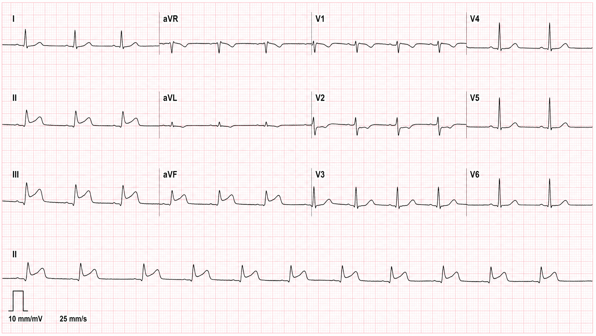
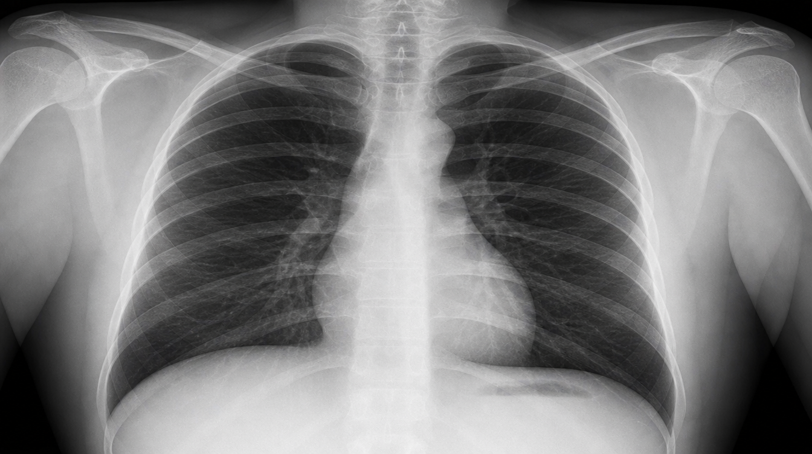

# STEMI 2.0.1 — focused diagnostic media review

**REVIEW_ONLY — PENDING_PHYSICIAN_REVIEW.** Implementation is not clinical approval.
Owner attests these library assets were generated for this project. Provenance:
PROJECT_GENERATED. Rights: OWNER_ATTESTED_PROJECT_USE_FORMAL_DOCUMENTATION_PENDING,
not RIGHTS_APPROVED. Original library files are untouched.

Runtime manifest: `v2/content/media/stemi/manifest.json`, version 1.0.0.
Only two candidate image/report pairs were copied. Each is presented separately
from the unchanged authoritative Case findings/report.

## 1. Standard 12-lead ECG

- Media ID: `asset.stemi.ecg-standard-pending`.
- Investigation: `investigation.ecg-standard`.
- Image source: `C:\Diagnostic Library\ECG's\ECG-002 — Acute Inferior STEMI.png`.
- Report source: `C:\Diagnostic Library\ECG-002 — Acute Inferior STEMI Report.txt`.
- Package image: `v2/apps/web/public/media/stemi/1.0.0/ecg-002.png`.
- Package report: `v2/apps/web/public/media/stemi/1.0.0/ecg-002-report.txt`.
- Image SHA-256: `735f2fdc6d6e9555dbbfe91cbadfb4f8ddbf868dd1d3f121402c08c1426ac776`.
- Report SHA-256: `bba37c489632a59181632094172c9e7d9dca6d24367f8df6b86bc22cfc735cb4`.
- Clinical / Expo: PENDING_PHYSICIAN_REVIEW / REVIEW_ONLY.

Exact paired library report:

> ECG Report
>
> Sinus rhythm at approximately 84 bpm. Acute ST-segment elevation in leads II, III and aVF, most pronounced in lead III. Reciprocal ST-segment depression in leads I and aVL. No bundle branch block.
> Impression: Acute inferior ST-elevation myocardial infarction (STEMI).

Existing Case finding (`fact.stemi.ecg-inferior-findings`, unchanged):

> 12-lead ECG: sinus tachycardia about 112 bpm, PR 160 ms, QRS 90 ms, QTc about 435 ms; ST elevation II 2 mm, III 3 mm, aVF 2 mm with reciprocal ST depression in I and aVL and no posterior pattern in V1-V3.

**Matching discrepancy:** library report rate 84 vs authored 112 bpm. The
supplied description supports candidate selection, not exact tracing approval.
Physician must check image accuracy, calibration, intervals, ST pattern and
fitness for this Case. No automated reinterpretation or medical correction was
made. Do not approve the mismatch merely because rendering works.

The existing Case report remains: “Structured findings are the review-authoritative
fallback; no final diagnostic tracing is included.” The candidate is explicitly
not a final tracing; library text does not replace this authored report.

## 2. Chest X-ray

- Media ID: `asset.stemi.cxr-pending`.
- Investigation: `investigation.chest-xray`.
- Image source: `C:\Diagnostic Library\X-RAY\CXR's\CXR-001 — Normal Chest X-ray.png`.
- Report source: `C:\Diagnostic Library\CXR-001 — Normal Chest X-ray Report.txt`.
- Package image: `v2/apps/web/public/media/stemi/1.0.0/cxr-001.png`.
- Package report: `v2/apps/web/public/media/stemi/1.0.0/cxr-001-report.txt`.
- Image SHA-256: `c03e089421638f658b2cae5bb356bd8d640cfda3c158c1161a2d0a364fd884ab`.
- Report SHA-256: `801e794c7e2f3475e8648dcbbb87c419afe8f5a38ec54ecf16ef52dc4c710194`.
- Clinical / Expo: PENDING_PHYSICIAN_REVIEW / REVIEW_ONLY.

Exact paired library report:

> Cardiomediastinal silhouette is within normal size limits. Lungs are clear without focal air-space opacity. No pleural effusion or pneumothorax. No acute osseous abnormality identified.
> Impression: No acute cardiopulmonary abnormality.

Existing Case finding (`fact.stemi.cxr-result`, unchanged):

> Chest radiograph: no pulmonary edema, pneumothorax, focal air-space disease, or mediastinal abnormality; cardiac silhouette is not enlarged.

Existing Case formal report:

> No pulmonary edema, pneumothorax, focal air-space disease, or mediastinal abnormality. Cardiac silhouette is not enlarged.

Filename/report support candidate selection; no independent physician approval
of the generated image is asserted. Check image/report agreement and suitability
for this Case. Image available at order +300 clinical seconds; formal report
(including the separately labeled reference report) not before +480.

## 3. Right-sided ECG — text only

- Media ID: `asset.stemi.ecg-right-pending`.
- Investigation: `investigation.ecg-right-sided`.
- No matching right-sided tracing/report candidate found; MEDIA_ASSET_PENDING.
- Source/version/rights of an absent asset: unresolved, not fabricated.
- Existing authoritative finding after order +120 seconds:

> Right-sided ECG: V3R ST elevation 1 mm and V4R ST elevation 1.5 mm, supporting right-ventricular involvement.

No standard, posterior or unrelated tracing substituted.

## 4. Focused echo — structured/text only

- Media ID: `asset.stemi.echo-pending`.
- Investigation: `investigation.focused-echo`.
- No suitable existing image found; MEDIA_ASSET_PENDING. Optional image absence
  is not an Expo implementation blocker.
- Existing authoritative finding:

> Focused echo: LVEF about 45%, inferior-wall hypokinesis, mildly-to-moderately dilated RV with reduced function, TAPSE about 14 mm, dilated IVC with reduced collapse, and no pericardial effusion, severe MR, VSD, or pulmonary edema.

Available nearby candidates inspected by filename/report, not copied:

| Under `C:\Diagnostic Library\ECHO's\` | Paired report | Decision |
|---|---|---|
| `ECHO-001 — Large Pericardial Effusion.png` | `ECHO-001 — Large Pericardial Effusion Report.txt` | Excluded: different described finding |
| `ECHO-002 — Cardiac Tamponade Frame.png` | `ECHO-002 — Cardiac Tamponade Frame Report.txt` | Excluded: different described finding |
| `ECHO-003 — Right Ventricular Dilatation -- PE Strain Pattern.png` | `ECHO-003 — Right Ventricular Dilatation  PE Strain Pattern Report.txt` | Excluded: PE-labeled pattern is not assumed to represent this Case |
| `ECHO-004 — Left Ventricular Hypertrophy.png` | `ECHO-004 — Left Ventricular Hypertrophy Report.txt` | Excluded: different described finding |

## Source inventory caveat and review decision

The adjacent `ECG's\ECG-002 — Acute Inferior STEMI Report.txt` and
`X-RAY\CXR's\CXR-001 — Normal Chest X-ray Report.txt` are **empty (0 bytes)**.
The nonempty same-ID reports at the library root (282 and 236 bytes respectively)
were used and copied byte-for-byte. No content was invented to fill empty files.
Other ECG/CXR diagnoses were not copied; no broad library expansion or medical
review of unrelated assets occurred. Library source paths are documentation
only; the UI uses local manifest URLs, never Windows paths.

Review still required:

- Physician accepts/rejects each candidate and resolves ECG rate mismatch.
- Owner records formal project-generated provenance/use documentation.
- Approval status must remain pending until actual signed evidence exists.

Patient runtime and existing pain still fallback retain their separate prior
visual approval; that does not approve these diagnostic images.
